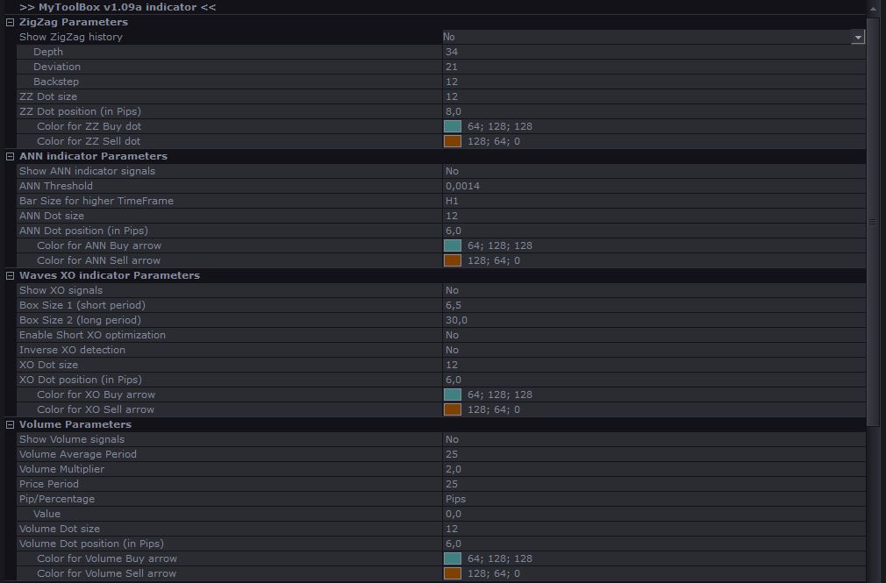
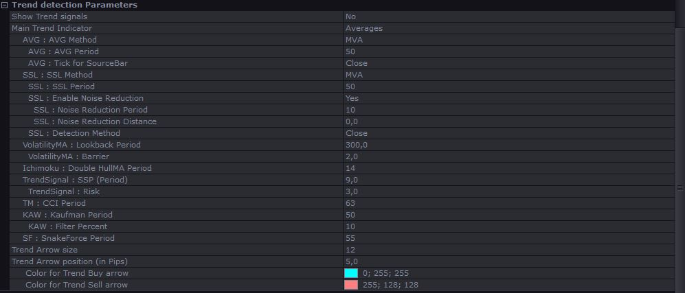
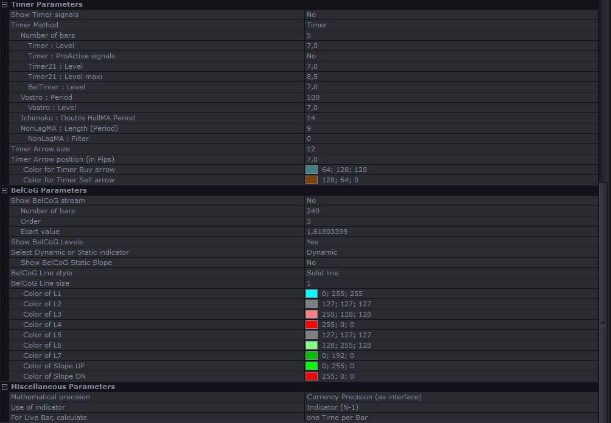

# MyToolBox v1.09a

> Source: https://fxcodebase.com/code/viewtopic.php?f=17&t=73583  
> Forum: 17 · Topic 73583 · 1 post(s)

---

## MyToolBox v1.09a

**Scrat_Power** · Mon Apr 10, 2023 3:51 pm

Hi all,

Well, I share with you one of my toolboxes with a compilation of indicators (this one is the v1.09a).
I have several other toolboxes but i let you discover this one.

You will have the signals proposed by these indicators.
You can show all of them but don't forget to select different positions to avoid superpositions : "indicator Dot position (in Pips)"

List of indicators :
 - ZigZag indicator with history
 - ANN indicator
 - Waves XO indicator
 - Volume indicator
 - Trend detections (Averages, SSL, VolatilityMA, Ichimoku, TrendSignal, TrendMagic, Kaufman Adaptative Wave, SnakeForce)
 - Timer indicators (Timer, Timer21, BelTimer, Vostro, Ichimoku, NonLagMA)
 - BelCoG indicator (Dynamic and Static)

You can select calculation on the last closed bar or on the live bar.
You can activate all indicators if you want.

By default :
- Up arrow (bleu or green) for Buy signal or Bull trend.
- Down arrow (orange or red) for Sell signal or Bear trend.
- Little square , perhaps good to stop ?

 

 

 

 [MyToolBox1.09a.bin](files/150347/MyToolBox1.09a.bin)

Scrat.
