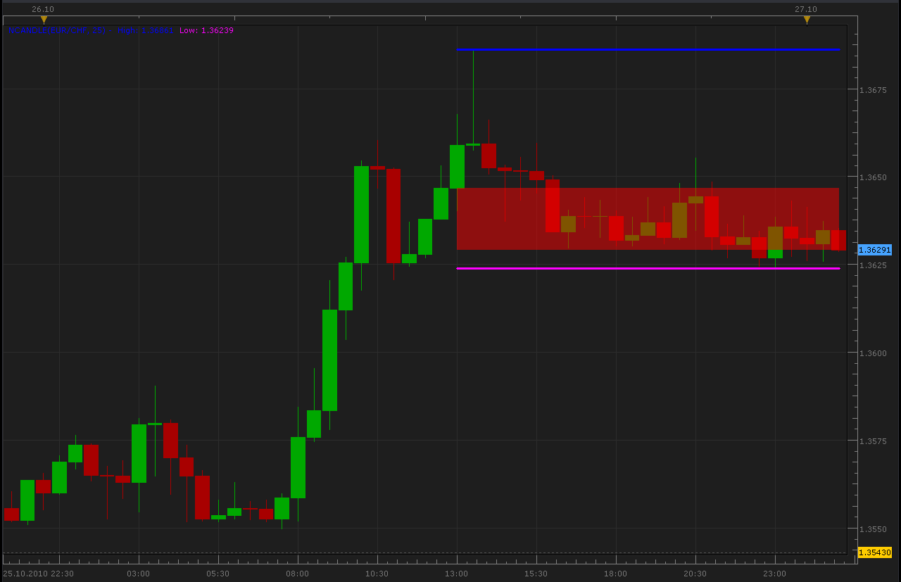

# N periods candle indicator

> Source: https://fxcodebase.com/code/viewtopic.php?f=17&t=2529  
> Forum: 17 · Topic 2529 · 19 post(s)

---

## N periods candle indicator

**Alexander.Gettinger** · Wed Oct 27, 2010 12:20 am

Indicator for calculating the candle formed by the last N periods:

Open = Open price N periods ago
Close = Close price current period
High = Higher price of the last N periods
Low = Lower price of the last N periods

 



```lua
function Init()
    indicator:name("NCandle indicator");
    indicator:description("NCandle indicator");
    indicator:requiredSource(core.Bar);
    indicator:type(core.Indicator);

    indicator.parameters:addGroup("Calculation");
    indicator.parameters:addInteger("N", "N", "", 10);

    indicator.parameters:addGroup("Style");
    indicator.parameters:addColor("HIGH", "Color for High", "Color for High", core.rgb(0,0,255));
    indicator.parameters:addColor("LOW", "Color for Low", "Color for Low", core.rgb(255,0,255));
    indicator.parameters:addColor("UP", "Color for UP", "Color for UP", core.rgb(0,255,0));
    indicator.parameters:addColor("DOWN", "Color for DOWN", "Color for DOWN", core.rgb(255,0,0));
    indicator.parameters:addInteger("widthLinReg", "Line width", "Line width", 3, 1, 5);
    indicator.parameters:addInteger("styleLinReg", "Line style", "Line style", core.LINE_SOLID);
    indicator.parameters:setFlag("styleLinReg", core.FLAG_LINE_STYLE);
    indicator.parameters:addInteger("Transparency", "Transparency", "", 50,0,100);
end

local first;
local source = nil;
local N;
local High;
local Low;
local hUP=nil;
local hDN=nil;
local lUP=nil;
local lDN=nil;

function Prepare()
    source = instance.source;
    N=instance.parameters.N;
    first = source:first();
    local name = profile:id() .. "(" .. source:name() .. ", " .. instance.parameters.N .. ")";
    instance:name(name);
    High = instance:addStream("High", core.Line, name .. ".High", "High", instance.parameters.HIGH, 0);
    Low = instance:addStream("Low", core.Line, name .. ".Low", "Low", instance.parameters.LOW, 0);
    hUP=instance:addInternalStream(0, 0);
    hDN=instance:addInternalStream(0, 0);
    lUP=instance:addInternalStream(0, 0);
    lDN=instance:addInternalStream(0, 0);
    High:setWidth(instance.parameters.widthLinReg);
    High:setStyle(instance.parameters.styleLinReg);
    Low:setWidth(instance.parameters.widthLinReg);
    Low:setStyle(instance.parameters.styleLinReg);
    instance:createChannelGroup("UpGroup","Up" , hUP, hDN, instance.parameters.UP, 100-instance.parameters.Transparency);
    instance:createChannelGroup("DnGroup","Dn" , lUP, lDN, instance.parameters.DOWN, 100-instance.parameters.Transparency);
end

function Update(period, mode)
   if (period>source:size()-N) and (period>=first+N) then
    local Max=core.max(source.high,core.rangeTo(source:size()-1,N));
    local Min=core.min(source.low,core.rangeTo(source:size()-1,N));
    core.drawLine(High,core.range(source:size()-N,period),Max,source:size()-N,Max,period);
    core.drawLine(Low,core.range(source:size()-N,period),Min,source:size()-N,Min,period);
    High[source:size()-1-N]=nil;
    Low[source:size()-1-N]=nil;
    local Open=source.open[source:size()-N];
    local Close=source.close[source:size()-1];
    if Open>Close then
     core.drawLine(lUP,core.range(source:size()-N,period),Open,source:size()-N,Open,period);
     core.drawLine(lDN,core.range(source:size()-N,period),Close,source:size()-N,Close,period);
     core.drawLine(hUP,core.range(source:size()-N,period),0,source:size()-N,0,period);
     core.drawLine(hDN,core.range(source:size()-N,period),0,source:size()-N,0,period);
     lUP[source:size()-1-N]=nil;
     lDN[source:size()-1-N]=nil;
     hUP[source:size()-1-N]=nil;
     hDN[source:size()-1-N]=nil;
    else
     core.drawLine(hUP,core.range(source:size()-N,period),Close,source:size()-N,Close,period);
     core.drawLine(hDN,core.range(source:size()-N,period),Open,source:size()-N,Open,period);
     core.drawLine(lUP,core.range(source:size()-N,period),0,source:size()-N,0,period);
     core.drawLine(lDN,core.range(source:size()-N,period),0,source:size()-N,0,period);
     lUP[source:size()-1-N]=nil;
     lDN[source:size()-1-N]=nil;
     hUP[source:size()-1-N]=nil;
     hDN[source:size()-1-N]=nil;
    end
   else
    High[period]=nil;
    Low[period]=nil;
   end
   
end
```

 [NCandle.lua](files/5591/NCandle.lua)

 [Modified NCandle.lua](files/5591/Modified%20NCandle.lua)

MT4/MQ4 version
[viewtopic.php?f=38&t=66241](https://fxcodebase.com/code/viewtopic.php?f=38&t=66241)

---

## Re: N periods candle indicator

**mcarr005** · Wed Oct 27, 2010 10:15 pm

Thank you very much, nice work!

---

## Re: N periods candle indicator

**rretch** · Wed Jul 27, 2011 4:08 pm

More nice work Alexander.

Would it be possible to make the indicator with an option to not include the current bar?

thanks -rob

---

## Re: N periods candle indicator

**dirtycat** · Mon Sep 26, 2011 10:06 pm

> **rretch wrote:**
> More nice work Alexander.
>
> Would it be possible to make the indicator with an option to not include the current bar?
>
>
> thanks -rob

I second that!

thx

d

---

## Re: N periods candle indicator

**Apprentice** · Tue Sep 27, 2011 4:53 am

I will forward this request to Alex.

---

## Re: N periods candle indicator

**Alexander.Gettinger** · Thu Oct 06, 2011 11:10 am

Please, see this version of indicator.

---

## Re: N periods candle indicator

**dirtycat** · Tue Oct 11, 2011 2:49 am

is there any way possible to make this a strategy? if current candle closes below the lowest price of n periods go short.. vice versa for long. I have searched the strategies and havent seen anything for a simple strategy as this.. thanks

dc

---

## Re: N periods candle indicator

**dirtycat** · Tue Oct 11, 2011 3:00 am

aww scratch that.. found one that does exactly what I need thanks for the aweseome indicator

dc

---

## Re: N periods candle indicator

**Apprentice** · Sun Mar 19, 2017 10:21 am

Indicator was revised and updated.

---

## Re: N periods candle indicator

**elsigis** · Mon Aug 07, 2017 9:36 am

Great work guys! I have been using this indicator for about 2 years now. A longer setting of 10 to 15 bars shows when a market is in a range and 3 to 5 period setting gives some of the best stoploss levels in trending markets.

I would like to request a small feature to be added: ignore inside bars; So that when and inside bar occurs one can have the option of the indicator counting the bars but ignoring the inside bar. This will help to reduce the chance of being stopped out too early when the market slows down.

Thanks you.

---

## Re: N periods candle indicator

**Apprentice** · Mon Aug 07, 2017 1:41 pm

Try Modified NCandle.lua

---

## Re: N periods candle indicator

**elsigis** · Thu Aug 10, 2017 11:29 am

> **Apprentice wrote:**
> Try Modified NCandle.lua

Yes. The modified Ncandle works just as I require.
Thanks.

---

## Re: N periods candle indicator

**axeas69** · Mon Jun 25, 2018 12:00 pm

Hello,
Please could you translate in MT4?
Thanks in advance
Best regards
Axeas69

---

## Re: N periods candle indicator

**Apprentice** · Thu Jun 28, 2018 3:26 pm

Your request is added to the development list under Id Number 4168

---

## Re: N periods candle indicator

**Apprentice** · Tue Jul 03, 2018 5:25 am

Mq4 version added.

---

## Re: N periods candle indicator

**axeas69** · Wed Jul 04, 2018 10:33 am

Hi,
Thanks a lot.
WKR
Axeas69

---

## Re: N periods candle indicator

**axeas69** · Fri Oct 23, 2020 9:52 am

Hi Friends,

From this indicator can you build a strategy with a filter as MACD_SAMPLE (signal)?
As we have a NC (89 or 144 or X ...) high and NC (89 or 144 or X...) low,
we open :

BUY when price touch NC 89 low H4 (for instance) we open buy order when MACD_SAMPLE (buy) is OK
up to NC 89 high H4, close order (or following limit - with stop and so on + song + email)

SELL when price touch NC 89 high H4 (for instance) we open sell order when MACD_SAMPLE (sell)
is OK down to NX 89 H4 close order (or following limit - with stop and so on + song + email)

I hope that the request is clear.
Thanks in advance
Best regards

---

## Re: N periods candle indicator

**Apprentice** · Sun Oct 25, 2020 4:19 am

Your request is added to the development list.
Development reference 2218.

---

## Re: N periods candle indicator

**Apprentice** · Sun Oct 25, 2020 9:43 am

[NCandle Strategy.lua](files/138453/NCandle%20Strategy.lua)

Try this version.
