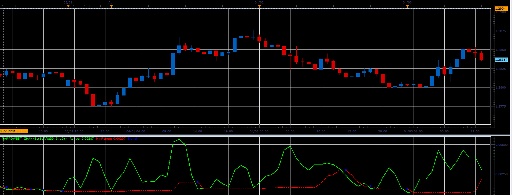

# Narrowest channel oscillator

> Source: https://fxcodebase.com/code/viewtopic.php?f=17&t=34055  
> Forum: 17 · Topic 34055 · 5 post(s)

---

## Narrowest channel oscillator

**Alexander.Gettinger** · Wed Apr 03, 2013 2:18 pm

This indicator is a ported MQL5 indicators from [http://www.mql5.com/en/code/1558](http://www.mql5.com/en/code/1558)

Formulas:
Range[i] = Max-Min, where
Max, min - maximum and minimum prices from (i-Range+1) to i.
MinRange[i] - minimum value of Range from (i-Period) to (i-1).

 

Download:

 [Narrowest_Channel.lua](files/57894/Narrowest_Channel.lua)

The indicator was revised and updated

---

## Re: Narrowest channel oscillator

**Alexander.Gettinger** · Wed Apr 10, 2013 4:11 pm

MQL4 version of this indicator: [viewtopic.php?f=38&t=34359](https://fxcodebase.com/code/viewtopic.php?f=38&t=34359)

---

## Re: Narrowest channel oscillator

**nsaale** · Fri Apr 12, 2013 8:30 am

How do you use it?

I don't understand its signals at all.

---

## Re: Narrowest channel oscillator

**Apprentice** · Mon Apr 15, 2013 5:09 am

Neither do I, Web reference are very vague, do not forget, in most cases we are just developers.

I can offer a more detailed description.
Alex have done a bad job in this regard.

Range will show the current range.
Range is calculated as High-Low.

Min. Range will show the smallest range in the last N periods.

Crosing of this two, will provide you indication of changes in market conditions.
For example from Ranging to Trending.

---

## Re: Narrowest channel oscillator

**Apprentice** · Thu May 11, 2017 1:49 pm

Indicator was revised and updated.
