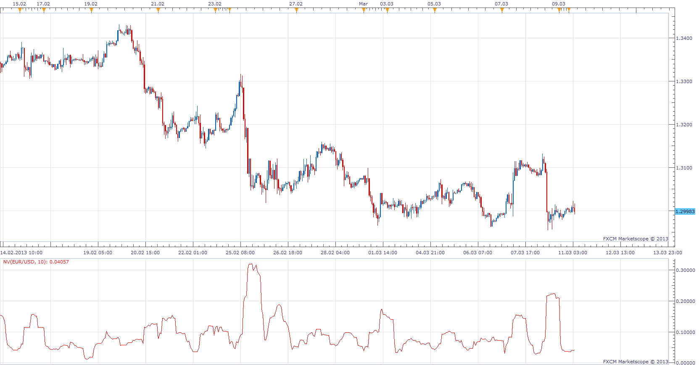

# Natenberg's Volatility

> Source: https://fxcodebase.com/code/viewtopic.php?f=17&t=33104  
> Forum: 17 · Topic 33104 · 4 post(s)

---

## Natenberg's Volatility

**Apprentice** · Mon Mar 11, 2013 4:58 am

Historical volatility is defined by Sheldon Natenberg, as the standard deviation of the logarithmic price changes measured at regular intervals of time.

 [NV.lua](files/56245/NV.lua)

The indicator was revised and updated

---

## Re: Natenberg's Volatility

**Apprentice** · Sat Jul 12, 2014 3:10 am

Updated.

---

## Re: Natenberg's Volatility

**Alexander.Gettinger** · Mon Sep 15, 2014 12:27 pm

MQL4 version of Natenberg's Volatility oscillator: [viewtopic.php?f=38&t=61154](https://fxcodebase.com/code/viewtopic.php?f=38&t=61154).

---

## Re: Natenberg's Volatility

**Apprentice** · Sat Jun 24, 2017 4:57 am

The indicator was revised and updated.
