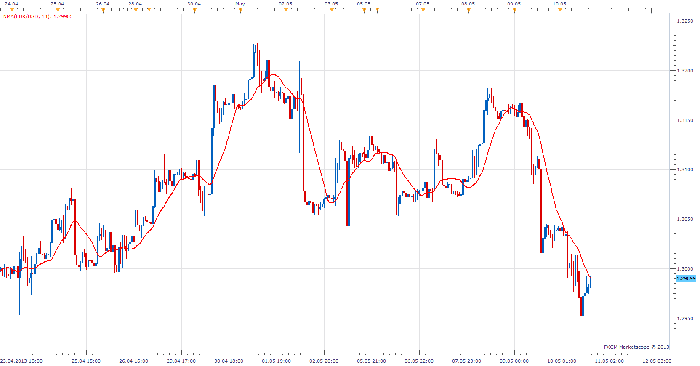

# Navel MA

> Source: https://fxcodebase.com/code/viewtopic.php?f=17&t=37405  
> Forum: 17 · Topic 37405 · 3 post(s)

---

## Navel MA

**Apprentice** · Sun May 12, 2013 3:02 am

NavelMA = MA( ( close*5 + open*2 + high + low ) / 9 )

 [NMA.lua](files/62266/NMA.lua)

The indicator was revised and updated

---

## Re: Navel MA

**Alexander.Gettinger** · Fri Sep 12, 2014 5:03 pm

MQL4 version of Navel MA: [viewtopic.php?f=38&t=61141](https://fxcodebase.com/code/viewtopic.php?f=38&t=61141).

---

## Re: Navel MA

**Apprentice** · Mon Jun 26, 2017 4:29 am

The indicator was revised and updated.
