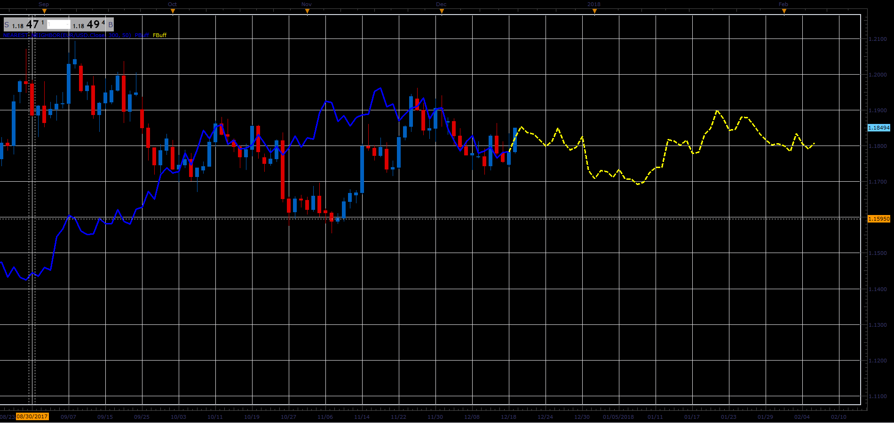

# Nearest Neighbor indicator

> Source: https://fxcodebase.com/code/viewtopic.php?f=17&t=65468  
> Forum: 17 · Topic 65468 · 2 post(s)

---

## Nearest Neighbor indicator

**Alexander.Gettinger** · Tue Dec 19, 2017 3:16 pm

Based on request: [viewtopic.php?f=27&t=63252&p=105279#p105279](https://fxcodebase.com/code/viewtopic.php?f=27&t=63252&p=105279#p105279)

 

Download:

 [Nearest_Neighbor.lua](files/116557/Nearest_Neighbor.lua)

In some cases, the indicator can not make a prediction. Then it does not draw anything.

---

## Re: Nearest Neighbor indicator

**Apprentice** · Wed Apr 04, 2018 6:42 am

The Indicator was revised and updated.
