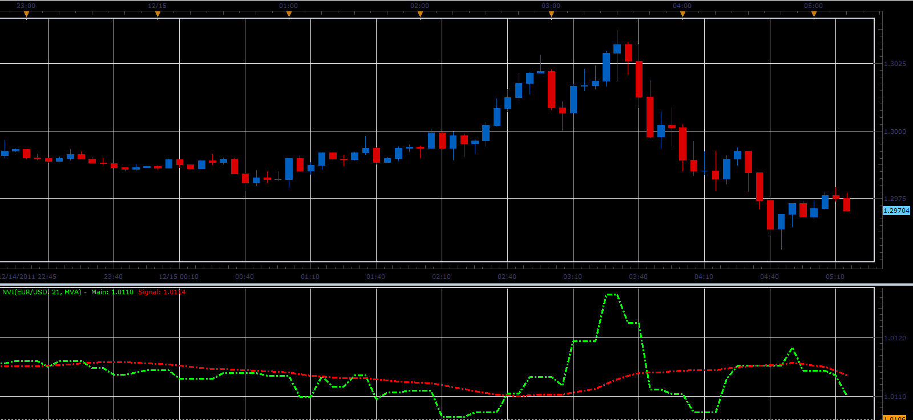

# Negative Volume Index

> Source: https://fxcodebase.com/code/viewtopic.php?f=17&t=9707  
> Forum: 17 · Topic 9707 · 5 post(s)

---

## Negative Volume Index

**Alexander.Gettinger** · Thu Dec 15, 2011 5:18 am

This indicator is a ported MQL5 indicator from [http://www.mql5.com/en/code/517](http://www.mql5.com/en/code/517)

 

Download:

 [NVI.lua](files/20701/NVI.lua)

For this indicator must be installed Averages indicator from [viewtopic.php?f=17&t=2430](https://fxcodebase.com/code/viewtopic.php?f=17&t=2430)

Positive Volume Index is available here.
[viewtopic.php?f=17&t=7886&p=111564](https://fxcodebase.com/code/viewtopic.php?f=17&t=7886&p=111564)

Volume Index is combination of two.
[viewtopic.php?f=17&t=65176](https://fxcodebase.com/code/viewtopic.php?f=17&t=65176)

---

## Re: Negative Volume Index

**Alexander.Gettinger** · Thu Apr 03, 2014 11:16 am

MQL4 version of Negative Volume Index: [viewtopic.php?f=38&t=60490](https://fxcodebase.com/code/viewtopic.php?f=38&t=60490).

---

## Re: Negative Volume Index

**StefPasc** · Mon Apr 07, 2014 2:24 am

Hi

please can you tell me how you calculate the "signal" on the NVI indicator ?
Is it a 21 moving average on NVI ?
Thank you in advance

---

## Re: Negative Volume Index

**Apprentice** · Mon Apr 07, 2014 3:39 am

Affirmative.

---

## Re: Negative Volume Index

**Apprentice** · Thu May 03, 2018 4:10 pm

The indicator was revised and updated.
