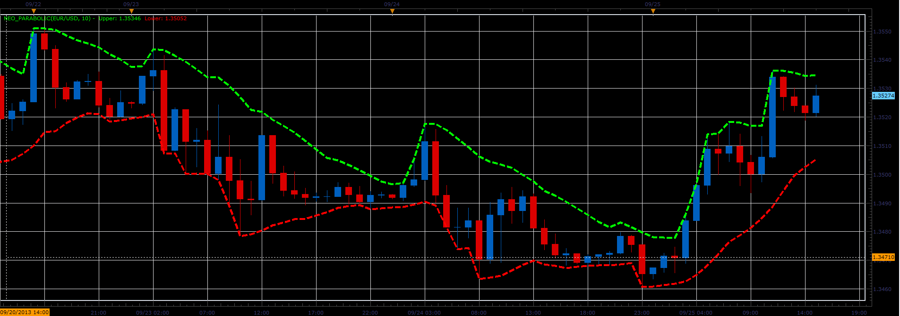

# Neoparabolic indicator

> Source: https://fxcodebase.com/code/viewtopic.php?f=17&t=59586  
> Forum: 17 · Topic 59586 · 3 post(s)

---

## Neoparabolic indicator

**Alexander.Gettinger** · Thu Sep 26, 2013 11:43 am

This indicator is a ported MQL5 indicator from [http://www.mql5.com/ru/code/1832](http://www.mql5.com/ru/code/1832) (in Russian).

Formulas:
Upper[i] = Max[i]/Period,
Lower[i] = Min[i]/Period, where
Min[i] = Sum of lowest prices at range from (i-Period+1) to (i),
Max[i] = Sum of highest prices at range from (i-Period+1) to (i).

 

Download:

 [Neo_Parabolic.lua](files/89717/Neo_Parabolic.lua)

The indicator was revised and updated

---

## Re: Neoparabolic indicator

**Alexander.Gettinger** · Thu Sep 26, 2013 11:45 am

MQL4 version of Neoparabolic indicator: [viewtopic.php?f=38&t=59587](https://fxcodebase.com/code/viewtopic.php?f=38&t=59587).

---

## Re: Neoparabolic indicator

**Apprentice** · Mon Jun 12, 2017 6:20 am

The indicator was revised and updated.
