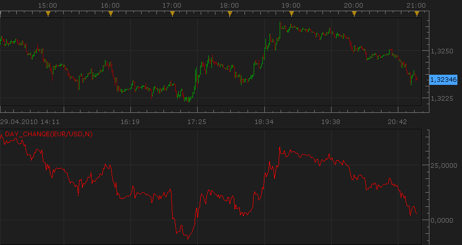

# Net and Percent Change against the day open

> Source: https://fxcodebase.com/code/viewtopic.php?f=17&t=883  
> Forum: 17 · Topic 883 · 23 post(s)

---

## Net and Percent Change against the day open

**Nikolay.Gekht** · Thu Apr 29, 2010 8:02 pm

The indicator shows the net change in pips or the the change in percents of the close of the bar against the open price of the day.

 

Download:

 [day_change.lua](files/1615/day_change.lua)

 [day_change with instrument selector.lua](files/1615/day_change%20with%20instrument%20selector.lua)

Use location parameter tab to superpone/overlay two different instruments on a single screen real estate.

The indicator was revised and updated

---

## Re: Net and Percent Change against the day open

**zekelogan** · Fri Apr 30, 2010 6:44 am

My dreams have come true!

Thank you so much. You folks most definitely have been busy! It shows in all the great indicators you've released.

You're hard work is greatly appreciated! You all have brought Marketscope 2.0 to a whole new level since you began.

---

## Re: Net and Percent Change against the day open

**Coondawg71** · Fri May 04, 2012 8:55 am

Can we please request a Strategy for this indicator.

Simple idea:

Buy= Indicator crosses UP through "0" line
Sell= Indicator crosses DOWN through "0" line

Thanks!

sjc

---

## Re: Net and Percent Change against the day open

**Coondawg71** · Fri May 04, 2012 8:58 am

I failed to ask the obvious, as you know I love my heatmaps!

Please construct a MTF Daychange heatmap, AND please a MTF MCP Daychange heatmap.

Thanks!

sjc

---

## Re: Net and Percent Change against the day open

**Apprentice** · Sun May 06, 2012 4:28 am

Your request is added to the development list.

---

## Re: Net and Percent Change against the day open

**Apprentice** · Tue May 08, 2012 10:59 am

Strategy can be found here.
[viewtopic.php?f=31&t=17969&p=32520#p32520](https://fxcodebase.com/code/viewtopic.php?f=31&t=17969&p=32520#p32520)
MTF MCP Day Change Heat Map can be found here.
[viewtopic.php?f=17&t=17971](https://fxcodebase.com/code/viewtopic.php?f=17&t=17971)

---

## Re: Net and Percent Change against the day open

**fxm12000** · Wed May 16, 2012 12:00 pm

Very usefull tool. Is it possible to make signal or strategy where there would be day_changes for two different instruments, e.g. xau and xag, or any other instrument that have high level of correlation, positive or negative. I would like to enter as condition for signal difference between the percentage of this two instruments. For example , at certain monent we find xauusd with percentage of 0,5 and xagusd -0,3. I would like to be signalized when difference between this two instruments is 0,5 or higher or whatever desired. The idea for strategy is that in a certain time percentage of this two instruments will come together, so at this example trading strategy would be sell xau and buy xag.

I hope I do not complicate too much and you can understand my idea.

Best regards
Dusan

---

## Re: Net and Percent Change against the day open

**Apprentice** · Thu May 17, 2012 2:28 am

I will think about how to best implement.
Further explanation may be needed.
Pozdrav iz Zagreba.

---

## Re: Net and Percent Change against the day open

**Captain** · Mon Oct 08, 2012 12:59 pm

Dear Apprentice,

Could I request this indicator without the lower diagram, just as a label on the chart with both the % and pips change.

Thank you in advance!

---

## Re: Net and Percent Change against the day open

**Apprentice** · Tue Oct 09, 2012 5:15 am

Requested can be found here.
[viewtopic.php?f=17&t=24220](https://fxcodebase.com/code/viewtopic.php?f=17&t=24220)

---

## Re: Net and Percent Change against the day open

**arstechnica** · Sat Oct 27, 2012 12:40 pm

I downloaded this indicator and applied to Ger30

If I apply percentace change it doesn't work properly with indexes and percentage range.

It could be usefull if we can add on a croo a daily cange of a different cross.

This will help a lot with correlations.

---

## Re: Net and Percent Change against the day open

**arstechnica** · Sun Oct 28, 2012 2:30 am

It should be very important if you could extend the time frame selection to week, month and year.

As some time when You observe 2 different pairs or indexes they recover their lost or gain respect to the siter currency or index in more than one day.

Please male this possible.

Regards

Salvatore

---

## Re: Net and Percent Change against the day open

**Apprentice** · Sun Oct 28, 2012 5:22 am

Currently, Indicator is written, calculate the change from 24 hours ago,
not from the start of trading as is the case with stock markets.
For this reason, the higher time frame like a week, month, year are not possible.
In this implementation, that is.

Should completely rewrite indicator.

---

## Re: Net and Percent Change against the day open

**Coondawg71** · Fri Feb 01, 2013 11:46 pm

Can we please ADD a "0" line? Add if possible, can we please have additional levels added that have color and line style options.

Such as:

0 White line
.25,-25 light blue
.50,-50 medium blue
.75,-75 royal blue
1.00,-1.00 red line
1.25,-1.25 yellow line
1.50, -1.50 green line

Thanks,

sjc

---

## Re: Net and Percent Change against the day open

**Apprentice** · Sat Feb 02, 2013 5:37 am

Your request is added to the developmental list.

---

## Re: Net and Percent Change against the day open

**Apprentice** · Mon Feb 04, 2013 10:08 am

Horizontal lines version Added.

---

## Re: Net and Percent Change against the day open

**Apprentice** · Thu Dec 04, 2014 4:40 am

Update.

---

## Re: Net and Percent Change against the day open

**Apprentice** · Sun Dec 14, 2014 3:47 am

day_change with instrument selector added.

---

## Re: Net and Percent Change against the day open

**daniel.herrera** · Thu Nov 03, 2016 2:51 pm

Hello, I need this kind of indicator because it is what I'm looking for. Please can you tell me how to get it?

Thank you!!

---

## Re: Net and Percent Change against the day open

**Apprentice** · Thu Nov 03, 2016 3:05 pm

It is available at the first post of this topic.
[viewtopic.php?f=17&t=883](https://fxcodebase.com/code/viewtopic.php?f=17&t=883)

---

## Re: Net and Percent Change against the day open

**daniel.herrera** · Sun Nov 06, 2016 5:27 am

Thanks!!!

I tried it and it's what I need. What it would possible add that operate with SUPERTREND INDICATOR instead of using moving averages?

Thank you very much and congratulations

> **Apprentice wrote:**
> It is available at the first post of this topic.
> [viewtopic.php?f=17&t=883](https://fxcodebase.com/code/viewtopic.php?f=17&t=883)

---

## Re: Net and Percent Change against the day open

**Apprentice** · Mon Nov 07, 2016 6:22 am

I'm not sure what you mean, the moving average is not used.

---

## Re: Net and Percent Change against the day open

**Apprentice** · Fri Apr 21, 2017 6:00 am

Indicator was revised and updated.
