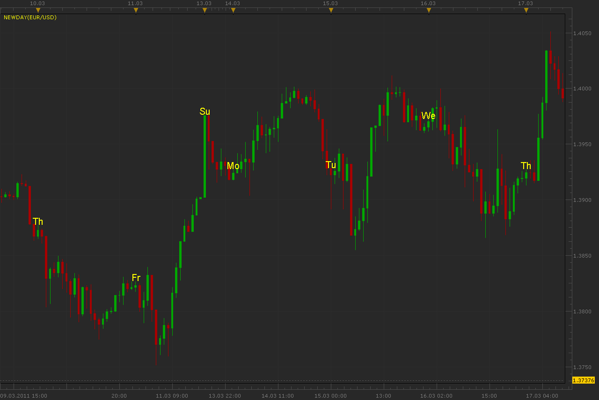

# New day indicator

> Source: https://fxcodebase.com/code/viewtopic.php?f=17&t=3663  
> Forum: 17 · Topic 3663 · 6 post(s)

---

## New day indicator

**Alexander.Gettinger** · Fri Mar 18, 2011 12:02 am

Indicator show day-name labels on first bar of day.

 

Download:

 [NewDay.lua](files/8864/NewDay.lua)

The indicator was revised and updated

---

## Re: New day indicator

**alepan72** · Tue Mar 22, 2011 7:46 pm

Hi there!
Nice indicator... But it 's only on EST time. Can you fix it that can be choose by user the time count?

---

## Re: New day indicator

**Alexander.Gettinger** · Wed Mar 23, 2011 9:23 pm

Indicator work with terminal time.
I will add time shift to indicator.

---

## Re: New day indicator

**Alexander.Gettinger** · Thu Mar 24, 2011 5:14 am

Indicator with time shift.

Download:

 [NewDay2.lua](files/9015/NewDay2.lua)

---

## Re: New day indicator

**alepan72** · Thu Mar 24, 2011 5:19 am

Thank you man!

---

## Re: New day indicator

**Apprentice** · Sat Feb 18, 2017 4:59 am

Indicator was revised and updated.
