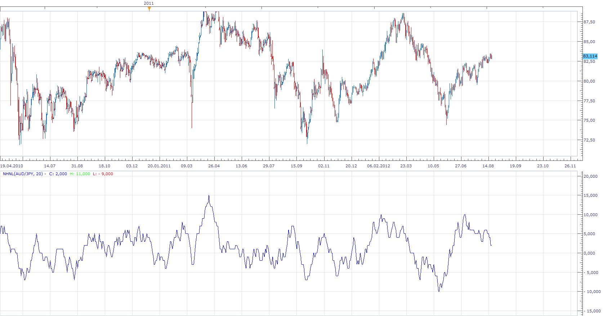

# New Highs New Lows Index

> Source: https://fxcodebase.com/code/viewtopic.php?f=17&t=22579  
> Forum: 17 · Topic 22579 · 15 post(s)

---

## New Highs New Lows Index

**Apprentice** · Mon Aug 20, 2012 6:02 am

Index is calculated as the difference between,
number of higher highs in the period, and,
number of lower lows in the period.

 [NHNL.lua](files/38934/NHNL.lua)

The indicator was revised and updated

---

## Re: New Highs New Lows Index

**newton** · Mon Aug 20, 2012 11:33 am

can you create divergence strategy based on this indicator. it will be more useful. thank you

---

## Re: New Highs New Lows Index

**Apprentice** · Wed Aug 22, 2012 1:42 am

Your request is added to the development list.

---

## Re: New Highs New Lows Index

**Alexander.Gettinger** · Tue Sep 04, 2012 2:09 pm

MQL4 version of this indicator: [viewtopic.php?f=38&t=23003](https://fxcodebase.com/code/viewtopic.php?f=38&t=23003)

---

## Re: New Highs New Lows Index

**nazaar** · Sat Sep 08, 2012 2:07 pm

Hi Apprentice,

this is another good tool. Could it be easier to draw a conclusion if boundary lines were added? The boundary line would be based on the inputted period. so it 21 was used for the period then a boundary line would be drawn at +21, -21 and a permanent line at 0.

Thoughts?

Nazaar

---

## Re: New Highs New Lows Index

**Apprentice** · Sat Sep 08, 2012 2:26 pm

Your request is added to the development list.

---

## Re: New Highs New Lows Index

**nazaar** · Sat Sep 08, 2012 2:50 pm

ok thanks Apprentice. this can be an informative tool towards understanding overall market sentiment.

so that I understand, may I review? The NHNL tool is measuring the number of new highs and lows made within a given period.

- is a new high or low made when compared to the immediate previous bar or when a new high/low is made within all of the chosen periods bars?

Thanks.

---

## Re: New Highs New Lows Index

**Apprentice** · Tue Sep 11, 2012 4:09 am

We have new high when we compare current high with previous bar High.
And current high is greater then the previous bar High.
Contrary for low.

---

## Re: New Highs New Lows Index

**Alexander.Gettinger** · Tue Oct 02, 2012 10:42 am

NHNL divergence indicator: [viewtopic.php?f=17&t=24017](https://fxcodebase.com/code/viewtopic.php?f=17&t=24017)

---

## Re: New Highs New Lows Index

**Alexander.Gettinger** · Tue Oct 02, 2012 10:46 am

NHNL divergence strategy: [viewtopic.php?f=31&t=24018](https://fxcodebase.com/code/viewtopic.php?f=31&t=24018)

---

## Re: New Highs New Lows Index

**Apprentice** · Tue Jan 29, 2013 5:28 pm

Updated.

---

## Re: New Highs New Lows Index

**Apprentice** · Wed Apr 26, 2017 10:52 am

Indicator was revised and updated.

---

## Re: New Highs New Lows Index

**ahmedalhosenyy** · Wed Mar 05, 2025 2:32 pm

Hello and thanks for the beautiful indicator,

May we have other options to be added to NHNL indicator to become "NHNL trend indicator"

1- Change candle color above 0 and below 0.
2- add option to change the chart background above 0 green , below 0 red
3- separate heat map indicator

Thanks a lot

---

## Re: New Highs New Lows Index

**Apprentice** · Mon Mar 10, 2025 2:52 pm

We have added your request to the development list.
Development reference 181

---

## Re: New Highs New Lows Index

**Apprentice** · Thu Jun 05, 2025 6:06 am

 [NHNL.lua](files/159472/NHNL.lua)

 [NHNL_Heatmap.lua](files/159472/NHNL_Heatmap.lua)
