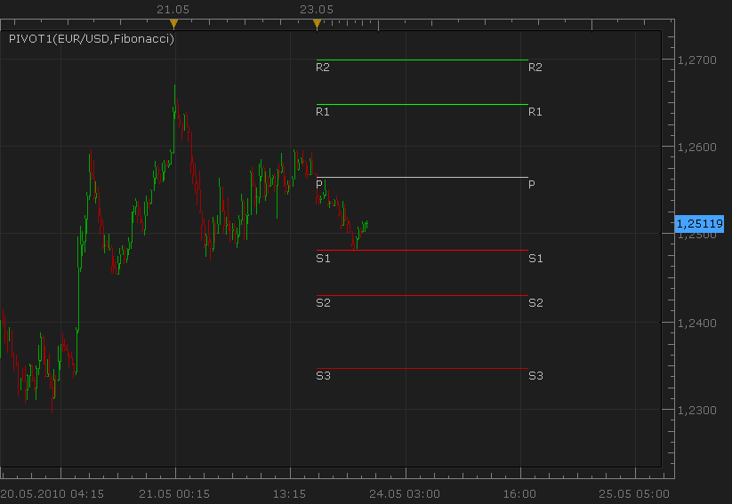
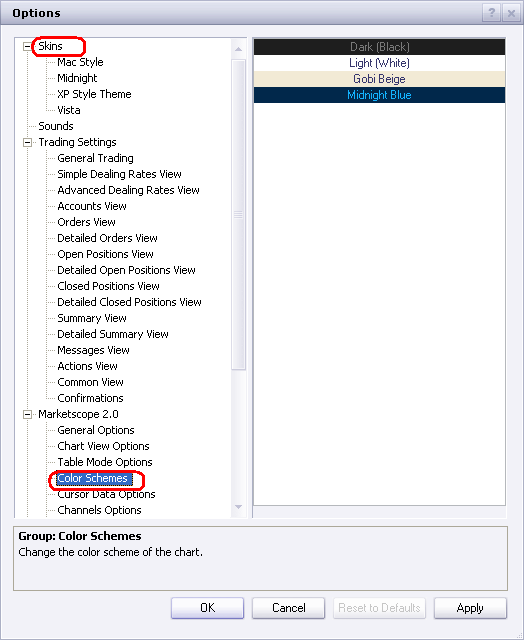
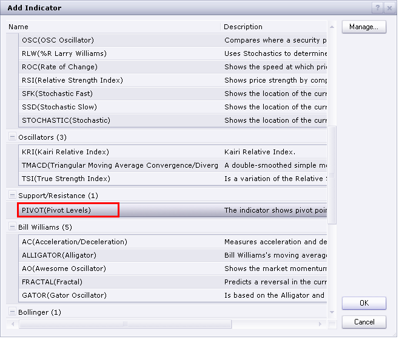
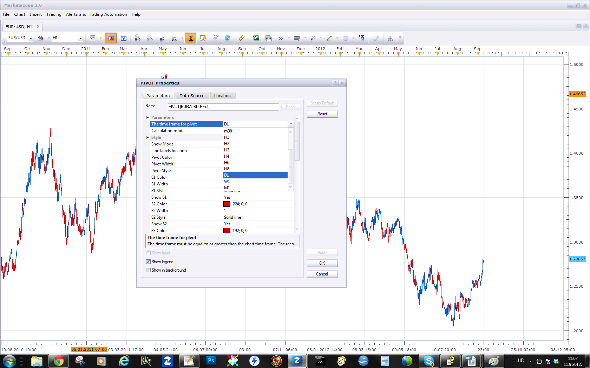
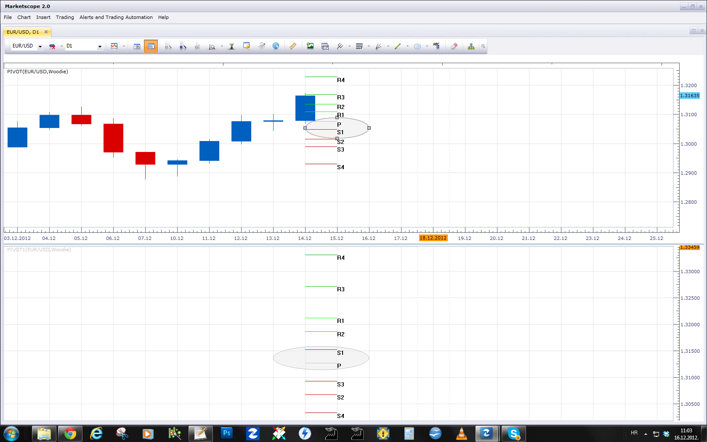

# New PIVOT indicator

> Source: https://fxcodebase.com/code/viewtopic.php?f=17&t=1093  
> Forum: 17 · Topic 1093 · 87 post(s)

---

## New PIVOT indicator

**Nikolay.Gekht** · Sun May 23, 2010 10:05 pm

**Note: This version of the indicator is included into the official release of Aug, 27 2010, so you don't need to download and install it anymore.**

This is the prototype of the PIVOT indicator which will be included into the next release of the Marketscope:

New features:
1) Fibonacci pivot lines, Floor pivot lines and Fibonacci replacement lines on the base of the previous period High/Lows is added.
2) In "today" mode the lines are drawn to the end of the current period (e.g. day).
3) You can put labels on the end, on the beginning and on both sides of the lines.
4) Mid point lines can be shown.

In the next release (unfortunately I can't do it without updating the marketscope) it will also show the tooltips on the lines with the line name and numeric level.

 

Download:

 [pivot1.lua](files/2089/pivot1.lua)

 [pivot1.lua.rc](files/2089/pivot1.lua.rc)

Note: Because the indicator is made on the base of the standard indicator, you must also download rc (localized resources file) and put it in the same folder as pivot1.lua file before you installing the custom indicator into Marketscope. All new functions has only English resources, so, you will see English texts even if another language is chosen. The translation will be provided with the new release of the Marketscope.

We all appreciate treasured efforts of **gg_frx** user in defining requirements and in testing of this new version.

---

## Re: New PIVOT indicator

**sabrumea** · Thu Aug 26, 2010 6:56 pm

hi Nikolay,

the indicator is great.. but could you help me with one question? is it possible to change the code in such a way that dayoffset would be different from that like it is in Marketscope.. they use London closing time. and what if i want another time? for example NY closing time or any other time at my discretion.. like is it possible to use function GetTradingDayOffsetUTC? honestly, i tried to change code myself.. but i can't figure out what's the format of parameter for GetTradingDayOffsetUTC function.. -(( is it possible to do this at all??

with kind regards,
R

---

## Re: New PIVOT indicator

**Nikolay.Gekht** · Fri Aug 27, 2010 7:53 am

It's no so simple as just a change of the "begin of the trading day". This version uses the server's day candles, which always are related to NY trading day. To do the thing you want you have to load 1-hour data and then calculate a day inside indicator (as the trading session hightlight indicator does). I can do such change, but a bit later, when we finish with most of accumulated requests.

---

## Re: New PIVOT indicator

**sabrumea** · Fri Aug 27, 2010 9:49 am

Thank you so much Nikolay for your quick respons.. really appreciate this! if you can do this change after you are done with all those accumulated requests (if it is not difficult for you),it would be just wonderful.. the thing is i have one strategy which is related with daily pivot point and so far proven to be profitable.. so this change could help to enhance the return.. i share it with you

with truly kind regards,
Rita

---

## Re: New PIVOT indicator

**DS0167** · Fri Aug 27, 2010 6:47 pm

Hello Rita,

Is there any possibility that you share your strategy with us ?

Kind regards,
Danielle

---

## Re: New PIVOT indicator

**pawelas** · Tue Aug 31, 2010 2:48 pm

good job

---

## Re: New PIVOT indicator

**jstoutt162** · Mon Nov 15, 2010 8:15 pm

i was checking out this pivot point indicator. I must say i like it so far, but i was wondering if someone is developing a more advanced version that you can select a start time and end time for it to calculate ,and have it draw the pivot lines from lets say 12midnight to 12 noon or whatever time frame you select.

---

## Re: New PIVOT indicator

**Nikolay.Gekht** · Tue Nov 16, 2010 4:10 pm

Such version is in the dev. queue, so we will do it as soon as we have free resources.

---

## Re: New PIVOT indicator

**gravboy** · Fri Nov 19, 2010 6:02 pm

This is a great indicator, I was wondering if you could make it work and set up for the UK sesions, as right now pivots are only avaiable for the set up of the US sesions, so updates would be 5 hrs earlier like the pivots in england. Remember the biggest traders of the FOREX are based out of Europe, and there pivots are more importiant then the American pivots. MEtatrader has such a code to swith pivots from US to UK time zones, which updates 5 hrs earlier, can you please do the same for FXCM.

Thanks

---

## Re: New PIVOT indicator

**gg_frx** · Wed Jan 19, 2011 4:36 am

**there is one minor bug in the pivot official realese**
Whit the new release of TSII on january i take a fresh install of the package, so i used the new pivot indicator but in historic mode lines are plotted in black and with black background they are not visible. With beta version of the indicator the lines are plotted with original colors.

---

## Re: New PIVOT indicator

**sunshine** · Wed Mar 02, 2011 5:11 am

> **gg_frx wrote:**
> **there is one minor bug in the pivot official realese**
> Whit the new release of TSII on january i take a fresh install of the package, so i used the new pivot indicator but in historic mode lines are plotted in black and with black background they are not visible. With beta version of the indicator the lines are plotted with original colors.

Hi,
Could you please tell me which skin and color scheme you use?
You can check them in Options (File -> Options):

 

Also can I ask you to save your layout with all elements and settings and send it to [[email protected]](https://fxcodebase.com/cdn-cgi/l/email-protection#cebdbbbebea1bcba8ea9aba6babda1a8babbbdafe0ada1a3)? It will greatly help to understand the reason of the issue. To save a layout:

1. On the **File** menu, point to Layouts and then click **Save Layout**.
2. Type a name for the layout and click **Save**.
3. On the **File** menu point to Layouts and then click **Manage Layouts**.
4. Click **Export**.
5. Choose the folder for saving your layout and click**Save**.

---

## Re: New PIVOT indicator

**Pip Slap** · Fri Jun 10, 2011 10:15 am

I was looking for the pivot indicator in the newest version of Trading Station and cant locate it. This thread mentioned the indicator is included but I cant find it. Is it actually there and I am not seeing it or do I need to DL it and install it myself?

Thanks in advance for the help!

---

## Re: New PIVOT indicator

**sunshine** · Sun Jun 12, 2011 11:46 pm

> **Pip Slap wrote:**
> I was looking for the pivot indicator in the newest version of Trading Station and cant locate it. This thread mentioned the indicator is included but I cant find it. Is it actually there and I am not seeing it or do I need to DL it and install it myself?
>
> Thanks in advance for the help!

HI,
The indicator is included in the standard set of indicators. So you don't need to download and install it.
Please check the Add indicator dialog:

 

---

## Re: New PIVOT indicator

**Pip Slap** · Tue Jun 14, 2011 10:08 am

Thanks for the response. Dont know how I overlooked that one.

What is the difference in the one that comes with trade station and the one I see scrolling on the front page called "New PIVOT Indicator?" From what I understand they are the saem thing, correct?

---

## Re: New PIVOT indicator

**sunshine** · Wed Jun 15, 2011 12:29 am

I've checked the code of the pivot indicator included in Marketscope and the code of the indicator attached to the top post.
As I see, Marketscope has improved version of the indicator since the issue with Woodie calculation has been fixed. So it's better to use the standard Marketscope indicator rather than the indicator from the top post.

---

## Re: New PIVOT indicator

**Pip Slap** · Thu Jun 16, 2011 9:30 pm

Thanks!

---

## Re: New PIVOT indicator

**t1982t** · Sat Jun 25, 2011 3:25 pm

Nikolay, thank you, great work. I wondering if is it posible a strategy to this indicator, specifically with next parameters:

At the start of signal pivot (... h1, h2,..., d1,...):
if the price reach higher level (1,2,... of the signal) long
if the price reach lower level (1,2,...of the signal), short

Additional options with option off on each ones:
Signal type: direct or riversal
Count of bars to entry or number or bars to confirm
Excess in pips to open
Just once entry per each signal (... h1, h2,..., d1,...)
Classic: limit, stop and stop trailing
Maybe confirm trend with MA

Aditional of the aditional
A special trailing stop and limit:
Diferents levels of limit (1,2, and 3): if level 1 then close n numbers of positions and move the stop to price of entry or above n pips. if level 2 then close n number of positions and move the stop to price of level 1 or above n pips. And so on.

Kind regards

---

## Re: New PIVOT indicator

**Apprentice** · Sun Jun 26, 2011 5:48 am

Your request is added to the developmental cue.

---

## Re: New PIVOT indicator

**t1982t** · Sun Jun 26, 2011 12:00 pm

Thank you very much Apprentice

I just forgot something really important:
If buy at level n of the pivot signal then limit at level n+1 (or n+2, n+3,..., and less some pips) of the pivot signal, and stop at level n-1 (or n-2, n-2,...).
If sell at level n of of the pivot signal then limit at level n-1 (or n-2, n-2,...and plus some pips) of the pivot signal, and stop at level (or n+2, n+3,...).

This maybe like an aditional option because the classic limit and stop option. I guess this is the key of this strategy.
Finally maybe it could use pivot signal of the ST2 so then it could use pivot signal H1, H2,..., D1,.... and not only dayly.

That´s all. I hope not to be doing this strategy so complicated to programming
Again thank you

Kind regards

---

## Re: New PIVOT indicator

**luigifx** · Mon Jun 27, 2011 2:49 am

Thanks a lot for your great job!! I have just a question why we do not have the same pivot points as we can see on dailyfx [http://www.dailyfx.com/technical_analysis/pivot_points/](http://www.dailyfx.com/technical_analysis/pivot_points/) when we use classical mode calcul .
Thanks a lot for your answer

---

## Re: New PIVOT indicator

**sunshine** · Mon Jun 27, 2011 8:02 am

> **luigifx wrote:**
> Thanks a lot for your great job!! I have just a question why we do not have the same pivot points as we can see on dailyfx [http://www.dailyfx.com/technical_analysis/pivot_points/](http://www.dailyfx.com/technical_analysis/pivot_points/) when we use classical mode calcul .
> Thanks a lot for your answer

Do you mean the difference in values? or the table view?

---

## Re: New PIVOT indicator

**luigifx** · Mon Jun 27, 2011 12:46 pm

> **sunshine wrote:**
> Do you mean the difference in values? or the table view?

I mean difference in value

---

## Re: New PIVOT indicator

**mfoste1** · Mon Jun 27, 2011 4:31 pm

Hey, I can't believe no one has tried to make a pivot strategy yet lol . I use pivot points in trading every single day. This would make an excellent algo.

It should work like this:

if prices touches pivot, support or resistance then open position in opposite direction

parameters

1. open position based on tick, candle close
2. once per day (yes/no)
3.one per side (yes/no)
4.allowed side (long/short)
5. type of signal (direct/reverse)

---

## Re: New PIVOT indicator

**Apprentice** · Tue Jun 28, 2011 4:27 am

Your request is added to the developmental cue.

---

## Re: New PIVOT indicator

**luigifx** · Tue Jun 28, 2011 7:47 am

> **luigifx wrote:**
>
>
> > **sunshine wrote:**
> > Do you mean the difference in values? or the table view?
>
>
> I mean difference in value

value come back to normal ... I don't know what happened yesterday, I will check next monday if I see the same problem (maybe due to sunday open)
Best regards,

---

## Re: New PIVOT indicator

**jtatalov** · Thu Oct 13, 2011 3:13 pm

If possible, I would like to request a multi-time frame fib-pivot indicator that can be overlaid onto lower time frame charts. For example, I'd like to be able to choose the 8,4, or 1-hourly pivot data and overlay this on the 15 or 5 min chart. Thank you guys for your help, I'll be sure to make a donation.

Jay

---

## Re: New PIVOT indicator

**LordTwig** · Fri Oct 14, 2011 2:50 am

> **mfoste1 wrote:**
> Hey, I can't believe no one has tried to make a pivot strategy yet lol . I use pivot points in trading every single day. This would make an excellent algo.
>
> It should work like this:
>
> if prices touches pivot, support or resistance then open position in opposite direction
>
> parameters
>
> 1. open position based on tick, candle close
> 2. once per day (yes/no)
> 3.one per side (yes/no)
> 4.allowed side (long/short)
> 5. type of signal (direct/reverse)

> **Apprentice wrote:**
> Your request is added to the developmental cue.

So when is this getting developed???

LordTwig

---

## Re: New PIVOT indicator

**MichaelArgus** · Sat Oct 15, 2011 1:17 pm

I would love to see this as a Strategy!

Thanks!

---

## Re: New PIVOT indicator

**alepan72** · Sat Oct 15, 2011 7:14 pm

I use pivot for every position I take.
I love to have a strategy based on...!

Wait for it dear developers!
Best regards, kisses from Greece!

---

## Re: New PIVOT indicator

**order66** · Sun Oct 23, 2011 8:28 am

If some could systemize the components of Frank Ochoa's work (Secrets of a Pivot Boss) and Mark B Fisher's work (The Logical Trader), that would be a powerful system indeed.

---

## Re: New PIVOT indicator

**Apprentice** · Sun Oct 23, 2011 5:14 pm

I will take a look.
If you can provide more information.
Web reference or sample code.
This would speed up the process.

---

## Re: New PIVOT indicator

**order66** · Mon Oct 24, 2011 1:31 pm

Please check your email.

---

## Re: New PIVOT indicator

**alepan72** · Thu Nov 10, 2011 7:50 am

> **Apprentice wrote:**
> I will take a look.
> If you can provide more information.
> Web reference or sample code.
> This would speed up the process.

Dear Apprentice,
I found two EA strategy based on pivot point. It might help you to write a strategy. I hope help you and Im waiting for news. I use pivot point every day and it's wonderfull to have a strategy like it.
(sorry for my english)...

Best regards!

---

## Re: New PIVOT indicator

**STEIGO** · Thu Nov 10, 2011 4:11 pm

Using the Historical option I can get the central pivot to work, but not the S1,S2, R1, R2 etc. Iam I missing something?

This option is certainly availble on other platforms

Regards STEIGO

---

## Re: New PIVOT indicator

**Apprentice** · Thu Nov 10, 2011 5:09 pm

@Alepan
Your request is added to the development queue

---

## Re: New PIVOT indicator

**jsotor** · Mon Nov 21, 2011 10:27 am

Hi,

I've been reading the entire thread, and i've found that at least 3 persons are also interested in a way to change the dayoffset. Also, i know there are other threads with the same request.

Really, It would be great to choose any time for pivot calculation!!! 12am, 3am, 8am, 5pm 12m, etc.

Of course, i understand that you are pretty busy with all other previuos request, but i think that the flexibility for us as end users will be priceless.

I also want to ask: how do you calculate Pivot Points for mondays? With daily candles, right?, Because, there is in deed a difference in the values with dailyfx, at least for today (monday), as it was previously noted.

I'm specially curious because in case of a change in the offset, we will find the weekend gap.

For example, in a 12:00am based calculation, some guys use Fridays 12am candle Open Price and Sunday 11pm Close price.

Also, i would like to suggest that each pivot point line should be identified based on its timeframe, offset and calculation mode.

For example:
P (D 00GMT CL)	for a daily Pivot, offset 00 GMT, clasicc
R1 (D 17GMT FI)	for a daily Resistance 1, offset 17 GMT, fibonacci
S1 (W 17GMT CL) for a weekly Support 1, offset 17GMT, clasicc

That is because we could be trying some strategies with a combination of pivots and it gets hard to identify each one, unless you use your mouse to try to change an indicator's properties.

Thanks for your hard work, and thanks in advance for your patience...

JS

---

## Re: New PIVOT indicator

**alepan72** · Thu Dec 01, 2011 3:56 am

Also, I wonder if it's possible, a strategy based on a standard pivot signal in marketscope. The logic of strategy could be the same as signal 's with an extra option of direct/reverse open position.

---

## Re: New PIVOT indicator

**Apprentice** · Thu Dec 01, 2011 9:19 am

The request is added to the developmental cue.

---

## Re: New PIVOT indicator

**KyleScalp** · Fri Feb 17, 2012 11:07 pm

The orignal marketscope pivot indicator only trails the central pivot when the "historical" setting is selected. This version historally trails all the pivot levels which is great.

Please can you add functionality to allow the customisation of each pivot line weight and style (dots, dashes etc) like the orignal as this seems to be missing from this version.

---

## Re: New PIVOT indicator

**Apprentice** · Sat Feb 18, 2012 4:15 am

Your request is added to the development list.

---

## Re: New PIVOT indicator

**LordTwig** · Mon Apr 30, 2012 10:03 am

Hey there,

> **LordTwig wrote:**
>
>
> > **mfoste1 wrote:**
> > Hey, I can't believe no one has tried to make a pivot strategy yet lol . I use pivot points in trading every single day. This would make an excellent algo.
> >
> > It should work like this:
> >
> > if prices touches pivot, support or resistance then open position in opposite direction
> >
> > parameters
> >
> > 1. open position based on tick, candle close
> > 2. once per day (yes/no)
> > 3.one per side (yes/no)
> > 4.allowed side (long/short)
> > 5. type of signal (direct/reverse)
>
>
>
>
>
> > **Apprentice wrote:**
> > Your request is added to the developmental cue.
>
>
>
> So when is this getting developed???
>
> LordTwig

So............?????
We are all still waiting for this Pivot Strategy as far as I am aware

When can we expect it??????

---

## Re: New PIVOT indicator

**mfoste1** · Mon Apr 30, 2012 4:29 pm

> **LordTwig wrote:**
> Hey there,
>
>
>
> > **LordTwig wrote:**
> >
> >
> > > **mfoste1 wrote:**
> > > Hey, I can't believe no one has tried to make a pivot strategy yet lol . I use pivot points in trading every single day. This would make an excellent algo.
> > >
> > > It should work like this:
> > >
> > > if prices touches pivot, support or resistance then open position in opposite direction
> > >
> > > parameters
> > >
> > > 1. open position based on tick, candle close
> > > 2. once per day (yes/no)
> > > 3.one per side (yes/no)
> > > 4.allowed side (long/short)
> > > 5. type of signal (direct/reverse)
> >
> >
> >
> >
> >
> > > **Apprentice wrote:**
> > > Your request is added to the developmental cue.
> >
> >
> >
> > So when is this getting developed???
> >
> > LordTwig
>
>
> So............?????
> We are all still waiting for this Pivot Strategy as far as I am aware
>
> When can we expect it??????

I'm trying to write this strategy right now. Hopefully I'll have it finished shortly here.

---

## Re: New PIVOT indicator

**LordTwig** · Mon May 07, 2012 1:09 am

> **LordTwig wrote:**
> I'm trying to write this strategy right now. Hopefully I'll have it finished shortly here.

Okay, great!

---

## Re: New PIVOT indicator

**LordTwig** · Fri Jun 22, 2012 9:15 am

Any update to when this is happening??????

---

## Re: New PIVOT indicator

**jooka1978** · Tue Jul 24, 2012 12:24 pm

Hi,

I am trying to use PIVOT indicator in my strategy, but I can't find out how.
I create the pivot in the Prepare(nameOnly) function using the following parameters:
indicator=core.indicators:create("PIVOT", Source, par_pivotBS, par_pivotCalcMode, "TODAY");

The indicator is updated in the extUpdate function:
indicator:update(core.UpdateLast);

And then I try to get the value of the pivot levels using this, but it does not work:
var_R1 = indicator:getStream(0)[period];
Could anyone please tell me, how can I put a pivot level values (R1, R2, S1, S2 etc.) in a variable?
Thanks

---

## Re: New PIVOT indicator

**Ekaterina** · Wed Jul 25, 2012 2:46 am

Hi jooka1978 ,

To get access through the streams you need History mode. In Todays mode only the simple lines are drawing.
Please replace your string of the code with this one:

Code: [Select all](https://fxcodebase.com/code/)
`indicator=core.indicators:create("PIVOT", Source, par_pivotBS, par_pivotCalcMode, "HIST");`

Best regards,
Ekaterina

---

## New PIVOT indicator

**LordTwig** · Wed Jul 25, 2012 2:58 am

> **mfoste1 wrote:**
> Hey, I can't believe no one has tried to make a pivot strategy yet lol . I use pivot points in trading every single day. This would make an excellent algo.
>
> It should work like this:
>
> if prices touches pivot, support or resistance then open position in opposite direction

and still no Pivot Strategy has yet been created.
How long do forum users have to wait for such a 'pivotal' Strategy?

---

## Re: New PIVOT indicator

**jooka1978** · Wed Jul 25, 2012 2:15 pm

Hi Ekaterina,

Thank you very much you solved my problem! It works fine.

---

## Re: New PIVOT indicator

**mstreck** · Mon Jul 30, 2012 4:10 am

Just one small comment, as I had already debugged this earlier. The error message in line 272 of the pivot indicator seems incorrect.

 assert(false, resources:get("R_SMODE_ERR") .. ": " .. instance.parameters.CalcMode);

It should be instance.parameters.ShowMode instead of the CalcMode.

Cheers,
Martin

---

## Re: New PIVOT indicator

**omrshkh** · Mon Jul 30, 2012 10:06 am

Hi all-I'm having problems with the pivot indicator in fxcm/mktscp in
that the lines are being drawn incorrectly. I suspect this has
something to do with the cut off time fxcm is using to calculate the
pivots. I've heard some traders say their pivots on fxcm are drawn as
of the 5pm close EST. I don't know how to check what close time my
system is taking. I have attached two charts, one fxcm (wrong) and one
from Igindex (correct) for audusd. I'm trading out of London time zone.
Hope someone can help. Thanks Omar Sheikh

---

## Re: New PIVOT indicator

**Nikolay.Gekht** · Thu Aug 02, 2012 11:08 am

The pivot indicator in the production version is drawn for a trading day, which starts at 17:00 New York time. The first diagram in your attachment starts at 22:00, so, I bet, your time zone is UK time. 22:00 UK is 17:00 NYT. The second chart in your example starts at midnight UK time.

The current production version does not have a pivot indicator which can be calculated starting at any hour. However, the current beta has such implementation and there are a day pivot indicator which starts at any chosen hour of a day. Just, please note that there is no data between Friday 17:00 NYT and Sunday 12:00 NYT, so at the border of the week such pivot can produce tight lines.

---

## Re: New PIVOT indicator

**Ekaterina** · Fri Aug 10, 2012 1:42 am

> and still no Pivot Strategy has yet been created.
> How long do forum users have to wait for such a 'pivotal' Strategy?

Hi LordTwig!

Please find the New Pivot Strategy here:
[viewtopic.php?f=31&t=22221#p38434](https://fxcodebase.com/code/viewtopic.php?f=31&t=22221#p38434)

Best regards,
Ekaterina

---

## Re: New PIVOT indicator

**LordTwig** · Fri Aug 10, 2012 10:37 am

Hi Ekaterina,

I will download and assess your strategy.
Thanks for being the person to finally write this Pivot strategy.

Cheers

---

## Re: New PIVOT indicator

**mctrade** · Fri Aug 10, 2012 11:07 am

Thank you very much for publishing this great indicator.

I have a question:

Is it maybe possible to program the yearly Pivot Points for long term trading?

---

## Re: New PIVOT indicator

**crusader1** · Mon Sep 10, 2012 7:07 am

Hi guys where can I find Weekly Pivot indicator for TS2??
Or TS2 has only Daily Pivot indicator?

Thanks

---

## Re: New PIVOT indicator

**Apprentice** · Tue Sep 11, 2012 3:58 am

Simply choose your desired time frame.

 

---

## Re: New PIVOT indicator

**guangho** · Fri Nov 02, 2012 1:31 pm

> **Apprentice wrote:**
> Simply choose your desired time frame.
>
>
> The attachment **Untitled.png** is no longer available

Just a minute K line picture to see the strange phenomenon, the index of BUG? Do you have found?

---

## Re: New PIVOT indicator

**Apprentice** · Sun Nov 04, 2012 7:25 am

Can you specify the settings used, like Chart Time Frame, Source Time frame and other.

---

## Re: New PIVOT indicator

**dementedgr** · Mon Dec 03, 2012 10:08 am

There seems to be a problem with the calculation of Monthly pivots!
I get the exact same levels with the Weekly pivots (1st week of the month)
which is highly unlikely for all currency pairs & cfds...
Anyone else noticing that?

---

## Re: New PIVOT indicator

**Apprentice** · Tue Dec 04, 2012 6:29 pm

Can you share your parameters used.
Use print screen.

---

## Re: New PIVOT indicator

**benben99** · Wed Dec 05, 2012 8:11 pm

> **dementedgr wrote:**
> There seems to be a problem with the calculation of Monthly pivots!
> I get the exact same levels with the Weekly pivots (1st week of the month)
> which is highly unlikely for all currency pairs & cfds...
> Anyone else noticing that?

hello everybody
well i have the same problem with the monthly pivot its normaly fixes utself after 1 week
well can anybody here do us all a big favor and make a great pivot strtegy?
i lready posted the parameters
please anybody?
comon

---

## Re: New PIVOT indicator

**Apprentice** · Thu Dec 06, 2012 2:48 am

One Pivot stratetgy can be found here.
[viewtopic.php?f=31&t=22221&p=43552&hilit=Pivot#p43552](https://fxcodebase.com/code/viewtopic.php?f=31&t=22221&p=43552&hilit=Pivot#p43552)
If this is not adequate, canm you define the conditions for it.
I'm still waiting parameters for the indicator.

---

## Re: New PIVOT indicator

**benben99** · Thu Dec 06, 2012 7:33 pm

> **Apprentice wrote:**
> One Pivot stratetgy can be found here.
> [http://fxcodebase.com/code/viewtopic.ph ... vot#p43552](https://fxcodebase.com/code/viewtopic.php?f=31&t=22221&p=43552&hilit=Pivot#p43552)
> If this is not adequate, canm you define the conditions for it.
> I'm still waiting parameters for the indicator.

hello apprentice- well if u will follow the link u have here u will see that we talked about it before and i already set the parameters and u said it looks good!!!!!!!
please bud try to make us all a nice strategy based on what i wrote on that link page

thanks alot benben

---

## Re: New PIVOT indicator

**mctrade** · Sat Dec 15, 2012 6:36 pm

> **Apprentice wrote:**
> Can you share your parameters used.
> Use print screen.

Hello Apprentice,

here`s a print screen of the USD/JPY pair.It shows the monthly classic pivot points of the TS2 indicator and the correct monthly pivot point on the daily timeframe.So all pivots of the indicator are completely wrong.The same is with monthly pivots on other timeframes for USD/JPY and also on other forex pairs.
Can you please check this indicator?

Best Regards,
mctrade.

---

## Re: New PIVOT indicator

**Apprentice** · Sun Dec 16, 2012 4:57 am

I found some inconsistencies.

 

We will investigate.
One question.
Do you have this problem with buildin TS Pivot,
or just with forum version.

---

## Re: New PIVOT indicator

**benben99** · Sun Dec 16, 2012 6:59 am

> **mctrade wrote:**
>
>
> > **Apprentice wrote:**
> > Can you share your parameters used.
> > Use print screen.
>
>
>
> Hello Apprentice,
>
> here`s a print screen of the USD/JPY pair.It shows the monthly classic pivot points of the TS2 indicator and the correct monthly pivot point on the daily timeframe.So all pivots of the indicator are completely wrong.The same is with monthly pivots on other timeframes for USD/JPY and also on other forex pairs.
> Can you please check this indicator?
>
> Best Regards,
> mctrade.

hello there its benben here are the parameters

hello
can u please help me to create a great pivot indicator?

i have some parameters if u can help me or anybody--------

1. open pos on a candle close above or below pivot
2.choose timeframe for the candle
3.one per day(yes-no)
4.1 per side(yes-no)
5.option to trade the opposite direction if the candle touched the pivot but didnt cross it the other way
6.allow side(long-short
7.stops and limts options to choose(in pips)
8.option to choose the size of the lot(from 1k and up)
9.option to choose how many lots to use
10.and most importand- option to make the strategy to use always 2 lots each trade with targets R1 and R2 for longs and targets S1 and S2 for shorts.......
--------------------------------------------------------------------
well thats alot i know but thats all in my mind , i think that way of targets and limits and stops will make anybosy trade better with better results
hope u can help me out here and im sure alot of others
thanks alot ben

---

## Re: New PIVOT indicator

**mctrade** · Sun Dec 16, 2012 7:28 am

Hello Apprentice,

thanks for your answer.

I`ve checked it and this problem exists with both versions of the indicator,
with the buildin TS2 version and also with the forum version.

I still have a question:
I want to ask you if it`s possible to code the yearly pivot points to this indicator?

Please invest your time in this indicator.
Pivot points are very useful and used by many traders.

Best Regards,
mctrade.

---

## Re: New PIVOT indicator

**rtsayers** · Sun Dec 16, 2012 7:35 pm

I would second this claim and I use these for my trading and I am wondering how this would effect the fib levels pivots points? I would love to see this working right!

Thanks

---

## Re: New PIVOT indicator

**cersoz** · Fri Apr 26, 2013 3:08 pm

dear apprentice

i need r5 and s5 level in camarilla mode!... and also i think specially in camarila mode pivot level is not true!..

---

## Re: New PIVOT indicator

**Apprentice** · Mon Apr 29, 2013 5:06 am

Your request is added to the development list.

---

## Re: New PIVOT indicator

**gpatel** · Wed Jun 12, 2013 9:28 am

Is there anyway you can change the standard pivot indicator to work on Tick chart (Timeframe for pivot is not tick)? I'm trying to make this change and first change the following line to core.Tick from core.Bar

before:
indicator:requiredSource(core.Bar);
after:
indicator:requiredSource(core.Tick);

but I get an error on the following line
core.getcandle(source:barSize(), core.now(), 0);

I understand that here the source expected is a bar source so I need to change the source used for the indicator to use barsource. How do I get that source when the indicator is applied to tick chart?

Thanks

---

## Re: New PIVOT indicator

**gpatel** · Mon Jun 17, 2013 6:37 am

Does anyone know or should I consider this impossible? There is no documentation I can find on the update that differentiated bar charts from tick charts. Most people I ask just say change core.bar to core.tick and it should work. Any marketscope programmer knows that will never be enough.

---

## Re: New PIVOT indicator

**Apprentice** · Tue Jun 18, 2013 8:17 am

Possible perhaps.
But you have one fundamental problem.
Pivot requires bar chart (open, close, high, low) for the calculation,
Tick ​​provides only one data point.

---

## Re: New PIVOT indicator

**gpatel** · Tue Jun 18, 2013 8:43 am

Yea, but is there a way to get bar data (1m) in to tick chart and calculate pivot on bar data (1m) and show the pivot lines on tick chart?

---

## Re: New PIVOT indicator

**nuhocodebase** · Tue Aug 20, 2013 12:27 pm

Hello,
Is it possible to create a pivot point on the bar and not over the previous bar.
If so, would it be possible to choose the time frame of this line as well as its style and color
thank you
Regards
nuho

---

## Re: New PIVOT indicator

**Apprentice** · Thu Aug 22, 2013 1:49 am

This is possible.
Your request is added to the development list.

---

## Re: New PIVOT indicator

**pdesai** · Wed Nov 13, 2013 2:14 pm

Hi
Is it at all possible to plot historical levels which are not connected in the new pivot indicator? ,currently this makes the chart look untidy.Also when ploting the original indicator there is an error message " pivot.lua 310 unknown label location.." can this be fixed? i like the original version
many thanks

---

## Re: New PIVOT indicator

**Outside_The_Box** · Wed Nov 13, 2013 4:17 pm

> **pdesai wrote:**
> Hi
> Is it at all possible to plot historical levels which are not connected in the new pivot indicator? ,currently this makes the chart look untidy.Also when ploting the original indicator there is an error message " pivot.lua 310 unknown label location.." can this be fixed? i like the original version
> many thanks

I've been getting the same error when trying to apply pivots. For some reason though, my templates that have pivots load just fine, I only have that error when applying them to a new chart. Probably a bug in MarketScope.

---

## Re: New PIVOT indicator

**Apprentice** · Thu Nov 14, 2013 4:23 am

I could not reproduce this.
Furthermore.
On line 310 we have a comment, Which can not give this error message.
Can you specify which version of Pivot Indicator you are using.

---

## Re: New PIVOT indicator

**Outside_The_Box** · Thu Nov 14, 2013 5:07 am

The only version I have is the default one that was already included in MarketScope.

---

## Re: New PIVOT indicator

**Patrick Sweet** · Sun Nov 24, 2013 2:14 pm

Hi,
Stupid question, probably. I apologise in advance. But it should be quick and painless to answer.
In the current installation of Pivot, I think Camarilla is perhaps wrong (which means this is not a stupid question) or it is correct and I am reading the LUA code incorrectly, hense the likely apology. here is my reference question.

I think the line below is a 'comment' (none functioning) line in the lua file.....because is it preceeded with two dashes '--' and is in green text in the lua file

normal text....
elseif CalcMode == O_CAM then
green text ...***-- P[period] = (ref.high[prev_i] + ref.close[prev_i] + ref.low[prev_i]) / 3;***

Then what follows is P[period] = ref.close[prev_i];

If I understand it, in this implementation Camilla is using the previous close as P. To check this I looked that the values of P (daily) and values of closing bar (opening bar 17:00) and the Camilla P value is indeed the same as ref.close[prev_i].

My understanding is that P value for Camilla =
-- P[period] = (ref.high[prev_i] + ref.close[prev_i] + ref.low[prev_i]) / 3; and not simply the closing value of the previous period/day. (like for some others).

If my reading is correct, could we please make it so that the Camilla P value is like those used for .....?

 if CalcMode == O_PIVOT or CalcMode == O_FIB or CalcMode == O_FLOOR then
 P[period] = (ref.high[prev_i] + ref.close[prev_i] + ref.low[prev_i]) / 3;

Or set me straight on what is happening...please? Patrick

CODE FROM LUA FILE:......
 pday = prev_i;
 if CalcMode == O_PIVOT or CalcMode == O_FIB or CalcMode == O_FLOOR then
 P[period] = (ref.high[prev_i] + ref.close[prev_i] + ref.low[prev_i]) / 3;
 elseif CalcMode == O_CAM then
 -- P[period] = (ref.high[prev_i] + ref.close[prev_i] + ref.low[prev_i]) / 3; (this text is in green)
 P[period] = ref.close[prev_i];

---

## Re: New PIVOT indicator

**Patrick Sweet** · Sun Nov 24, 2013 2:27 pm

Hi again,

I have been checking values for Classical P, Floor P and Fib P (calculated according to the P=(prevH+preClose+prevLow)/3 compared to simple P=prevClose, and on october 7th for example the diffence is 27pips.

I had to check for my own piece of mind that I was not splitting hairs over a difference without a significance, but I think this rates as a difference of significance (so I at least feel better about raising the finding).

Thanks,P

---

## Re: New PIVOT indicator

**Patrick Sweet** · Sun Nov 24, 2013 4:20 pm

Hi Again, Again,
I beg your apology...but I found that MT4 uses Close as P.

MT4=
R4 = (H - L) X 1.1 / 2 + C
R3 = (H - L) X 1.1 / 4 + C
R2 = (H - L) X 1.1 / 6 + C
R1 = (H - L) X 1.1 / 12 + C
S1 = C - (H - L) X 1.1 / 12
S2 = C - (H - L) X 1.1 / 6
S3 = C - (H - L) X 1.1 / 4
S4 = C - (H - L) X 1.1 / 2

I trust you know by now that I understand there are multiple implementations.....
I wonder, would it be possible to actually ADD the (what many purport to be) original formula for Camarilla?

Where P is calculated like you calculate P for Classic, Floor, and Fib in the Pivot implementation??
And accept again my greatest gratitude for all your work!

Patrick

---

## Re: New PIVOT indicator

**Apprentice** · Sat Jun 17, 2017 3:56 am

The indicator was revised and updated.

---

## Re: New PIVOT indicator

**nookie** · Thu Feb 08, 2018 12:04 pm

Is it possible this to be in .mq4 ? Or already exists somewhere in this site ?

---

## Re: New PIVOT indicator

**Apprentice** · Fri Feb 09, 2018 6:19 am

Something like this?
[viewtopic.php?f=38&t=32374&p=117654&hilit=pivot#p117654](https://fxcodebase.com/code/viewtopic.php?f=38&t=32374&p=117654&hilit=pivot#p117654)

---

## Re: New PIVOT indicator

**nookie** · Fri Feb 09, 2018 5:53 pm

Yes, exactly, thanks !
