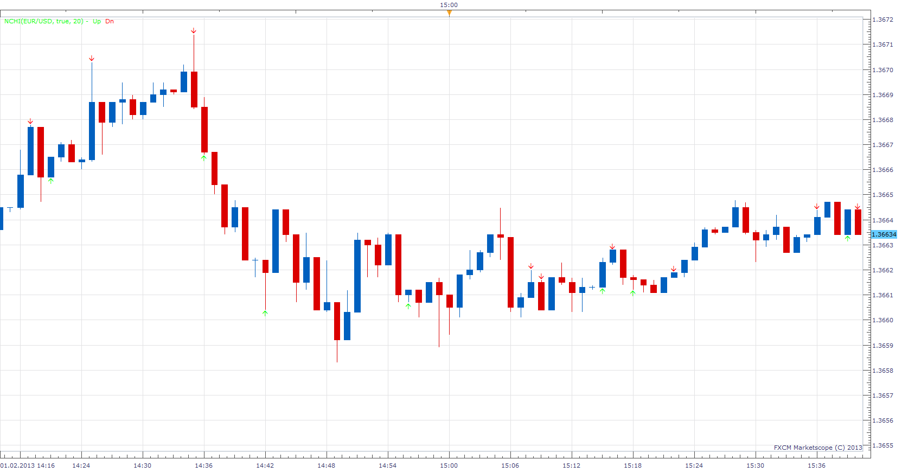

# Next Candle Heading indicator

> Source: https://fxcodebase.com/code/viewtopic.php?f=17&t=31660  
> Forum: 17 · Topic 31660 · 7 post(s)

---

## Next Candle Heading indicator

**Apprentice** · Fri Feb 01, 2013 5:13 pm

Next Candle Heading indicator try to forecast next candle Heading.

 [NCHI.lua](files/53995/NCHI.lua)

1.) If current candle volume at least doubled in comparison to previous candle
AND the color of the current candle has changed in comparison to previous candle
next will have same Heading as of current candle.

2.) If current candle volume at least doubled in comparison to previous candle
AND the color of the current candle has NOT changed from the previous candle then next next candle will have opposite Heading of current candle.

3.) If current candle volume at least have halved
AND the color of the current candle has changed in comparison to previous candle
next will have same Heading as of current candle.

4.) If current candle volume at least have halved
 AND the color of the current candle has NOT changed from the previous candle then next next candle will have opposite Heading of current candle.

5.) Wick Size Filter.
5.1.) If current candle has a wick(upper tail) of 20% or more of body then up signal will not be given.
5.2.) if current candle has a tail(lower tail) of 20% or more of body then down signal will not be given.

---

## Re: Next Candle Heading indicator

**spadaii** · Mon Feb 11, 2013 5:37 pm

Hello,

Is it possible to make a strategy with this indicator?

Thank you

---

## Re: Next Candle Heading indicator

**Apprentice** · Mon Feb 11, 2013 6:02 pm

Your request is added to the development list.

---

## Re: Next Candle Heading indicator

**spadaii** · Mon Feb 11, 2013 6:11 pm

Thank you

---

## Re: Next Candle Heading indicator

**dtb71fx** · Fri Feb 15, 2013 4:35 am

Thanks for this indicator -- pretty cool

...what does the "Filter" do? In the code I only see it used in the name, nowhere else ?

---

## Re: Next Candle Heading indicator

**Apprentice** · Fri Feb 15, 2013 7:09 am

Good point, I forgot to add this switch.
Fixed.

---

## Re: Next Candle Heading indicator

**Apprentice** · Thu Apr 05, 2018 6:00 am

The Indicator was revised and updated.
