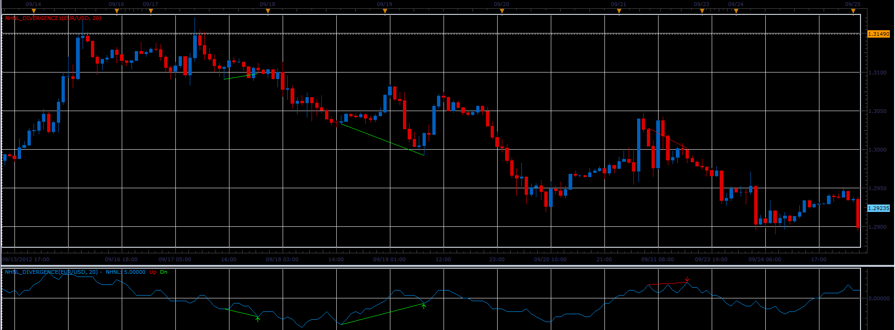

# NHNL divergence indicator

> Source: https://fxcodebase.com/code/viewtopic.php?f=17&t=24017  
> Forum: 17 · Topic 24017 · 5 post(s)

---

## NHNL divergence indicator

**Alexander.Gettinger** · Tue Oct 02, 2012 10:41 am

The indicator shows NHNL indicator ([viewtopic.php?f=17&t=22579&p=39930](https://fxcodebase.com/code/viewtopic.php?f=17&t=22579&p=39930)), NHNL divergence lines and trend lines on the prices.

 

Download divergence oscillator:

 [NHNL_Divergence.lua](files/41283/NHNL_Divergence.lua)

Download divergence indicator for main chart:

 [NHNL_Divergence1.lua](files/41283/NHNL_Divergence1.lua)

For this indicator must be installed NHNL indicator ([viewtopic.php?f=17&t=22579](https://fxcodebase.com/code/viewtopic.php?f=17&t=22579)).

---

## Re: NHNL divergence indicator

**Alexander.Gettinger** · Tue Oct 02, 2012 10:46 am

NHNL divergence strategy: [viewtopic.php?f=31&t=24018](https://fxcodebase.com/code/viewtopic.php?f=31&t=24018)

---

## Re: NHNL divergence indicator

**jetaro** · Mon Aug 29, 2016 1:29 pm

I get an error "attempt to index upvalue 'NHNL' (a nil value)

---

## Re: NHNL divergence indicator

**Apprentice** · Tue Aug 30, 2016 4:41 am

For this indicator must be installed NHNL indicator
 ([viewtopic.php?f=17&t=22579](https://fxcodebase.com/code/viewtopic.php?f=17&t=22579)).

Please re-download.
Updated versions will inform you about this.

---

## Re: NHNL divergence indicator

**Apprentice** · Tue Aug 28, 2018 11:26 am

The indicator was revised and updated.
