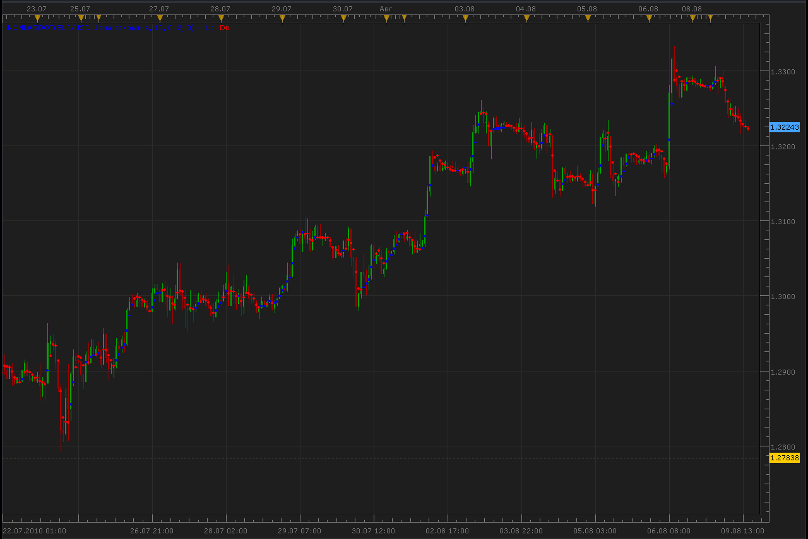
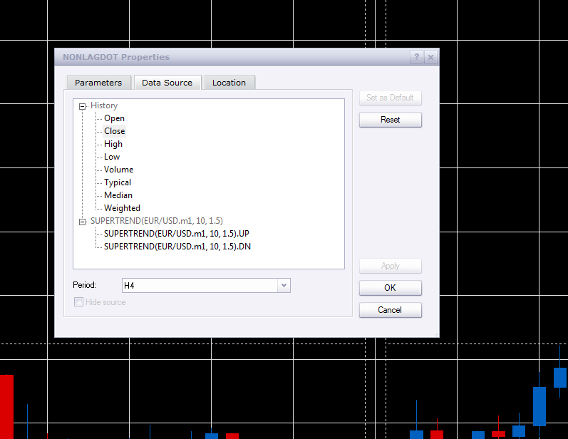
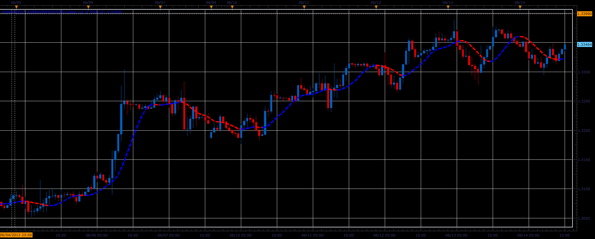
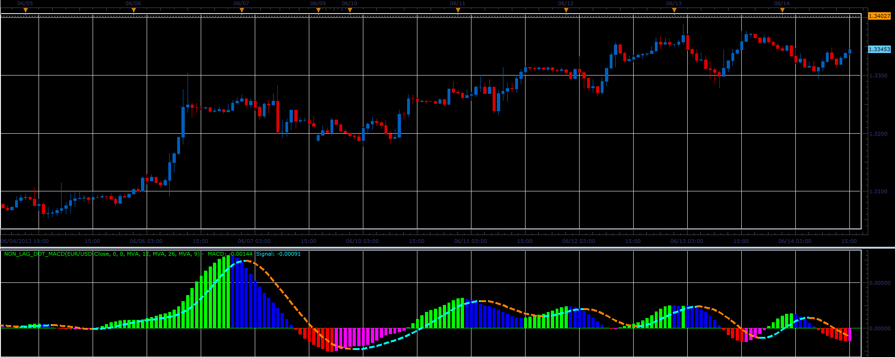

# Non lag Dot indicator

> Source: https://fxcodebase.com/code/viewtopic.php?f=17&t=1721  
> Forum: 17 · Topic 1721 · 29 post(s)

---

## Non lag Dot indicator

**Alexander.Gettinger** · Mon Aug 09, 2010 2:23 pm

[viewtopic.php?f=27&t=1705](https://fxcodebase.com/code/viewtopic.php?f=27&t=1705)

 



```lua
function Init()
    indicator:name("NonLagDot indicator");
    indicator:description("NonLagDot indicator");
    indicator:requiredSource(core.Tick);
    indicator:type(core.Indicator);
   
    indicator.parameters:addInteger("Length", "Length", "Length", 10);
    indicator.parameters:addInteger("Filter", "Filter", "Filter", 0);
    indicator.parameters:addInteger("ColorBarBack", "ColorBarBack", "ColorBarBack", 2);
    indicator.parameters:addDouble("Deviation", "Deviation", "Deviation", 0);

    indicator.parameters:addColor("clrUP", "UP color", "UP color", core.rgb(0, 0, 255));
    indicator.parameters:addColor("clrDN", "DN color", "DN color", core.rgb(255, 0, 0));
end

local first;
local source = nil;
local Length;
local Filter;
local ColorBarBack;
local Deviation;
local buffUP=nil;
local buffDN=nil;
local trend;
local buff;
local Coeff;
local Phase;
local Len;

function Prepare()
    source = instance.source;
    Length=instance.parameters.Length;
    Filter=instance.parameters.Filter;
    ColorBarBack=instance.parameters.ColorBarBack;
    Deviation=instance.parameters.Deviation;
    trend = instance:addInternalStream(0, 0);
    buff = instance:addInternalStream(0, 0);
    first = source:first()+2;
    local name = profile:id() .. "(" .. source:name() .. ", " .. instance.parameters.Length .. ", " .. instance.parameters.Filter .. ", " .. instance.parameters.ColorBarBack .. ", " .. instance.parameters.Deviation .. ")";
    instance:name(name);
    buffUp = instance:createTextOutput ("Up", "Up", "Wingdings", 10, core.H_Center, core.V_Center, instance.parameters.clrUP, first);
    buffDn = instance:createTextOutput ("Dn", "Dn", "Wingdings", 10, core.H_Center, core.V_Center, instance.parameters.clrDN, first);
    Coeff=3.*math.pi;
    Phase=Length-1;
    Len=Length*4.+Phase;
end

function Update(period, mode)
    if (period>first+Len+2) then
     local Weight=0;
     local Sum=0;
     local t=0;
     for i=0,Len-1,1 do
      local g=1./(Coeff*t+1.);
      if t<=0.5 then
       g=1.;
      end
      local beta=math.cos(math.pi*t);
      local alpha=g*beta;
      Sum=Sum+alpha*source[period-i];
      Weight=Weight+alpha;
      if t<1. then
       t=t+1./(Phase-1.);
      elseif t<Len-1. then
       t=t+7./(4.*Length-1.);
      end
     end
     if Weight>0. then
      buff[period]=(1.+Deviation/100.)*Sum/Weight;
     end
     if Filter>0. then
      if math.abs(buff[period]-buff[period-1])<Filter*source:pipSize() then
       buff[period]=buff[period-1];
      end
     end
     trend[period]=trend[period-1];
     if buff[period]-buff[period-1]>Filter*source:pipSize() then
      trend[period]=1;
     end
     if buff[period-1]-buff[period]>Filter*source:pipSize() then
      trend[period]=-1;
     end
     if trend[period]>0 then
      buffUp:set(period, buff[period], "\159", "");
      if trend[period-ColorBarBack]<0 then
       buffUp:set(period-ColorBarBack, buff[period-ColorBarBack], "\159", "");
      end
     end
     if trend[period]<0 then
      buffDn:set(period, buff[period], "\159", "");
      if trend[period-ColorBarBack]>0 then
       buffDn:set(period-ColorBarBack, buff[period-ColorBarBack], "\159", "");
      end
     end

    end
end
```

 [NonLagDot.lua](files/3438/NonLagDot.lua)

New Versions By Apprentice

 [NLD.lua](files/3438/NLD.lua)

 [NonLagDot.lua](files/3438/NonLagDot%20%282%29.lua)

MT4/MQ4 version.
[viewtopic.php?f=38&t=69002](https://fxcodebase.com/code/viewtopic.php?f=38&t=69002)

---

## Re: Non lag Dot indicator

**patick** · Wed Aug 11, 2010 5:56 am

Perhaps this was a design flaw in the orig indicator, but looks like there might be a repainting issue:

---

## Re: Non lag Dot indicator

**briansummy** · Wed Mar 07, 2012 9:08 pm

From your pic I see what you mean however trading an H1 or longer after the close of the candle I do not see this repainting. You will notice that when looking at the dots color there are breaks by a few candles and then the trend may continue. I use this as the signal in my system compared to a condition with a trend indicator. Maybe compare a short term and long term nonlagdot system? That would be an interesting EA.

---

## Re: Non lag Dot indicator

**briansummy** · Thu Mar 08, 2012 9:52 am

I just realized, an MTF Nonlagdot would be amazing. Is this possible?

---

## Re: Non lag Dot indicator

**aricanderson** · Sun Mar 11, 2012 2:22 pm

Is there any way to make a strategy based on this indicator?

Buy after first blue dot and sell after first red dot.

---

## Re: Non lag Dot indicator

**Apprentice** · Mon Mar 12, 2012 3:15 am

aricanderson:
Can you define the Entry, Exit conditions.
briansummy :
Your request is added to the development list.

---

## Re: Non lag Dot indicator

**Alexander.Gettinger** · Mon Mar 12, 2012 2:56 pm

> **briansummy wrote:**
> I just realized, an MTF Nonlagdot would be amazing. Is this possible?

Use parameter "Period" for other TF:

 



---

## Re: Non lag Dot indicator

**briansummy** · Tue Mar 13, 2012 9:52 pm

Perfect! Thanks!

---

## Re: Non lag Dot indicator

**briansummy** · Sat Mar 17, 2012 4:50 pm

Can you do a strategy with NonLagDot in agreement with Parabolic SAR where the dot is the signal and SAR sets trend agreement?

---

## Re: Non lag Dot indicator

**Apprentice** · Mon Mar 19, 2012 1:05 am

Your request is added to the list of developers.

---

## Re: Non lag Dot indicator

**briansummy** · Tue Mar 20, 2012 8:52 pm

I have been watching this on a m1 chart and yes it does repaint. Is there anything to prevent this? It looks similar to Fractals with a 3 bar count to calculate.

---

## Re: Non lag Dot indicator

**Apprentice** · Thu Apr 05, 2012 3:14 am

New Version Added.
Old Version Updated.

---

## Re: Non lag Dot indicator

**Apprentice** · Thu Apr 05, 2012 5:11 am

MTF version can b found here.
[viewtopic.php?f=17&t=15574&p=29351#p29351](https://fxcodebase.com/code/viewtopic.php?f=17&t=15574&p=29351#p29351)

---

## Re: Non lag Dot indicator

**Apprentice** · Fri Apr 06, 2012 1:03 pm

NLD SAR strategy can be found here.
[viewtopic.php?f=31&t=15659](https://fxcodebase.com/code/viewtopic.php?f=31&t=15659)

---

## Re: Non lag Dot indicator

**Coondawg71** · Fri May 24, 2013 1:51 pm

Can we please request the "MACD of Non Lag Dot Indicator" added to Lua development que along with the corresponding Non Lag Dot Signal too please. Signal would be based on change of Non Lag direction and cross of zero signal line of histogram.

Thanks,

sjc

[http://www.mql5.com/en/code/1296](http://www.mql5.com/en/code/1296)

---

## Re: Non lag Dot indicator

**Apprentice** · Sun Jun 02, 2013 12:09 pm

Your request is added to the development list.

---

## Re: Non lag Dot indicator

**Alexander.Gettinger** · Fri Jun 14, 2013 3:34 pm

Version of Non Lag Dot with Averages indicator:

 



Download:

 [Nonlagdot_Averages.lua](files/67058/Nonlagdot_Averages.lua)

For this indicator must be installed Averages indicator ([viewtopic.php?f=17&t=2430](https://fxcodebase.com/code/viewtopic.php?f=17&t=2430)).

---

## Re: Non lag Dot indicator

**Alexander.Gettinger** · Fri Jun 14, 2013 3:36 pm

> **Coondawg71 wrote:**
> Can we please request the "MACD of Non Lag Dot Indicator" added to Lua development que along with the corresponding Non Lag Dot Signal too please. Signal would be based on change of Non Lag direction and cross of zero signal line of histogram.
> [http://www.mql5.com/en/code/1296](http://www.mql5.com/en/code/1296)

 



Download:

 [Non_Lag_Dot_MACD.lua](files/67059/Non_Lag_Dot_MACD.lua)

For this indicator must be installed Averages indicator ([viewtopic.php?f=17&t=2430](https://fxcodebase.com/code/viewtopic.php?f=17&t=2430)) and Nonlagdot_Averages indicator.

---

## Re: Non lag Dot indicator

**Alexander.Gettinger** · Fri Jun 14, 2013 3:42 pm

MQL4 version of this indicators: [viewtopic.php?f=38&t=40966](https://fxcodebase.com/code/viewtopic.php?f=38&t=40966)

---

## Re: Non lag Dot indicator

**Apprentice** · Tue May 23, 2017 6:03 am

Indicator was revised and updated.

---

## Re: Non lag Dot indicator

**Recursive Trendline** · Fri Sep 08, 2017 10:27 am

Hi Apprentice,

I want the 'Non Lag Dot' indicator to repaint maximum one candle behind. What parameters should I place? Colourback = 0 ?

Regards,

---

## Re: Non lag Dot indicator

**Apprentice** · Sun Sep 10, 2017 6:09 pm

Your request is added to the development list, Under Id Number 3889
 If someone is interested to do this task, please contact me.

---

## Re: Non lag Dot indicator

**Alexander.Gettinger** · Wed Sep 13, 2017 3:24 pm

> **Recursive Trendline wrote:**
> Hi Apprentice,
>
> I want the 'Non Lag Dot' indicator to repaint maximum one candle behind. What parameters should I place? Colourback = 0 ?
>
> Regards,

Colorback=1 for 1 candle behind
or
Colorback=0 for no repainting.

---

## Re: Non lag Dot indicator

**Recursive Trendline** · Thu Sep 14, 2017 12:23 pm

Thanks Alexander and Apprentice.

Got it!

Regards

---

## Re: Non lag Dot indicator

**Apprentice** · Sun Sep 23, 2018 7:04 am

The Indicator was revised and updated.

---

## Re: Non lag Dot indicator

**planstyr** · Sat Oct 05, 2019 1:01 am

> **Apprentice wrote:**
> The Indicator was revised and updated.

Can this Non lag Dot indicator be made fro MT4, with NoRepaint Version?

---

## Re: Non lag Dot indicator

**Apprentice** · Wed Oct 09, 2019 10:54 am

Your request is added to the development list.
Development reference 159.

---

## Re: Non lag Dot indicator

**planstyr** · Wed Oct 09, 2019 11:13 am

> **Apprentice wrote:**
> Your request is added to the list of developers.

Thanks!

---

## Re: Non lag Dot indicator

**Apprentice** · Thu Oct 10, 2019 12:44 pm

MT4/MQ4 version.
[viewtopic.php?f=38&t=69002](https://fxcodebase.com/code/viewtopic.php?f=38&t=69002)
