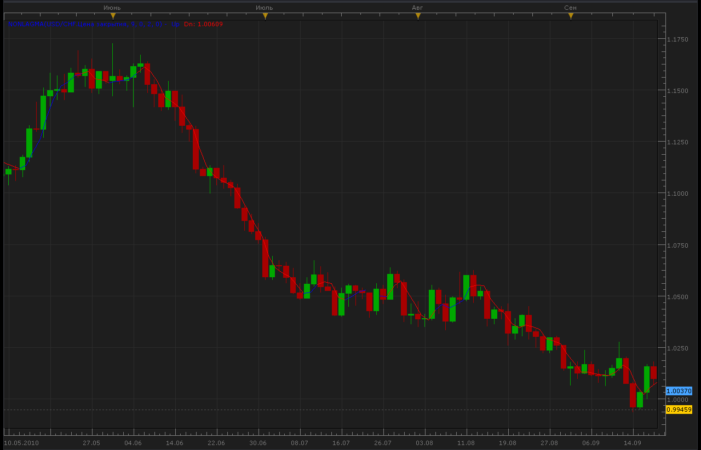
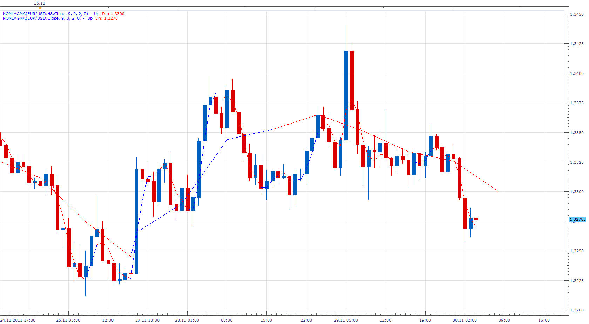

# Non-Lag Moving Average

> Source: https://fxcodebase.com/code/viewtopic.php?f=17&t=2231  
> Forum: 17 · Topic 2231 · 32 post(s)

---

## Non-Lag Moving Average

**Alexander.Gettinger** · Mon Sep 20, 2010 10:41 pm

[viewtopic.php?f=27&t=2219](https://fxcodebase.com/code/viewtopic.php?f=27&t=2219)

 



 [NonLagMA.lua](files/4663/NonLagMA.lua)

 [SSNonLagMA.lua](files/4663/SSNonLagMA.lua)

 [NonLagMA Overlay.lua](files/4663/NonLagMA%20Overlay.lua)

The indicator was revised and updated

---

## Re: Non-Lag Moving Average

**colddog** · Mon Sep 20, 2010 11:26 pm

Thanks so much for your help!

---

## Re: Non-Lag Moving Average

**colddog** · Wed Sep 22, 2010 10:33 am

Hi,

just wondering if its possible to include an option which changes the width of the line being drawn? so that i can make it thicker?

---

## Re: Non-Lag Moving Average

**Apprentice** · Wed Sep 22, 2010 11:55 am

Added to development cue.

---

## Re: Non-Lag Moving Average

**Alexander.Gettinger** · Mon Oct 04, 2010 9:55 pm

Update Non-Lag Moving Average.
Added line styles.

```lua
function Init()
    indicator:name("NonLagMA indicator");
    indicator:description("NonLagMA indicator");
    indicator:requiredSource(core.Tick);
    indicator:type(core.Indicator);
   
    indicator.parameters:addGroup("Calculation");
    indicator.parameters:addInteger("Length", "Length", "Length", 9);
    indicator.parameters:addInteger("Filter", "Filter", "Filter", 0);
    indicator.parameters:addInteger("ColorBarBack", "ColorBarBack", "ColorBarBack", 2);
    indicator.parameters:addDouble("Deviation", "Deviation", "Deviation", 0);

    indicator.parameters:addGroup("Style");
    indicator.parameters:addColor("clrUP", "UP color", "UP color", core.rgb(0, 0, 255));
    indicator.parameters:addColor("clrDN", "DN color", "DN color", core.rgb(255, 0, 0));
   
    indicator.parameters:addInteger("widthLinReg", "Line width", "Line width", 1, 1, 5);
    indicator.parameters:addInteger("styleLinReg", "Line style", "Line style", core.LINE_SOLID);
    indicator.parameters:setFlag("styleLinReg", core.FLAG_LINE_STYLE);
end

local first;
local source = nil;
local Length;
local Filter;
local ColorBarBack;
local Deviation;
local buffUP=nil;
local buffDN=nil;
local trend;
local buff;
local Coeff;
local Phase;
local Len;

function Prepare()
    source = instance.source;
    Length=instance.parameters.Length;
    Filter=instance.parameters.Filter;
    ColorBarBack=instance.parameters.ColorBarBack;
    Deviation=instance.parameters.Deviation;
    trend = instance:addInternalStream(0, 0);
    buff = instance:addInternalStream(0, 0);
    first = source:first()+2;
    local name = profile:id() .. "(" .. source:name() .. ", " .. instance.parameters.Length .. ", " .. instance.parameters.Filter .. ", " .. instance.parameters.ColorBarBack .. ", " .. instance.parameters.Deviation .. ")";
    instance:name(name);
    buffUp = instance:addStream("buffUp", core.Line, name .. ".Up", "Up", instance.parameters.clrUP, first);
    buffDn = instance:addStream("buffDn", core.Line, name .. ".Dn", "Dn", instance.parameters.clrDN, first);
    buffUp:setWidth(instance.parameters.widthLinReg);
    buffUp:setStyle(instance.parameters.styleLinReg);
    buffDn:setWidth(instance.parameters.widthLinReg);
    buffDn:setStyle(instance.parameters.styleLinReg);
    Coeff=3.*math.pi;
    Phase=Length-1;
    Len=Length*4.+Phase;
end

function Update(period, mode)
    if (period>first+Len+2) then
     local Weight=0;
     local Sum=0;
     local t=0;
     for i=0,Len-1,1 do
      local g=1./(Coeff*t+1.);
      if t<=0.5 then
       g=1.;
      end
      local beta=math.cos(math.pi*t);
      local alpha=g*beta;
      Sum=Sum+alpha*source[period-i];
      Weight=Weight+alpha;
      if t<1. then
       t=t+1./(Phase-1.);
      elseif t<Len-1. then
       t=t+7./(4.*Length-1.);
      end
     end
     if Weight>0. then
      buff[period]=(1.+Deviation/100.)*Sum/Weight;
     end
     if Filter>0. then
      if math.abs(buff[period]-buff[period-1])<Filter*source:pipSize() then
       buff[period]=buff[period-1];
      end
     end
     trend[period]=trend[period-1];
     if buff[period]-buff[period-1]>Filter*source:pipSize() then
      trend[period]=1;
     end
     if buff[period-1]-buff[period]>Filter*source:pipSize() then
      trend[period]=-1;
     end
     if trend[period]>0 then
      buffUp[period]=buff[period];
      if trend[period-ColorBarBack]<0 then
       buffUp[period-ColorBarBack]=buff[period-ColorBarBack];
      end
     end
     if trend[period]<0 then
      buffDn[period]=buff[period];
      if trend[period-ColorBarBack]>0 then
       buffDn[period-ColorBarBack]=buff[period-ColorBarBack];
      end
     end

    end
end
```

---

## Re: Non-Lag Moving Average

**Apprentice** · Fri Oct 22, 2010 12:30 pm

[NonLagMA.lua](files/5455/NonLagMA.lua)

Single Line Option Added, Needed for compatibility with some indicators, signals.

---

## Re: Non-Lag Moving Average

**Jigit Jigit** · Fri Oct 29, 2010 3:28 pm

Can someone, please, test this indicator thoroughly?
It seems to struggle...

It is very slow to load, that is to say, it doesn't spread itself over the price action. One has to drag the chart back manually to actually make it draw itself (especially with a period greater than 100).

Also, is there a limit as to how many Non-lag MAs can be planted on one chart?
Once I load 10 of them they seem to kill Marketscope, it literally freezes.

I have already posted a request for a multiple non-lag indicator.
Do you think multiple non-lag MAs would work better if made into one indicator? Would it be easier for Marketscope to load?

---

## Re: Non-Lag Moving Average

**thejesters1** · Mon Nov 01, 2010 3:02 am

a signal for this would be great. thanks

---

## Re: Non-Lag Moving Average

**Apprentice** · Mon Nov 01, 2010 4:00 am

Added to developmental cue.

---

## Re: Non-Lag Moving Average

**Alexander.Gettinger** · Tue Nov 09, 2010 2:15 am

Indicator updated. Added non-color mode.

```lua
function Init()
    indicator:name("NonLagMA indicator");
    indicator:description("NonLagMA indicator");
    indicator:requiredSource(core.Tick);
    indicator:type(core.Indicator);
   
    indicator.parameters:addGroup("Calculation");
    indicator.parameters:addInteger("Length", "Length", "Length", 9);
    indicator.parameters:addInteger("Filter", "Filter", "Filter", 0);
    indicator.parameters:addInteger("ColorBarBack", "ColorBarBack", "ColorBarBack", 2);
    indicator.parameters:addDouble("Deviation", "Deviation", "Deviation", 0);
    indicator.parameters:addBoolean("ColorMode", "ColorMode", "ColorMode", true);

    indicator.parameters:addGroup("Style");
    indicator.parameters:addColor("MainClr", "Main color", "Main color", core.rgb(0, 255, 0));
    indicator.parameters:addColor("clrUP", "UP color", "UP color", core.rgb(0, 0, 255));
    indicator.parameters:addColor("clrDN", "DN color", "DN color", core.rgb(255, 0, 0));
   
    indicator.parameters:addInteger("widthLinReg", "Line width", "Line width", 1, 1, 5);
    indicator.parameters:addInteger("styleLinReg", "Line style", "Line style", core.LINE_SOLID);
    indicator.parameters:setFlag("styleLinReg", core.FLAG_LINE_STYLE);
end

local first;
local source = nil;
local Length;
local Filter;
local ColorBarBack;
local Deviation;
local buffUP=nil;
local buffDN=nil;
local trend;
local buff;
local Coeff;
local Phase;
local Len;
local ColorMode;
local MainBuff=nil;

function Prepare()
    source = instance.source;
    Length=instance.parameters.Length;
    Filter=instance.parameters.Filter;
    ColorMode=instance.parameters.ColorMode;
    ColorBarBack=instance.parameters.ColorBarBack;
    Deviation=instance.parameters.Deviation;
    trend = instance:addInternalStream(0, 0);
    buff = instance:addInternalStream(0, 0);
    first = source:first()+2;
    local name = profile:id() .. "(" .. source:name() .. ", " .. instance.parameters.Length .. ", " .. instance.parameters.Filter .. ", " .. instance.parameters.ColorBarBack .. ", " .. instance.parameters.Deviation .. ")";
    instance:name(name);
    MainBuff = instance:addStream("MainBuff", core.Line, name .. ".MA", "MA", instance.parameters.MainClr, first);
    buffUp = instance:addStream("buffUp", core.Line, name .. ".Up", "Up", instance.parameters.clrUP, first);
    buffDn = instance:addStream("buffDn", core.Line, name .. ".Dn", "Dn", instance.parameters.clrDN, first);
    MainBuff:setWidth(instance.parameters.widthLinReg);
    MainBuff:setStyle(instance.parameters.styleLinReg);
    buffUp:setWidth(instance.parameters.widthLinReg);
    buffUp:setStyle(instance.parameters.styleLinReg);
    buffDn:setWidth(instance.parameters.widthLinReg);
    buffDn:setStyle(instance.parameters.styleLinReg);
    Coeff=3.*math.pi;
    Phase=Length-1;
    Len=Length*4.+Phase;
end

function Update(period, mode)
    if (period>first+Len+2) then
     local Weight=0;
     local Sum=0;
     local t=0;
     for i=0,Len-1,1 do
      local g=1./(Coeff*t+1.);
      if t<=0.5 then
       g=1.;
      end
      local beta=math.cos(math.pi*t);
      local alpha=g*beta;
      Sum=Sum+alpha*source[period-i];
      Weight=Weight+alpha;
      if t<1. then
       t=t+1./(Phase-1.);
      elseif t<Len-1. then
       t=t+7./(4.*Length-1.);
      end
     end
     if Weight>0. then
      buff[period]=(1.+Deviation/100.)*Sum/Weight;
     end
     if Filter>0. then
      if math.abs(buff[period]-buff[period-1])<Filter*source:pipSize() then
       buff[period]=buff[period-1];
      end
     end
     trend[period]=trend[period-1];
     if buff[period]-buff[period-1]>Filter*source:pipSize() then
      trend[period]=1;
     end
     if buff[period-1]-buff[period]>Filter*source:pipSize() then
      trend[period]=-1;
     end
     if ColorMode==true then
      if trend[period]>0 then
       buffUp[period]=buff[period];
       if trend[period-ColorBarBack]<0 then
        buffUp[period-ColorBarBack]=buff[period-ColorBarBack];
       end
      end
      if trend[period]<0 then
       buffDn[period]=buff[period];
       if trend[period-ColorBarBack]>0 then
        buffDn[period-ColorBarBack]=buff[period-ColorBarBack];
       end
      end
     else
      if trend[period]>0 then
       MainBuff[period]=buff[period];
       if trend[period-ColorBarBack]<0 then
        MainBuff[period-ColorBarBack]=buff[period-ColorBarBack];
       end
      end
      if trend[period]<0 then
       MainBuff[period]=buff[period];
       if trend[period-ColorBarBack]>0 then
        MainBuff[period-ColorBarBack]=buff[period-ColorBarBack];
       end
      end
     
     end

    end
end
```

---

## Re: Non-Lag Moving Average

**Alexander.Gettinger** · Tue Nov 09, 2010 2:19 am

Strategy on this indicator: [viewtopic.php?f=31&t=2632](https://fxcodebase.com/code/viewtopic.php?f=31&t=2632)

---

## Re: Non-Lag Moving Average

**Fortunelost** · Thu Feb 03, 2011 11:27 am

Sorry ignore past post, I note what I have suggested is already available. thanks.

---

## Re: Non-Lag Moving Average

**Giantball** · Sat Apr 09, 2011 9:50 am

Hi,

I like to to make a request for a Non-Lag Moving Average- bigger time frame version. There is a BF Averages already, but the numbers are different to the Non-Lag.

Great work on all these indicators!

Thanks,
G

---

## Re: Non-Lag Moving Average

**Apprentice** · Sat Apr 09, 2011 5:36 pm

Added to developmental cue.

---

## Re: Non-Lag Moving Average

**Alexander.Gettinger** · Wed Apr 27, 2011 10:44 pm

Please, see this universal indicator: [viewtopic.php?f=17&t=4048](https://fxcodebase.com/code/viewtopic.php?f=17&t=4048)

---

## Re: Non-Lag Moving Average

**Giantball** · Fri Apr 29, 2011 5:11 pm

I added the NonLag thru BF indicator, but it doesn't work.

---

## Re: Non-Lag Moving Average

**Giantball** · Fri Jun 03, 2011 4:02 pm

Hi,

I was wondering if the BF non-lag will be created soon? Thank you for the great job you did will all the indicators.

Best regards,
G

---

## Re: Non-Lag Moving Average

**Apprentice** · Sat Jun 04, 2011 4:46 am

Alex is committed to this task.
I'll ask him.

---

## Re: Non-Lag Moving Average

**Alexander.Gettinger** · Mon Jun 06, 2011 2:54 am

I work on it.

---

## Re: Non-Lag Moving Average

**Apprentice** · Wed Nov 30, 2011 3:59 am



Bigger time frame version is now unnecessary.
It is possible to have this, by changing the time frame of the data source.

---

## Re: Non-Lag Moving Average

**Apprentice** · Sun Mar 19, 2017 11:00 am

Indicator was revised and updated.

---

## Re: Non-Lag Moving Average

**easytrading** · Tue Jul 17, 2018 7:51 pm

Hello Apprentice,

if you please, could we have price overlay for NonLagMA.lua with my appreciation.

---

## Re: Non-Lag Moving Average

**Apprentice** · Wed Jul 18, 2018 7:31 am

NonLagMA Overlay.lua added.

---

## Re: Non-Lag Moving Average

**easytrading** · Mon Jul 23, 2018 11:55 pm

Hello Apprentice,

if you please, is it possible to add another method of price overlay for NonLagMA Overlay.lua based on line color change and let the user to select between slope or line color change overlay with my appreciation.

---

## Re: Non-Lag Moving Average

**Apprentice** · Tue Jul 24, 2018 8:39 am

Your request is added to the development list under Id Number 4196

---

## Re: Non-Lag Moving Average

**easytrading** · Fri Jan 18, 2019 1:07 am

Hello Apprentice,

if you please, is it possible to add another version of price overlay for NonLagMA.lua based on line color mode change cause the one that we have already is based on line slope overlay but what i need is to overlay the price candles according to line color mode changing with my highly appreciation.

---

## Re: Non-Lag Moving Average

**Apprentice** · Fri Jan 18, 2019 5:43 am

Your request is added to the development list under Id Number 4432

---

## Re: Non-Lag Moving Average

**Alexander.Gettinger** · Wed Feb 20, 2019 4:56 pm

Please try this indicator:

 [NonLagMA Overlay2.lua](files/124036/NonLagMA%20Overlay2.lua)

---

## Re: Non-Lag Moving Average

**Gilles** · Sat Feb 26, 2022 10:08 am

Hi Apprentice,

Please can you added a Non-Lag Triangular Moving Average (TMA)

Thank you very much :) !

---

## Re: Non-Lag Moving Average

**Apprentice** · Mon Feb 28, 2022 10:03 am

Your request is added to the development list.
Development reference 131.

---

## Re: Non-Lag Moving Average

**Apprentice** · Tue Mar 01, 2022 11:40 am

You can use Averages.lua
[https://fxcodebase.com/code/viewtopic.php?f=17&t=2430](https://fxcodebase.com/code/viewtopic.php?f=17&t=2430)

---

## Re: Non-Lag Moving Average

**Gilles** · Sat Mar 05, 2022 7:13 am

Hello Apprentice,
How to combine averages.lua with Non-Lag Moving Average to get Non-Lag Triangular Moving Average (NLTMA). I don't understand how to change the code to do that.
Thank you very much for your help.
