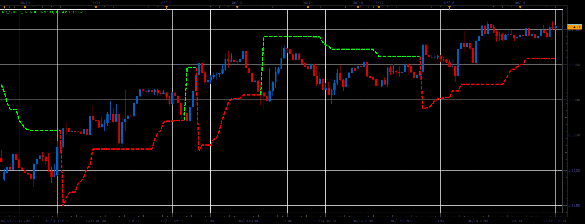

# Non Repainting Supertrend Indicator

> Source: https://fxcodebase.com/code/viewtopic.php?f=17&t=41453  
> Forum: 17 · Topic 41453 · 14 post(s)

---

## Non Repainting Supertrend Indicator

**Alexander.Gettinger** · Wed Jun 19, 2013 2:47 pm

Non-repainting supertrend indicator on the base of articles at [http://www.marketcalls.in/](http://www.marketcalls.in/) blog.

Formulas:
Up branch = Median price + Mulriplier*ATR(Period),
Dn branch = Median price + Mulriplier*ATR(Period).

 

Download:

 [NR_Super_Trend.lua](files/67701/NR_Super_Trend.lua)

 [NR_Super_Trend with Alert.lua](files/67701/NR_Super_Trend%20with%20Alert.lua)

MT4/MQ4 version
[viewtopic.php?f=38&t=65458&p=116509#p116509](https://fxcodebase.com/code/viewtopic.php?f=38&t=65458&p=116509#p116509)

---

## Re: Non Repainting Supertrend Indicator

**speakinmymind** · Thu Aug 22, 2013 12:50 pm

Could you please develop a strategy to trade on this indicator??

---

## Re: Non Repainting Supertrend Indicator

**Apprentice** · Fri Aug 23, 2013 2:00 am

Your request is added to the development list.

---

## Re: Non Repainting Supertrend Indicator

**Patrick Sweet** · Fri Aug 23, 2013 12:12 pm

I second the request for a strategy!
I have calibrated this against the atrtshl indicator (very similar) but this one provides a bit better filtering at lower periods.
Thanks!

---

## Re: Non Repainting Supertrend Indicator

**Apprentice** · Sat Aug 24, 2013 4:46 am

Requested strategy can be found here.
[viewtopic.php?f=31&t=59291](https://fxcodebase.com/code/viewtopic.php?f=31&t=59291)

---

## Re: Non Repainting Supertrend Indicator

**Stance** · Mon Jul 13, 2015 11:51 pm

Hi,

How to use this indicator?

BUY when the price is above the red line and SELL when it's below the green line?

---

## Re: Non Repainting Supertrend Indicator

**Apprentice** · Thu Jul 16, 2015 5:26 am

While personally I do not use indicator in my trading.
This seems like a reasonable approach.

---

## Re: Non Repainting Supertrend Indicator

**Apprentice** · Mon Jan 16, 2017 4:57 am

New Non Repainting Supertrend Indicator strategy is available here.
[viewtopic.php?f=31&t=64304](https://fxcodebase.com/code/viewtopic.php?f=31&t=64304)

---

## Re: Non Repainting Supertrend Indicator

**sliova** · Thu Dec 14, 2017 2:29 am

This indicator is great, especially when u want trade trend.

Can U add alert in this indicator and make a MT4 version? thks

---

## Re: Non Repainting Supertrend Indicator

**Apprentice** · Fri Dec 15, 2017 7:04 am

MQ4 bit was added to the development list under Id Number 3977

---

## Re: Non Repainting Supertrend Indicator

**Apprentice** · Fri Dec 15, 2017 7:30 am

NR_Super_Trend with Alert.lua added.

---

## Re: Non Repainting Supertrend Indicator

**Apprentice** · Sun Dec 17, 2017 6:38 am

MT4/MQ4 version
[viewtopic.php?f=38&t=65458&p=116509#p116509](https://fxcodebase.com/code/viewtopic.php?f=38&t=65458&p=116509#p116509)

---

## Re: Non Repainting Supertrend Indicator

**sliova** · Tue Dec 19, 2017 3:06 am

Great Job, thanks so much

---

## Re: Non Repainting Supertrend Indicator

**Apprentice** · Wed Jun 20, 2018 6:04 am

The Indicator was revised and updated.
