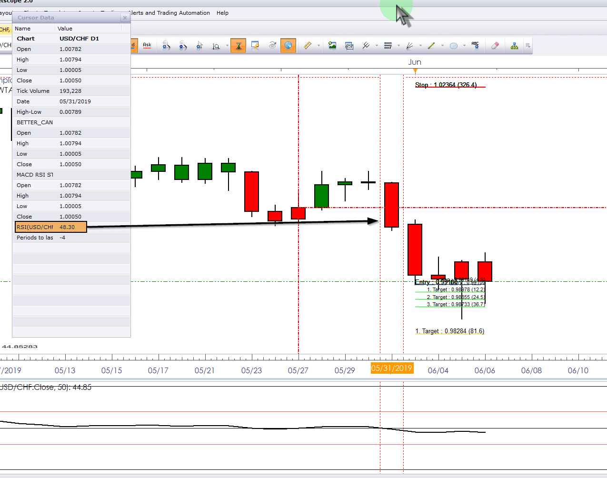

# Non-standard Timeframe PMO Helper wTargets

> Source: https://fxcodebase.com/code/viewtopic.php?f=17&t=68422  
> Forum: 17 · Topic 68422 · 17 post(s)

---

## Non-standard Timeframe PMO Helper wTargets

**Apprentice** · Tue May 07, 2019 7:11 am

Based on PMO.lua
[viewtopic.php?f=17&t=61209](https://fxcodebase.com/code/viewtopic.php?f=17&t=61209)
and request.
[viewtopic.php?f=27&t=68384](https://fxcodebase.com/code/viewtopic.php?f=27&t=68384)

 [Non-standard Timeframe PMO Helper wTargets.lua](files/126180/Non-standard%20Timeframe%20PMO%20Helper%20wTargets.lua)

---

## Re: Non-standard Timeframe PMO Helper wTargets

**jrichardson83** · Tue May 07, 2019 9:15 am

Something odd is happening. As I compress the chart (add more data) the indicator seems to calculate further back, like its repainting further back in time and not displaying the most recent signal.

---

## Re: Non-standard Timeframe PMO Helper wTargets

**Apprentice** · Thu May 09, 2019 1:03 pm

yes, it'll happen because FXTS2 limit the amount of data available to the indicator.
 I don't think it's possible to fix in the code.
The only way to fix it is to use higher timeframes which show all the data needed.

---

## Re: Non-standard Timeframe PMO Helper wTargets

**jrichardson83** · Fri May 17, 2019 6:02 pm

> **Apprentice wrote:**
> yes, it'll happen because FXTS2 limit the amount of data available to the indicator.
> I don't think it's possible to fix in the code.
> The only way to fix it is to use higher timeframes which show all the data needed.

Alright, thanks for giving it a go. I don't think that it'll be useful in the strategy I'm using because of the way it paints.

I'm wondering though, would the same problem arise if you programmed the targets algorithm for a standard RSI indicator, buy when RSI crosses above 50, sell when RSI crosses below? (See picture) If so, could you program this for me (and include the vertical line option).

 

---

## Re: Non-standard Timeframe PMO Helper wTargets

**Apprentice** · Sun May 19, 2019 4:10 am

How we will calculate Stop/Target levels?

---

## Re: Non-standard Timeframe PMO Helper wTargets

**jrichardson83** · Sun May 19, 2019 4:27 am

> **Apprentice wrote:**
> How we will calculate Stop/Target levels?

Well, what I was thinking was that you would base the stop relative to the last high or low from when the indicator conditions are met. For example, in the image, the RSI crosses below 50. The stop is placed at the most recent prior high and the target is set to a risk/reward of 1:1 (just as an example). This functionality would be similar to the way in which the PSAR Targets and Moving Average Target indicators work.

Is that possible with the RSI?

---

## Re: Non-standard Timeframe PMO Helper wTargets

**Apprentice** · Tue May 21, 2019 5:05 am

Your request is added to the development list under Id Number 4670

---

## Re: Non-standard Timeframe PMO Helper wTargets

**jrichardson83** · Sun Jun 02, 2019 8:48 pm

> **Apprentice wrote:**
> Your request is added to the development list under Id Number 4670

Just wanted to check on the status of this indie??

---

## Re: Non-standard Timeframe PMO Helper wTargets

**Apprentice** · Tue Jun 04, 2019 5:54 am

[RSI wTargets.lua](files/126695/RSI%20wTargets.lua)

Try this version.
Fixed an issue in Non-standard Timeframe PMO Helper wTargets.

---

## Re: Non-standard Timeframe PMO Helper wTargets

**jrichardson83** · Thu Jun 06, 2019 3:55 pm

> **Apprentice wrote:**
>
>
> The attachment **RSI wTargets.lua** is no longer available
>
>
> Try this version.
> Fixed an issue in Non-standard Timeframe PMO Helper wTargets.

I also noticed that this indie doesn't seem to be calculating correctly. In the image, the RSI last crossed below 50 on 05/31, but the indicator is painting, real time, the close on 06/03 and is repainting in real time as the price fluctuates on the current intraday candle of 06/06.

 

---

## Re: Non-standard Timeframe PMO Helper wTargets

**Apprentice** · Mon Jun 10, 2019 3:43 am

I don't have such an issue. It's likely that you are using different parameters for RSI and RSI wTargets

---

## Re: Non-standard Timeframe PMO Helper wTargets

**jrichardson83** · Thu Jun 13, 2019 1:17 am

> **Apprentice wrote:**
> I don't have such an issue. It's likely that you are using different parameters for RSI and RSI wTargets

Okay, I see what the issue was now. However, there is still the problem where the STOP is printing in the wrong place.See image

 

---

## Re: Non-standard Timeframe PMO Helper wTargets

**Apprentice** · Thu Jun 13, 2019 1:23 pm

Can't repeat that. What is the instrument/timeframe/parameters?

---

## Re: Non-standard Timeframe PMO Helper wTargets

**jrichardson83** · Thu Jun 13, 2019 3:08 pm

> **Apprentice wrote:**
> Can't repeat that. What is the instrument/timeframe/parameters?

Please see image for pair and parameters. This occurs on all pairs, however. Not just EURAUD. I wonder if its because of the RSI calculation period, maybe?? This should've printed a buy signal.

Thanks for your help!

 

---

## Re: Non-standard Timeframe PMO Helper wTargets

**Apprentice** · Thu Jun 20, 2019 7:41 am

Try this version.

 [RSI wTargets.lua](files/127003/RSI%20wTargets.lua)

---

## Re: Non-standard Timeframe PMO Helper wTargets

**jrichardson83** · Fri Jun 28, 2019 12:25 pm

> **Apprentice wrote:**
> Try this version.
>
>
> The attachment **RSI wTargets.lua** is no longer available

Something's wrong with the STOP. It's printing at an angle.

 

---

## Re: Non-standard Timeframe PMO Helper wTargets

**Apprentice** · Mon Jul 01, 2019 12:42 pm

Try it now.
