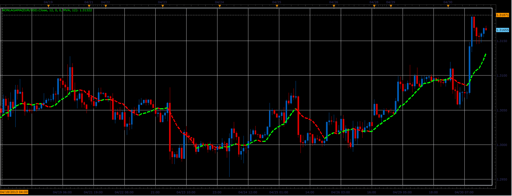

# NonLagAMA indicator

> Source: https://fxcodebase.com/code/viewtopic.php?f=17&t=36259  
> Forum: 17 · Topic 36259 · 2 post(s)

---

## NonLagAMA indicator

**Alexander.Gettinger** · Thu May 02, 2013 10:13 am

This indicator is ported MQL5 indicator from [http://www.mql5.com/ru/code/1655](http://www.mql5.com/ru/code/1655) (in Russian).

 

Download:

 [NonLagAMA.lua](files/60885/NonLagAMA.lua)

The indicator was revised and updated

---

## Re: NonLagAMA indicator

**Apprentice** · Thu May 11, 2017 1:34 pm

Indicator was revised and updated.
