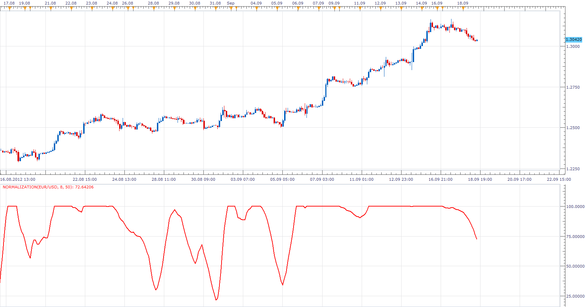
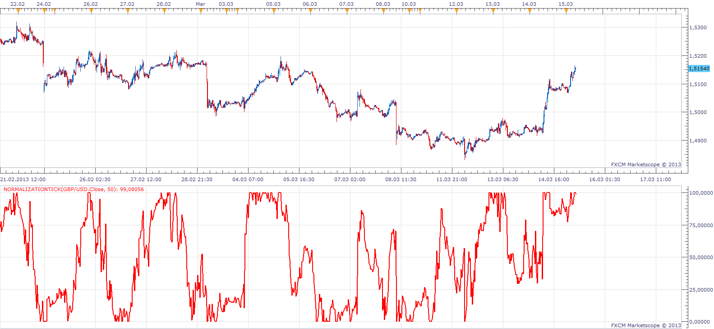
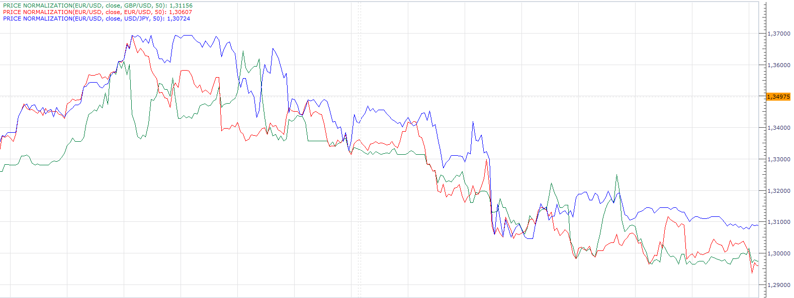

# Normalization

> Source: https://fxcodebase.com/code/viewtopic.php?f=17&t=23559  
> Forum: 17 · Topic 23559 · 7 post(s)

---

## Normalization

**Apprentice** · Tue Sep 18, 2012 3:19 pm

Having trouble comparing two values ​​of Price Action or indicator value.
Values ​​may be the same, but Market conditions have changed,
 Normalization is one of the tools that can help you in comparison.
This indicator provides three methods of normalization, "Standard Deviation," "ATR" and "Historical Range." Tickle version do not have ATR filter.
In his article "Normalization", Brian Bell introduces few methods for normalizing market Data.
As indicator source we use smoothed price.

 [Normalization.lua](files/40536/Normalization.lua)

 [NormalizationTick.lua](files/40536/NormalizationTick.lua)

---

## Re: Normalization

**Apprentice** · Fri Mar 15, 2013 7:12 am

These versions allow it to normalize unsmoothed data.
Historic algorithm, It is only available

 [Normalization Tick.lua](files/56624/Normalization%20Tick.lua)

 [Normalization Bar.lua](files/56624/Normalization%20Bar.lua)

---

## Re: Normalization

**Apprentice** · Fri Mar 15, 2013 7:54 am

This version allows you to use other time frames, currency pairs.
The proposed method of use.
Add several currency pairs on same chart.
This will show you in which phase is chosen currency
compared to other currencies.

 [MTF MCP Normalization.lua](files/56631/MTF%20MCP%20Normalization.lua)

---

## Re: Normalization

**Apprentice** · Fri Mar 15, 2013 8:51 am

This version allows you to compare, price action for the various instruments on Price Chart.

 [Price Normalization.lua](files/56634/Price%20Normalization.lua)

---

## Re: Normalization

**Apprentice** · Mon Jun 20, 2016 8:57 am

Minor Update.

---

## Re: Normalization

**Apprentice** · Sun Feb 05, 2017 4:32 am

Indicator was revised and updated.

---

## Re: Normalization

**Apprentice** · Mon Feb 05, 2018 9:36 am

The Indicator was revised and updated.
