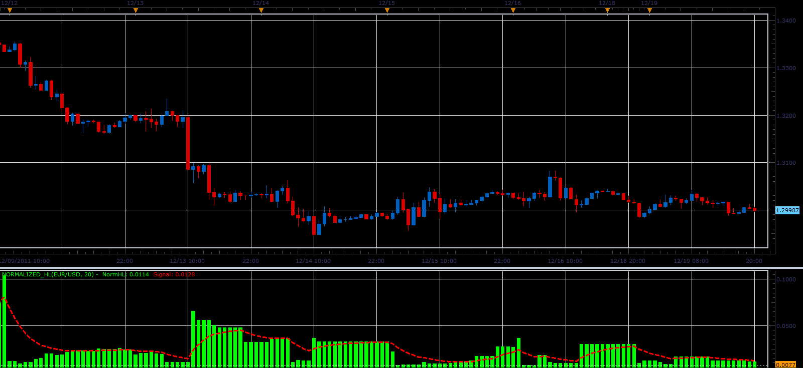

# Normalized HL range

> Source: https://fxcodebase.com/code/viewtopic.php?f=17&t=10151  
> Forum: 17 · Topic 10151 · 2 post(s)

---

## Normalized HL range

**Alexander.Gettinger** · Mon Dec 19, 2011 8:55 pm

The indicator shows the size of each candle and the average value.

Formulas:
NormHL[i]=High[i]-Low[i], if [Normalize] is false and
NormHL[i]=(High[i]-Low[i])/Abs(Time(High)-Time(Low)).

 

Download:

 [Normalized_HL.lua](files/21251/Normalized_HL.lua)

The indicator was revised and updated

---

## Re: Normalized HL range

**Apprentice** · Tue Mar 21, 2017 6:17 am

Indicator was revised and updated.
