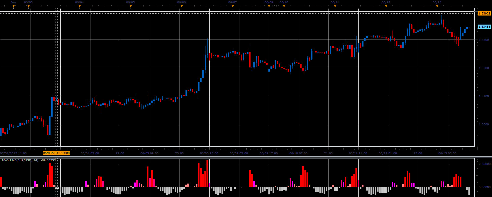

# Normalized volume

> Source: https://fxcodebase.com/code/viewtopic.php?f=17&t=41287  
> Forum: 17 · Topic 41287 · 2 post(s)

---

## Normalized volume

**Alexander.Gettinger** · Tue Jun 18, 2013 12:39 pm

This indicator is a ported MQL5 indicator from [http://www.mql5.com/en/code/1705](http://www.mql5.com/en/code/1705)

> The blue color indicates that the current volume is less than the average one for the period;
> The dark green color indicates a little increase of volume compared to the average one for the period;
> The light green color indicates that increase of volume overcame Fibo level of 38.2% compared to the average one for the period;
> The orange color indicates that increase of volume overcame Fibo level of 61,8% compared to the average one for the period;
> The yellow color indicates that increase of volume overcame Fibo level of 100% compared to the average one for the period;

 

Download:

 [NVolume.lua](files/67507/NVolume.lua)

The indicator was revised and updated

---

## Re: Normalized volume

**Apprentice** · Sat Mar 25, 2017 5:59 am

Indicator was revised and updated.
