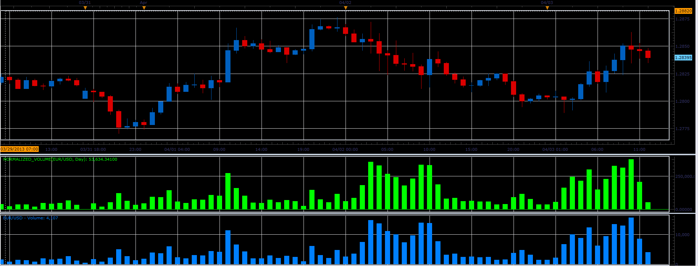

# Normalized volume

> Source: https://fxcodebase.com/code/viewtopic.php?f=17&t=34058  
> Forum: 17 · Topic 34058 · 3 post(s)

---

## Normalized volume

**Alexander.Gettinger** · Wed Apr 03, 2013 2:25 pm

The indicator normalizes the volume by time (number of ticks per minute, per hour, per day).

 

Download:

 [Normalized_Volume.lua](files/57897/Normalized_Volume.lua)

The indicator was revised and updated

---

## Re: Normalized volume

**Alexander.Gettinger** · Wed Apr 10, 2013 4:10 pm

MQL4 version of this indicator: [viewtopic.php?f=38&t=34361](https://fxcodebase.com/code/viewtopic.php?f=38&t=34361)

---

## Re: Normalized volume

**Apprentice** · Tue May 09, 2017 6:12 am

Indicator was revised and updated.
