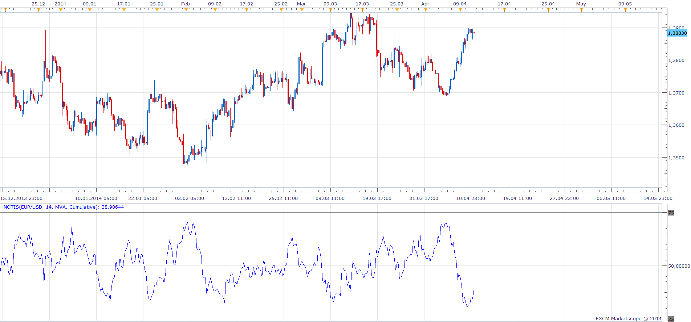

# NOTIS% V

> Source: https://fxcodebase.com/code/viewtopic.php?f=17&t=60533  
> Forum: 17 · Topic 60533 · 5 post(s)

---

## NOTIS% V

**Apprentice** · Sun Apr 13, 2014 3:45 am

> The Notis% V indicator provides an excellent opportunity to trade volatility based on the spread between the intraday high (High) and the daily low (Low) to measure. With the volatility, reversals and breakouts can be identified quickly and easily. The volatility is high when this margin between high and low is large and it is low when this margin is small.

 [NOTIS.lua](files/93496/NOTIS.lua)

The indicator was revised and updated

---

## Re: NOTIS% V

**Alexander.Gettinger** · Mon Jun 02, 2014 5:11 pm

MQL4 version of oscillator: [viewtopic.php?f=38&t=60763](https://fxcodebase.com/code/viewtopic.php?f=38&t=60763).

---

## Re: NOTIS% V

**rplust** · Thu Jun 26, 2014 4:59 am

> **Alexander.Gettinger wrote:**
> MQL4 version of oscillator: [viewtopic.php?f=38&t=60763](https://fxcodebase.com/code/viewtopic.php?f=38&t=60763).

Hi, could you create a mirror image of this incdcator (Mq4 and Lua). Having a difficult time to think opposite. Thanks.

---

## Re: NOTIS% V

**Apprentice** · Tue Jul 08, 2014 3:43 am

Inverse parameter is added to the cumulative.

---

## Re: NOTIS% V

**Apprentice** · Sun Jun 25, 2017 1:12 pm

The indicator was revised and updated.
