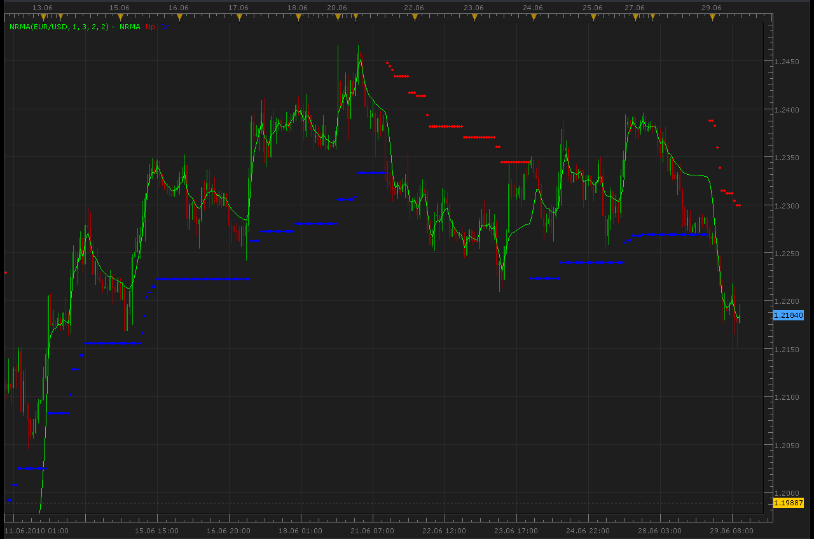

# NRMA indicator

> Source: https://fxcodebase.com/code/viewtopic.php?f=17&t=1427  
> Forum: 17 · Topic 1427 · 2 post(s)

---

## NRMA indicator

**Alexander.Gettinger** · Tue Jun 29, 2010 10:58 am

NRMA is the famous indicator by Konstantin Kopyrkin, it produced numerous realizations of the indicator NRTR. In this variant we see a moving average (line) and trailing stops NRTR (points).

 

The indicator was revised and updated

---

## Re: NRMA indicator

**Apprentice** · Sun Jan 08, 2017 6:36 am

Indicator was revised and updated.
