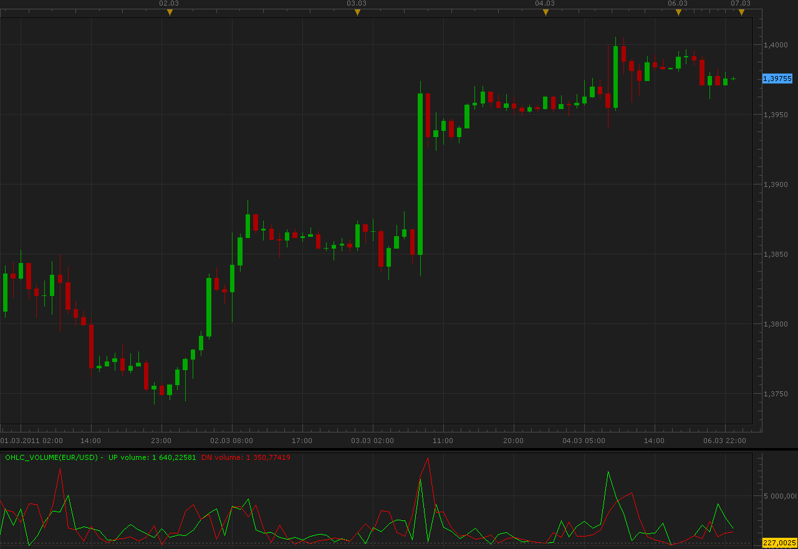
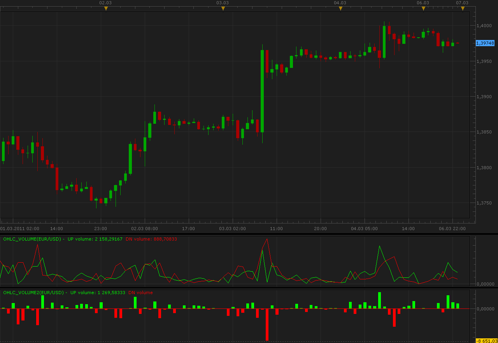

# OHLC Volume

> Source: https://fxcodebase.com/code/viewtopic.php?f=17&t=3611  
> Forum: 17 · Topic 3611 · 3 post(s)

---

## OHLC Volume

**Alexander.Gettinger** · Sun Mar 06, 2011 11:39 pm

Indicator separate volume in correspondence to open, close, high and low values of bar.

Formulas:
UP volume=Volume*UP_Coeff/(UP_Coeff+DN_Coeff),
DN volume=Volume*DN_Coeff/(UP_Coeff+DN_Coeff), where
UP_Coeff=High-Open,
DN_Coeff=Close-Low.

 

Download:

 [OHLC_Volume.lua](files/8677/OHLC_Volume.lua)

MT4/Mq4 version
[viewtopic.php?f=38&t=64529&p=111508#p111508](https://fxcodebase.com/code/viewtopic.php?f=38&t=64529&p=111508#p111508)

The indicator was revised and updated

---

## Re: OHLC Volume

**Alexander.Gettinger** · Sun Mar 06, 2011 11:42 pm

Other version of OHLC volume.
Oscillator show difference between UP and DN volume form previous indicator.

 

Download:

 [OHLC_Volume2.lua](files/8678/OHLC_Volume2.lua)

---

## Re: OHLC Volume

**Apprentice** · Fri Mar 03, 2017 8:51 am

Indicator was revised and updated.
