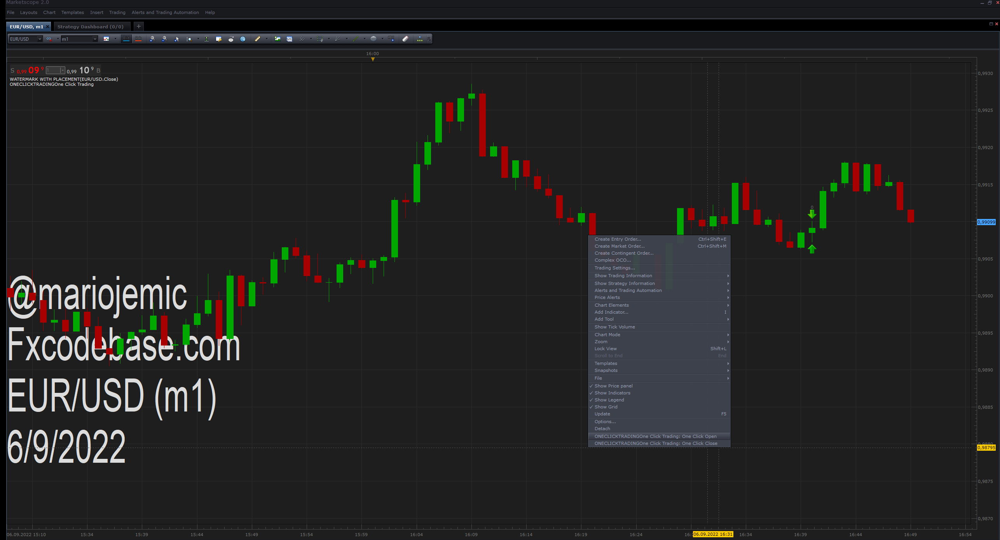
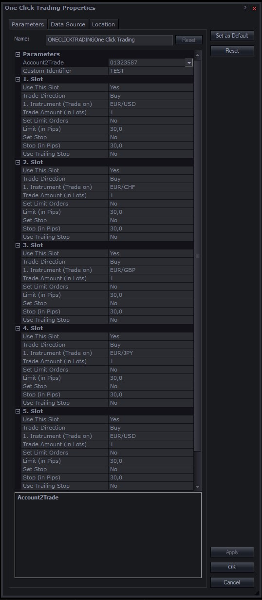

# One Click Trading

> Source: https://fxcodebase.com/code/viewtopic.php?f=17&t=72701  
> Forum: 17 · Topic 72701 · 4 post(s)

---

## One Click Trading

**Apprentice** · Tue Sep 06, 2022 10:52 am

 

Based on the request.
[https://fxcodebase.com/code/viewtopic.php?f=27&p=147355](https://fxcodebase.com/code/viewtopic.php?f=27&p=147355)

Will allow you to pre-define up to 5 trades,
and open them simultaneously with one mouse click.
Have the option to close all trades with the same id.

 [OneClickTrading.lua](files/147370/OneClickTrading.lua)

MT4 version.
[https://fxcodebase.com/code/viewtopic.php?f=38&t=72734](https://fxcodebase.com/code/viewtopic.php?f=38&t=72734)

---

## Re: One Click Trading

**tutumlgb** · Tue Sep 06, 2022 2:27 pm

> **Apprentice wrote:**
>
>
> 1.png
>
>
>
>
> 2.jpg
>
>
> Based on the request.
> [https://fxcodebase.com/code/viewtopic.php?f=27&p=147355](https://fxcodebase.com/code/viewtopic.php?f=27&p=147355)
>
> Will allow you to pre-define up to 5 trades,
> and open them simultaneously with one mouse click.
> Have the option to close all trades with the same id.
>
>
>
> OneClickTrading.lua

CAN YOU MAKE ANOTHER FOR MT4

---

## Re: One Click Trading

**Apprentice** · Thu Sep 08, 2022 2:12 am

We have added your request to the development list.
Development reference 546.

---

## Re: One Click Trading

**Apprentice** · Wed Sep 21, 2022 1:42 am

MT4 version.
[https://fxcodebase.com/code/viewtopic.php?f=38&t=72734](https://fxcodebase.com/code/viewtopic.php?f=38&t=72734)
