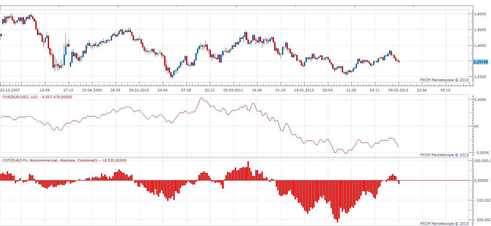

# Open Interest Approximation

> Source: https://fxcodebase.com/code/viewtopic.php?f=17&t=33316  
> Forum: 17 · Topic 33316 · 4 post(s)

---

## Open Interest Approximation

**Apprentice** · Thu Mar 14, 2013 7:49 am

As shown by a comparative chart
Open Interest Approximation, and COT, have a high degree of correlation.
U can use Open Interest Approximation for istruments in cases where Open Interest or and COT are unavailable.

 [OIA.bin](files/56559/OIA.bin)

---

## Re: Open Interest Approximation

**nsaale** · Mon Apr 01, 2013 5:07 am

how does this indicator work? should one buy when it is increasing and sell when it i s decreasing?

Again do negative and positive values indicate regions?

---

## Re: Open Interest Approximation

**Apprentice** · Tue Apr 02, 2013 6:36 am

Open Interest, COT will give you information about the current positions, Long /Short Ratio, for observed Traders/investors.
A positive/negativ value, the change in slope can provide a trade signal.
This type of indicators will not have classical Overbought / Oversold zones.

Positive
Long positions prevail.
Negative
Short positions prevail.

Changes are gradual, slope alone can give early indication.

You can interpret the ratio as Tide, and Slope as Wave.

---

## Re: Open Interest Approximation

**Apprentice** · Wed May 10, 2017 5:31 am

Indicator was revised and updated.
