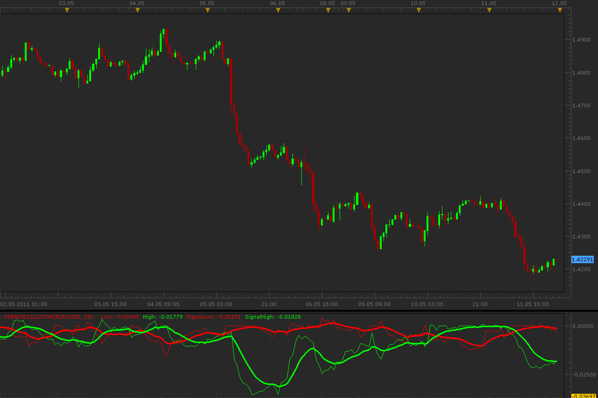

# Open oscillator

> Source: https://fxcodebase.com/code/viewtopic.php?f=17&t=4202  
> Forum: 17 · Topic 4202 · 2 post(s)

---

## Open oscillator

**Alexander.Gettinger** · Wed May 11, 2011 10:11 pm

Formulas:
Low[i]=Open[MinPos]-Open[i],
High[i]=Open[i]-Open[MaxPos], where
MinPos is a position of minimum Low price in range from (i-Period) to (i),
MaxPos is a position of maximum High price in range from (i-Period) to (i).

Also oscillator have a 2 signal line (EMA with [SignalPeriod]).

 

Download:

 [OpenOscillator.lua](files/10544/OpenOscillator.lua)

The indicator was revised and updated

---

## Re: Open oscillator

**Apprentice** · Sun Mar 12, 2017 5:54 pm

Indicator was revised and updated.
