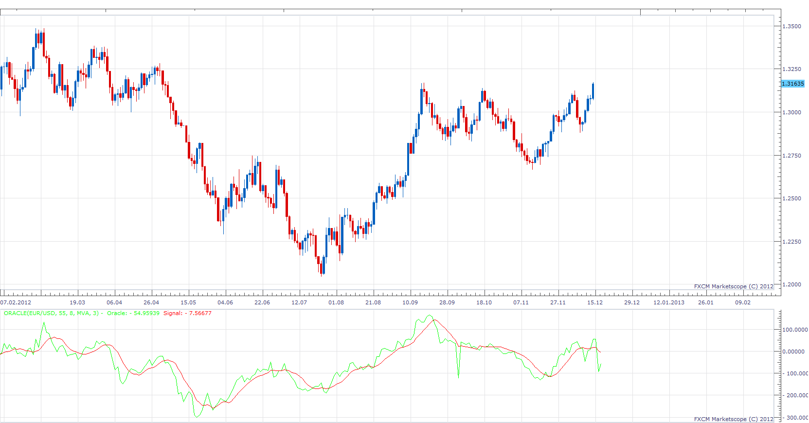

# Oracle

> Source: https://fxcodebase.com/code/viewtopic.php?f=17&t=27743  
> Forum: 17 · Topic 27743 · 2 post(s)

---

## Oracle

**Apprentice** · Sun Dec 16, 2012 6:13 am

Written upon request from user.
More on this indicator can be found here.
[http://www.mql5.com/en/code/1178](http://www.mql5.com/en/code/1178)

 [Oracle.lua](files/48589/Oracle.lua)

Warning, this indicator redraws, after each period.

The indicator was revised and updated

---

## Re: Oracle

**Apprentice** · Fri Apr 21, 2017 6:44 am

Indicator was revised and updated.
