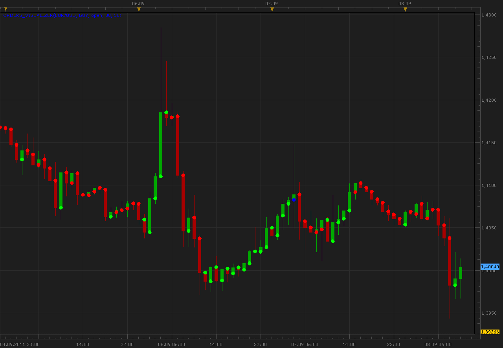

# Orders visualizer

> Source: https://fxcodebase.com/code/viewtopic.php?f=17&t=6395  
> Forum: 17 · Topic 6395 · 5 post(s)

---

## Orders visualizer

**Alexander.Gettinger** · Thu Sep 08, 2011 9:50 am

The indicator shows the result of orders with the specified parameters, open the opening / closing of the candle.

 

The parameters of orders are defined as a parameters of indicator.
Green dot corresponds to profitable results, red - unprofitable results, blue - unknown results.
Unknown results occur when a limit and stop orders are executed at one bar.

Download:

 [Orders_Visualizer.lua](files/14685/Orders_Visualizer.lua)

The indicator was revised and updated

---

## Re: Orders visualizer

**Hailkayy** · Sat Apr 14, 2012 10:24 pm

Please make a strategy of it so i can backtest this

---

## Re: Orders visualizer

**Apprentice** · Mon Apr 16, 2012 3:45 am

Can you be more eloquent, and describe this strategy.

---

## Re: Orders visualizer

**Hailkayy** · Mon Apr 16, 2012 6:11 am

I would like to backtest this indicator

 Period tested : i.e 60 periods
The limit : i.e 30 pips
The SL : i.e O or 30 or 10000 (infinite)

And then see the results on a account

I guess you understand
tks

---

## Re: Orders visualizer

**Apprentice** · Mon Apr 03, 2017 6:06 am

Indicator was revised and updated.
