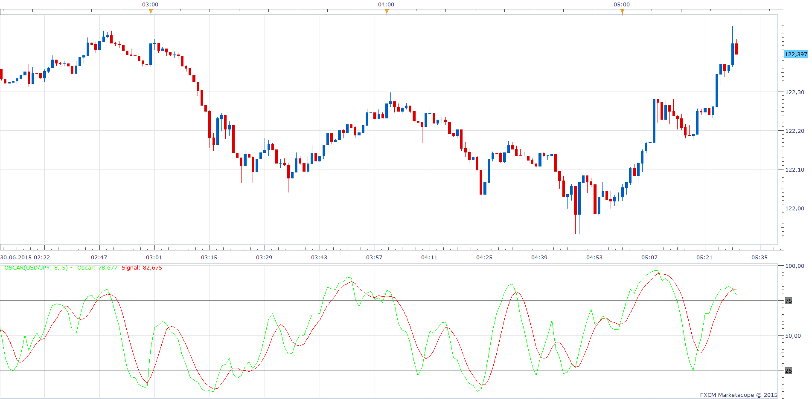

# Oscar

> Source: https://fxcodebase.com/code/viewtopic.php?f=17&t=62379  
> Forum: 17 · Topic 62379 · 8 post(s)

---

## Oscar

**Apprentice** · Tue Jun 30, 2015 5:05 am

Based on request.
[viewtopic.php?f=27&t=62371](https://fxcodebase.com/code/viewtopic.php?f=27&t=62371)

 [Oscar.lua](files/101224/Oscar.lua)

---

## Re: Oscar

**mulligan** · Mon Dec 21, 2015 5:30 am

This is the best scalping indicator I've seen in a long time. An alert for signal line cross and OB and OS cross would be great.

Thanks

---

## Re: Oscar

**Apprentice** · Tue Dec 22, 2015 4:48 am

Alert functionality added.

---

## Re: Oscar

**Ehab.Ali** · Wed Jun 01, 2016 7:46 am

> **mulligan wrote:**
> This is the best scalping indicator I've seen in a long time. An alert for signal line cross and OB and OS cross would be great.
>
> Thanks

what is the best frame time to use on it in your opinion for scalping

thanks

---

## Re: Oscar

**Ehab.Ali** · Wed Jun 01, 2016 8:31 am

> **Apprentice wrote:**
> Alert functionality added.

can we have strategy for the oscar indecator ??

---

## Re: Oscar

**Apprentice** · Thu Jun 02, 2016 2:43 am

Try this version.
[viewtopic.php?f=31&t=63552](https://fxcodebase.com/code/viewtopic.php?f=31&t=63552)

---

## Re: Oscar

**Ehab.Ali** · Thu Jun 02, 2016 4:51 am

> **Apprentice wrote:**
> Try this version.
> [viewtopic.php?f=31&t=63552](https://fxcodebase.com/code/viewtopic.php?f=31&t=63552)

thank you for the quick respond

---

## Re: Oscar

**Apprentice** · Fri Sep 14, 2018 5:44 am

The indicator was revised and updated.
