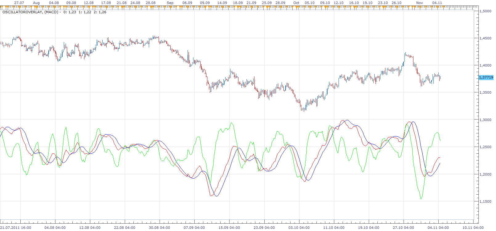

# Oscillator Price Overlay

> Source: https://fxcodebase.com/code/viewtopic.php?f=17&t=7412  
> Forum: 17 · Topic 7412 · 4 post(s)

---

## Oscillator Price Overlay

**Apprentice** · Wed Oct 19, 2011 9:39 am

Popular demand is an indicator that has the ability to add Oscillatora on Main (Price) Chart.
This is a conceptual indicator, which has this capability.
Its purpose is to examine current limitations.
Improved versions are certain in the near future.

 [OscillatorOverlay.lua](files/16470/OscillatorOverlay.lua)

The indicator was revised and updated

---

## Can't see both orice and oscilator.

**Rectav** · Wed Oct 19, 2011 2:41 pm

Hello Apprentice,

and thanks for this indicator. Really great one. Here are my findings in terms of future improvement:

I need to squeeze my chart a lot to be able to see both price and the oscilator.

Regards,

Sam.

---

## Re: Oscillator Price Overlay

**Apprentice** · Sun Nov 06, 2011 12:28 pm

Indicator improvement.
I added the possibility of positioning.
Central, Top, Bottom.
Adaptation algorithm has been improved.

---

## Re: Oscillator Price Overlay

**Apprentice** · Fri Mar 17, 2017 7:51 am

Indicator was revised and updated.
