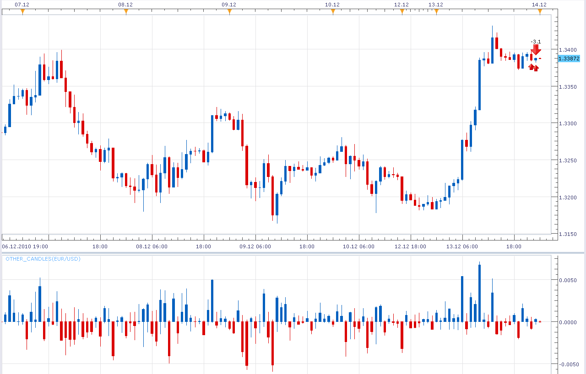
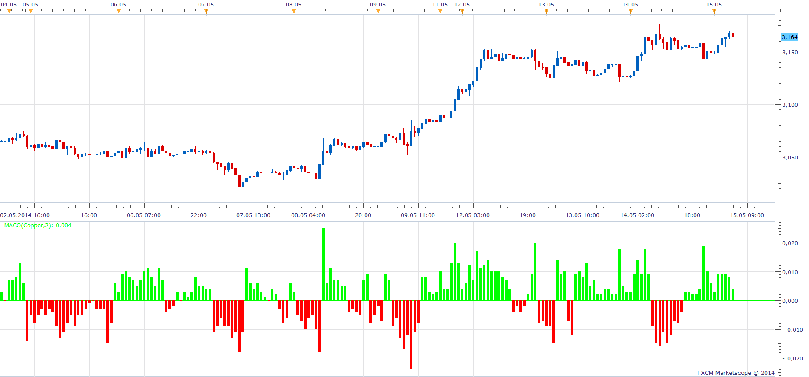

# Other candles

> Source: https://fxcodebase.com/code/viewtopic.php?f=17&t=2949  
> Forum: 17 · Topic 2949 · 3 post(s)

---

## Other candles

**Alexander.Gettinger** · Tue Dec 14, 2010 12:11 am

This indicator draw candles from central line.

 

Download:

 [Other_Candles.lua](files/6746/Other_Candles.lua)

The indicator was revised and updated

---

## Market Action & Contrast Oscillator (MACO)

**Apprentice** · Thu May 15, 2014 4:18 am

 

Based on the request.
[viewtopic.php?f=27&t=60683](https://fxcodebase.com/code/viewtopic.php?f=27&t=60683)
After N consecutive candles in the same direction.
MACO will be shifted to in this direction.
MACO and Candle Range (High-Low)

 [MACO.lua](files/94017/MACO.lua)

---

## Re: Other candles

**Apprentice** · Tue Jul 18, 2017 6:37 am

The indicator was revised and updated.
