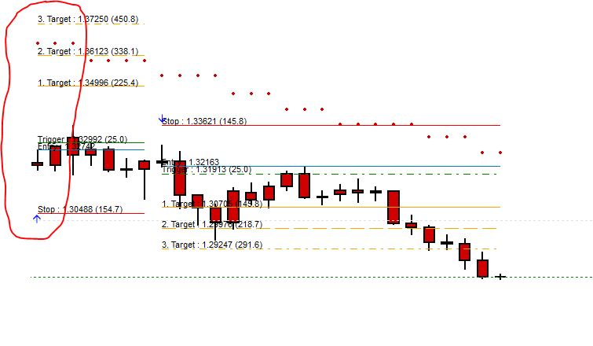
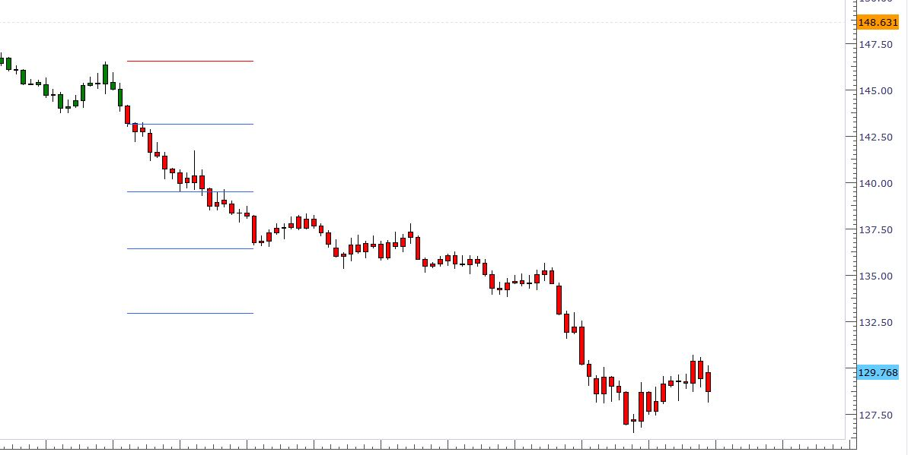

# Other Time Frame SAR Price Targets

> Source: https://fxcodebase.com/code/viewtopic.php?f=17&t=65883  
> Forum: 17 · Topic 65883 · 12 post(s)

---

## Other Time Frame SAR Price Targets

**Apprentice** · Sat Apr 07, 2018 4:41 pm

Based on the request.
[viewtopic.php?f=27&t=65879](https://fxcodebase.com/code/viewtopic.php?f=27&t=65879)

 [Other Time Frame SAR.lua](files/118517/Other%20Time%20Frame%20SAR.lua)

 [Other Time Frame SAR Price Targets.lua](files/118517/Other%20Time%20Frame%20SAR%20Price%20Targets.lua)

---

## Re: Other Time Frame SAR Price Targets

**jrichardson83** · Thu Aug 09, 2018 8:15 pm

Hey Apprentice. I noticed sometime ago that there seems to be a slight discrepancy between the SAR and the SAR Price Targets for this custom indie. You'll see in the screen shot there an Entry has been printed (LONG) while the SAR is still indicating a downtrend. Both the SAR and the SAR Price Targets, in this picture, are set to D5, 0.01 and Max Step O.2.

 

---

## Re: Other Time Frame SAR Price Targets

**Apprentice** · Sat Aug 11, 2018 5:49 am

Your request is added to the development list under Id Number 4224

---

## Re: Other Time Frame SAR Price Targets

**Apprentice** · Sun Aug 12, 2018 3:53 am

Fixed.

---

## Re: Other Time Frame SAR Price Targets

**jrichardson83** · Thu Aug 16, 2018 2:00 pm

> **Apprentice wrote:**
> Fixed.

Hey Apprentice, thanks for working on this. It seems its still off a bit. In the image you'll see that the entry paints about 16 bars after the initial PSAR prints. I noticed that anything above "D2" winds up with the two indicators printing out of alignment. That got me thinking, would it be possible to just combine the two? So that when the parabolic SAR prints the targets also print at the same time within the same indicator?

Thanks

 

 

---

## Re: Other Time Frame SAR Price Targets

**jrichardson83** · Sun Sep 09, 2018 8:27 pm

Is it going to be possible to have these two indicators combined into one?

---

## Re: Other Time Frame SAR Price Targets

**jrichardson83** · Sat Sep 22, 2018 1:33 pm

> **Apprentice wrote:**
> Fixed.

Just wondering if this was still being worked on? Combining these two indicators into one.

---

## Re: Other Time Frame SAR Price Targets

**Gilles** · Thu Jul 18, 2019 3:02 pm

Hi, Apprentice !

Please a SAR Price Target Strategy !

See you soon !

---

## Re: Other Time Frame SAR Price Targets

**Apprentice** · Sun Jul 21, 2019 4:47 am

Can you please define trading logic?

---

## Re: Other Time Frame SAR Price Targets

**jrichardson83** · Mon Aug 26, 2019 10:27 am

Hey Apprentice,

Could you create an iteration of this indie using the CCI? Basically, buy/sell entry at crossover/under of ZERO line with stop place at prior high/low. See attachment for an example.

Thanks

 

---

## Re: Other Time Frame SAR Price Targets

**Apprentice** · Tue Aug 27, 2019 7:16 am

Your request is added to the development list.
 Internal developer reference 3.

---

## Re: Other Time Frame SAR Price Targets

**Apprentice** · Thu Aug 29, 2019 5:19 am

Try this version.
[viewtopic.php?f=17&t=68858](https://fxcodebase.com/code/viewtopic.php?f=17&t=68858)
