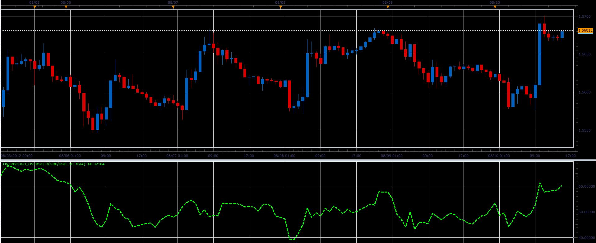

# Overbought and oversold indicator

> Source: https://fxcodebase.com/code/viewtopic.php?f=17&t=22268  
> Forum: 17 · Topic 22268 · 12 post(s)

---

## Overbought and oversold indicator

**Alexander.Gettinger** · Fri Aug 10, 2012 2:42 pm

Formula:
Overbought_Oversold=(MA/ATR)*100, where
MA - moving average for (Close-Low) with Length as period,
ATR - average true range with Length as period.

 

Download:

 [Overbough_Oversold.lua](files/38504/Overbough_Oversold.lua)

The indicator was revised and updated

---

## Re: Overbought and oversold indicator

**Blackcat2** · Fri Aug 10, 2012 3:21 pm

How to read/interpret this indicator?

What is the overbought and oversold level?

Cheers..
BC

---

## Re: Overbought and oversold indicator

**Jeffreyvnlk** · Sun Aug 26, 2012 12:14 pm

Sorry, i can not load that indicator, the message as following:

Uploaded with [ImageShack.us](http://imageshack.us)

---

## Re: Overbought and oversold indicator

**Ekaterina** · Sun Aug 26, 2012 11:56 pm

Hi Jeffreyvnlk ,

Please load the indicator from the attachment below. That should solve the problem:

 [Averages.lua](files/39234/Averages.lua)

Best regards,
Ekaterina

---

## Re: Overbought and oversold indicator

**Jeffreyvnlk** · Wed Apr 10, 2013 6:49 pm

Appreciated if you could add 2 levels for overbought and oversold.Thanks

---

## Re: Overbought and oversold indicator

**Apprentice** · Fri Apr 12, 2013 4:17 am

overbought, oversold levels added.

---

## Re: Overbought and oversold indicator

**Jeffreyvnlk** · Thu Apr 25, 2013 3:18 am

If you want to know, this kind of alternative %R

---

## Re: Overbought and oversold indicator

**Apprentice** · Fri Apr 26, 2013 10:54 am

Can you explain this post ...

---

## Re: Overbought and oversold indicator

**Jeffreyvnlk** · Sun Apr 28, 2013 4:13 pm

> **Apprentice wrote:**
> Can you explain this post ...

Original Post : OB/OS relating to MVA(Close-Low)/ ATR (H-L)

and

%R ~ (H-C)/ (H-L)

The indicator made in this topic dealing with Low whereas %R High so both sort of same

---

## Re: Overbought and oversold indicator

**Apprentice** · Mon Apr 29, 2013 5:16 am

Alex is using this formula it his indicator.
OBOS =100* MA of (close - low) / ATR (Price)
Price is not H-L
Can you once again write forumulu that you want to use.
Is it.
%R ~ (H-C)/ (H-L)

---

## Re: Overbought and oversold indicator

**Jeffreyvnlk** · Mon Apr 29, 2013 11:44 am

> **Apprentice wrote:**
> Alex is using this formula it his indicator.
> OBOS =100* MA of (close - low) / ATR (Price)
> Price is not H-L
> Can you once again write forumulu that you want to use.
> Is it.
> %R ~ (H-C)/ (H-L)

Sorry for making it messy but i think ATR have some components dealing with H and L. Of course it is not so directly as %R case. If i am wrong, please correct me.Thanks

---

## Re: Overbought and oversold indicator

**Apprentice** · Thu May 11, 2017 1:44 pm

Indicator was revised and updated.
