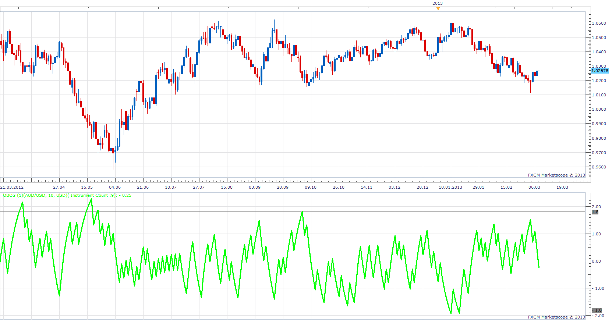

# Overbought/Oversold Indicator

> Source: https://fxcodebase.com/code/viewtopic.php?f=17&t=32888  
> Forum: 17 · Topic 32888 · 8 post(s)

---

## Overbought/Oversold Indicator

**Apprentice** · Thu Mar 07, 2013 4:19 pm

The Overbought/Oversold ("OB/OS") indicator is a market breadth indicator based on the smoothed difference between advancing and declining currency pairs against the base currency.

As with all OB/OS-type indicators, extreme readings may be a sign of a change in investor expectations and may not be followed by the expected correction.

 [OBOS.lua](files/55947/OBOS.lua)

---

## Re: Overbought/Oversold Indicator

**Blackcat2** · Thu Mar 07, 2013 5:13 pm

What is the overbought and oversold values? Can it be customised?

Cheers..
BC

---

## Re: Overbought/Oversold Indicator

**Apprentice** · Thu Mar 07, 2013 6:23 pm

Not really. I add an additional parameter. Please update.
It seems 20 percent of total number of istruments is a good start.
OB / OS level can vary depending on the number of Instruments included in the calculation.

---

## Re: Overbought/Oversold Indicator

**Apprentice** · Wed May 03, 2017 2:47 pm

Indicator was revised and updated.

---

## Re: Overbought/Oversold Indicator

**xyz1453** · Fri May 05, 2017 9:10 pm

Hi,
Is the mql4 version of this indi available?

---

## Re: Overbought/Oversold Indicator

**Apprentice** · Sat May 06, 2017 3:59 am

No.

Your request is added to the development list, Under Id Number 3795
 If someone is interested to do this task, please contact me.

---

## Re: Overbought/Oversold Indicator

**Alexander.Gettinger** · Wed Aug 16, 2017 5:14 pm

> **xyz1453 wrote:**
> Hi,
> Is the mql4 version of this indi available?

Yes.
Try this: [viewtopic.php?f=38&t=23087&p=39787](https://fxcodebase.com/code/viewtopic.php?f=38&t=23087&p=39787)

---

## Re: Overbought/Oversold Indicator

**Apprentice** · Wed Feb 21, 2018 6:09 am

The Indicator was revised and updated.
