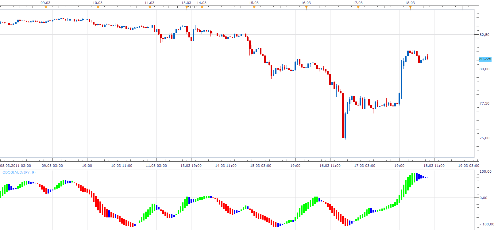
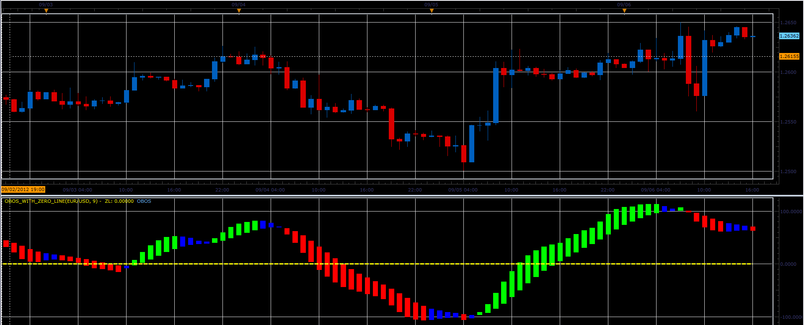

# Overbought/Oversold Indicator

> Source: https://fxcodebase.com/code/viewtopic.php?f=17&t=3664  
> Forum: 17 · Topic 3664 · 34 post(s)

---

## Overbought/Oversold Indicator

**Apprentice** · Fri Mar 18, 2011 7:05 am

 [OBOS.lua](files/8869/OBOS.lua)

 [OBOS Indicator.lua](files/8869/OBOS%20Indicator.lua)

 

 [OBOS Overlay.lua](files/8869/OBOS%20Overlay.lua)

 [OBOS Overlay with Alert.lua](files/8869/OBOS%20Overlay%20with%20Alert.lua)

MT4/MQ4 version.
[viewtopic.php?f=38&t=65682](http://www.fxcodebase.com/code/viewtopic.php?f=38&t=65682)

---

## Re: Overbought/Oversold Indicator

**Faalaakh** · Fri Mar 18, 2011 8:10 am

Dear Apprentice
how does this differ/match compared to stochastic? Are there any instructions (or specific settings) for any timeframe?

---

## Re: Overbought/Oversold Indicator

**Apprentice** · Fri Mar 18, 2011 2:23 pm

Unfortunately, I can not give you a good answer.
I've got only a brief description of the indicator and its formula.

[http://www.wisestocktrader.com/indicato ... -indicator](http://www.wisestocktrader.com/indicators/579-overbought-oversold-indicator)

---

## Re: Overbought/Oversold Indicator

**luigipg** · Fri Apr 29, 2011 1:34 am

Hi Apprentice, can you get the signal for this indicator? (which, in my opinion, is underrated) Every time the bar will change color, "Buy" signal, "Neutral" signal and "Sell" signal. Also where can I find the signal for the Voltychannel_Stop? I downloaded it but it doesn't work. Thanks for everything especially for your great work. Luigi!

---

## Re: Overbought/Oversold Indicator

**Apprentice** · Fri Apr 29, 2011 6:00 am

Your request has been added to developmental cue.

---

## Re: Overbought/Oversold Indicator

**Apprentice** · Fri Apr 29, 2011 6:02 am

Voltychannel_Stop Strategy can be found here.
[viewtopic.php?f=31&t=2208&hilit=Voltychannel_Stop](https://fxcodebase.com/code/viewtopic.php?f=31&t=2208&hilit=Voltychannel_Stop)
Voltychannel_Stop Signal can be found here.
[viewtopic.php?f=29&t=1061](https://fxcodebase.com/code/viewtopic.php?f=29&t=1061)

---

## Re: Overbought/Oversold Indicator

**RJH501** · Fri Aug 17, 2012 2:51 pm

Hello Apprentice,

Would you or one of your collegues please develop a strategy using the OBOS indicator.

Buy = on a change from Overbought to Buy indicator candle
Sell = on a change from Oversold to Sell indicator candle

Also include:
1. Price Type & Time Frame
2. Time of Day to open and close the strategy
 * Start time for trading
 * Stop time for trading
 * Use mandatory closing
 * Mandatory closing time
 * Valid interval for operation
3. OBOS Price Source & Period
4. Type of Signal
5. Trading Parameters:
 * Allow strategy to trade
 * Allowed side
 * Allow multiple
 * Account to trade
 * Trade amount in lots
 * Set limit order
 * Limit order in pips
 * Set stop orders
 * Stop order pips
 * Trailing stop order
7. Alerts:
 * Show alert
 * Play sound
 * Sound file
 * Reccurant sound
 * Send email
 * Email

Thanks in advance!!

RJH

---

## Re: Overbought/Oversold Indicator

**RJH501** · Fri Aug 17, 2012 3:14 pm

Hello Apprentice;

Would you add three horizontal lines on the OBOS indicator and their value:

Default values would be:

1 line at 100
1 line at -100
1 line at 0 (zero)

User should have ability to select line width, style and color.

These changes will make the indicator a bit mor usefull.

Thanks in advance!

RJH

---

## Re: Overbought/Oversold Indicator

**RJH501** · Fri Aug 17, 2012 3:25 pm

Hello Apprentice;

Regarding my previous post on developing a strategy for this indicator:

Buy = 2 or more Oversold candles change to Buy candle
Sell = 2 or more Overbought candles change to Sell candle

This is needed to filter out a few false or uneeded trades caused when a single overbought/oversold candle appears in a trend.

Thank you!

RJH

---

## Re: Overbought/Oversold Indicator

**RJH501** · Sat Aug 18, 2012 9:33 am

Hello Apprentice;

My apologies for making an additional change to the buy/sell signal. After reviewing the indicator at several periods on severall time frames it became apparent that buy and sell with the overbought/oversold candles will give too many false signals.

A better approach would be to use the horizontal lines 0, 100, & -100 (or whatever the user selects as overbought/oversold) to create the buy and sell signal.

For Example:

Buy signal one could occur when Green candle crosses overbought line up.
Buy signal two could occur when Green candle crosses center line up.
Buy signal three could occur when Green candle crosses oversold line up.

Sell signal one could occur when Red candle crooses oversold line down.
Sell signal two could occur when Red candle crosses center line down.
Sell signal three could occur when Red candle crosses oversold line down.

I will follow up with a graphical view later today.

Thank you for your assitance and consideration.

RJH

---

## Re: Overbought/Oversold Indicator

**Apprentice** · Mon Aug 20, 2012 2:13 am

Your request is added to the development list.

---

## Re: Overbought/Oversold Indicator

**elsigis** · Mon Aug 20, 2012 7:27 am

This is a great indicator!
I discovered that one can use the longer term period settings of 10 and above for swing or trend trading and the shorter term periods, 3 to 9 for scalping.
Could could you include a line at the 0.00 point so that when momentum/trend shifts to the upside or downside it would be obvious.
Thanks.

---

## Re: Overbought/Oversold Indicator

**Apprentice** · Wed Aug 22, 2012 2:05 am

Your request is added to the development list.

---

## Re: Overbought/Oversold Indicator

**Alexander.Gettinger** · Thu Sep 06, 2012 2:58 pm

> **elsigis wrote:**
> This is a great indicator!
> I discovered that one can use the longer term period settings of 10 and above for swing or trend trading and the shorter term periods, 3 to 9 for scalping.
> Could could you include a line at the 0.00 point so that when momentum/trend shifts to the upside or downside it would be obvious.
> Thanks.

Please, see this version of indicator.

 

Download:

 [OBOS_with_zero_line.lua](files/39786/OBOS_with_zero_line.lua)

---

## Re: Overbought/Oversold Indicator

**Alexander.Gettinger** · Thu Sep 06, 2012 3:07 pm

MQL4 version of this indicator: [viewtopic.php?f=38&t=23087](https://fxcodebase.com/code/viewtopic.php?f=38&t=23087)

---

## Re: Overbought/Oversold Indicator

**southflm11** · Thu Aug 21, 2014 12:57 pm

Apprentice, This Newer Overbought and Oversold Indicator would be a good Strategy. I have had it on many chart's and timeframes and looks really good on the 4 hour chart will include a pic .would it be possible to have it go long when it turns green and it will stay in the trade till it turns red and then it will go short .The blue won't have any affect .
 Mark

---

## Re: Overbought/Oversold Indicator

**Apprentice** · Fri Aug 22, 2014 4:48 am

Requested can be found here.
[viewtopic.php?f=31&t=61064](https://fxcodebase.com/code/viewtopic.php?f=31&t=61064)

---

## Re: Overbought/Oversold Indicator

**Apprentice** · Wed Apr 08, 2015 9:38 am

OBOS Overlay.lua Added.

---

## Re: Overbought/Oversold Indicator

**7510109079** · Wed Apr 08, 2015 12:52 pm

many thanks for the rapid response Apprentice!

---

## Re: Overbought/Oversold Indicator

**amerado121** · Tue Aug 25, 2015 10:18 am

Hi Apprentice, great work on the indicator!
Is it possible to have alerts made on the +100 and -100 marks.

---

## Re: Overbought/Oversold Indicator

**Apprentice** · Mon Nov 09, 2015 7:46 am

"Use Source Color" added to OBOS.lua

---

## Re: Overbought/Oversold Indicator

**jrichardson83** · Mon Nov 09, 2015 1:44 pm

I think another user asked for this, but can we add user definable additional levels? For example, I would like to see horizontal lines at +/- 50 and 100.

---

## Re: Overbought/Oversold Indicator

**Apprentice** · Tue Nov 10, 2015 1:28 pm

OB/OS Lines Added.

---

## Re: Overbought/Oversold Indicator

**gpfd1985** · Wed Nov 18, 2015 5:00 pm

Hey guys another great indicator. One small request, can you add an alert (email or Text alert ) when the color goes to the first blue, either after being overbought or oversold.
Thank you very much

---

## Re: Overbought/Oversold Indicator

**Apprentice** · Tue Nov 24, 2015 7:17 am

OBOS Overlay with Alert.lua added

---

## Re: Overbought/Oversold Indicator

**Segwin** · Wed Mar 23, 2016 2:56 pm

Hello Apprentice,

Is it possible to add an alert to the OBOS.LUA without the overlay? I like to look at plain candles without coloring them.

If that's possible thanks.

Terry

---

## Re: Overbought/Oversold Indicator

**Apprentice** · Thu Mar 24, 2016 4:30 am

Show OB/OS Colouring option added to OBOS Overlay with Alert.lua

---

## Re: Overbought/Oversold Indicator

**Apprentice** · Tue Apr 18, 2017 9:17 am

Indicator was revised and updated.

---

## Re: Overbought/Oversold Indicator

**standup** · Thu Jan 25, 2018 9:37 pm

Hello Apprentice:
Would you change the "OBOS Overlay with Alert.lua" to "OBOS Overlay with Alert.mq4"?
Thanks in advance!

---

## Re: Overbought/Oversold Indicator

**standup** · Thu Jan 25, 2018 9:40 pm

> **Apprentice wrote:**
>
>
> OBOS.png
>
>
>
>
> OBOS.lua
>
>
>
>
> OBOS Indicator.lua
>
>
>
>
> OBOS Overlay.png
>
>
>
>
> OBOS Overlay.lua
>
>
>
>
> OBOS Overlay with Alert.lua

Hello Apprentice,

Would you change the "OBOS Overlay with Alert.lua" to"OBOS Overlay with Alert.mq4"?
Thanks in advance!!

---

## Re: Overbought/Oversold Indicator

**standup** · Fri Jan 26, 2018 9:23 am

Hello Apprentice,

Would you rewrite the ""OBOS OVERLAY WITH ALERT" to run in the MT4 soft?
Thanks in advance!!

---

## Re: Overbought/Oversold Indicator

**Apprentice** · Fri Jan 26, 2018 11:52 am

Your request is added to the development list under Id Number 4026

---

## Re: Overbought/Oversold Indicator

**Apprentice** · Tue Jan 30, 2018 11:41 am

Try this version.
[viewtopic.php?f=38&t=65682&p=117354#p117354](http://www.fxcodebase.com/code/viewtopic.php?f=38&t=65682&p=117354#p117354)

---

## Re: Overbought/Oversold Indicator

**Apprentice** · Wed Feb 21, 2018 8:01 am

The Indicator was revised and updated.
