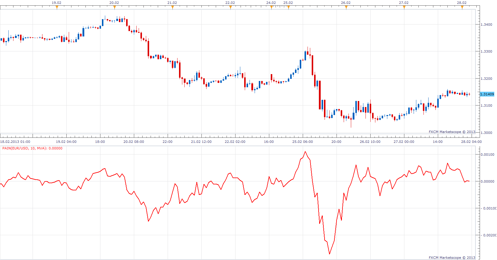

# Pain

> Source: https://fxcodebase.com/code/viewtopic.php?f=17&t=32520  
> Forum: 17 · Topic 32520 · 4 post(s)

---

## Pain

**Apprentice** · Thu Feb 28, 2013 5:04 am

Pain = ( (CLOSE -OPEN )+(CLOSE -HIGH )+(CLOSE -LOW ) ) / 2;

 [Pain.lua](files/55396/Pain.lua)

---

## Re: Pain

**Alexander.Gettinger** · Mon Sep 15, 2014 12:41 pm

MQL4 version of Pain oscillator: [viewtopic.php?f=38&t=61157](https://fxcodebase.com/code/viewtopic.php?f=38&t=61157).

---

## Re: Pain

**Cactus** · Thu Jul 28, 2016 5:45 pm

I love the name

---

## Re: Pain

**Apprentice** · Tue Aug 07, 2018 5:17 am

The indicator was revised and updated.
