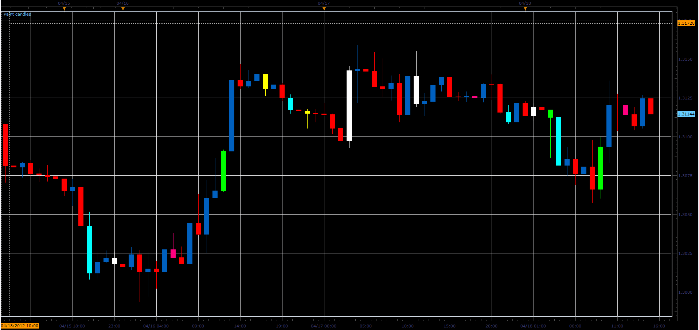

# Paint candles

> Source: https://fxcodebase.com/code/viewtopic.php?f=17&t=16320  
> Forum: 17 · Topic 16320 · 6 post(s)

---

## Paint candles

**Alexander.Gettinger** · Wed Apr 18, 2012 3:10 pm

The indicator allows the user to paint the bars as you wish.

 

To define a candle color use the commands from the command menu (right mouse click).

Download:

 [Paint_Candles.lua](files/30409/Paint_Candles.lua)

MT4/MQ4 version.
[viewtopic.php?f=38&t=64598](https://fxcodebase.com/code/viewtopic.php?f=38&t=64598)

The indicator was revised and updated

---

## Re: Paint candles

**kryptons27** · Fri May 18, 2012 1:12 am

Nice one bro... but I would appreciate if I can stick to my UP/DN color... meaning no need to change UP/DN color...

---

## Re: Paint candles

**traderking** · Sun Aug 26, 2012 4:17 am

Very nice...I like this indicator. I will like to have the MT4 version. Please kindly post the MT4 version as well. Thanks

---

## Re: Paint candles

**Apprentice** · Mon Aug 27, 2012 6:48 am

Your request is added to the development list.

But I'm not sure whether this is possible in MQ4.
I have consulted the development team.

---

## Re: Paint candles

**Apprentice** · Thu Apr 06, 2017 3:59 pm

Indicator was revised and updated.

---

## Re: Paint candles

**Apprentice** · Mon Apr 17, 2017 3:10 am

MT4/MQ4 version added.
