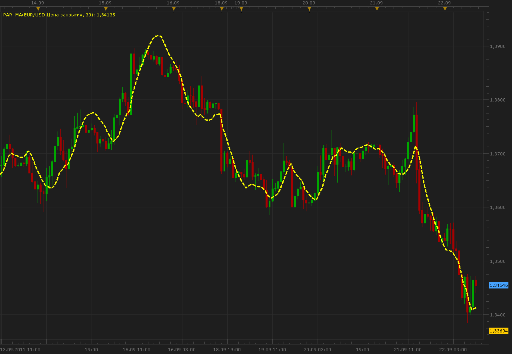
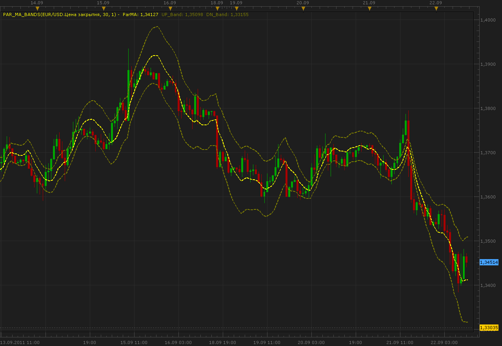

# Parabolic moving average and bands

> Source: https://fxcodebase.com/code/viewtopic.php?f=17&t=6718  
> Forum: 17 · Topic 6718 · 2 post(s)

---

## Parabolic moving average and bands

**Alexander.Gettinger** · Thu Sep 22, 2011 10:53 am

Parabolic regression indicator (see [http://www.encyclopediaofmath.org/index ... regression](http://www.encyclopediaofmath.org/index.php/Parabolic_regression)).

The indicator produces the less lag than majority of other moving average indicators.

The algorithm is taken from V.P. Dyakonov. Reference book by the algorithms and programs on the Basic language for personal computers. M 1987.

Parabolic MA:

 

Download:

 [Par_MA.lua](files/15293/Par_MA.lua)

Parabolic MA with bands:

 

Download:

 [Par_MA_Bands.lua](files/15293/Par_MA_Bands.lua)

The indicator was revised and updated

---

## Re: Parabolic moving average and bands

**Apprentice** · Thu Mar 16, 2017 1:58 pm

Indicator was revised and updated.
