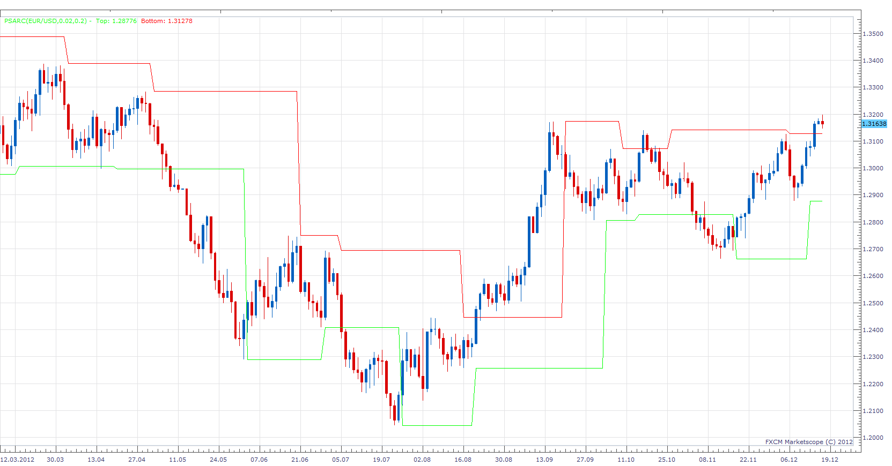

# Parabolic SAR Channel

> Source: https://fxcodebase.com/code/viewtopic.php?f=17&t=27761  
> Forum: 17 · Topic 27761 · 26 post(s)

---

## Parabolic SAR Channel

**Apprentice** · Mon Dec 17, 2012 4:18 am

 [PSARC.lua](files/48621/PSARC.lua)

 [PSARC with Alert.lua](files/48621/PSARC%20with%20Alert.lua)

MT4 / MT5 versions.
[https://fxcodebase.com/code/viewtopic.php?f=38&t=72989](https://fxcodebase.com/code/viewtopic.php?f=38&t=72989)

---

## Re: Parabolic SAR Channel

**Taskryr** · Sun Jan 05, 2014 2:46 pm

Hello,

Is it possible to describe how the PSAR gets rendered on screen? What value determines it's positioning? I ask because I place entries at the PSAR level (not the channel), but over the weekend, my entry is not on the PSAR. It's not even close. Does this indicator render differently each time I open the Marketscope over a weekend or should I be considering an issue with the trading platform?

Thanks for any explanation.

---

## Re: Parabolic SAR Channel

**Apprentice** · Mon Jan 06, 2014 3:02 am

You can specify that the Time Frame and currency pair is in question.

Also, things will be clearer, if you overlay Sar Indicator.
Very likely SAR indicat had a new indication.

Parabolic SAR Channel Lines are simply last SAR indications.

---

## Re: Parabolic SAR Channel

**Taskryr** · Mon Jan 06, 2014 3:15 pm

My apologies,

Marketscope was missing 4 days of data which threw the indicator for a loop and confused me until I realized what was going on.

Thanks

---

## Re: Parabolic SAR Channel

**Taskryr** · Wed Feb 05, 2014 8:46 pm

Would it be at all possible to make this indicator a MTF indicator? That is, if I was using a 1H chart, would it be possible to see where the parabolic sar would be positioned on the 4H chart?

---

## Re: Parabolic SAR Channel

**Apprentice** · Thu Feb 06, 2014 3:39 am

Simply choose, H4, as Indicator source, Time Frame.

---

## Re: Parabolic SAR Channel

**Coondawg71** · Wed Jun 17, 2015 11:12 am

Can we please request Alert function added to this indicator.

Alert would be triggered upon the breach of candle Close outside the channel.

Thanks!

sjc

---

## Re: Parabolic SAR Channel

**Apprentice** · Fri Jun 19, 2015 5:04 am

PSARC with Alert.lua added.

---

## Re: Parabolic SAR Channel

**easytrading** · Wed Jun 24, 2015 12:56 pm

hello Apprentice,
Can we please request a strategy for PSARC with Alert.lua based on the direction of the arrow that this indicator is generating as below:

buy on up arrow
sell on down arrow
close on opposite

with much appreciation in advance.

---

## Re: Parabolic SAR Channel

**Apprentice** · Thu Jun 25, 2015 4:31 am

Requested can be found here.
[viewtopic.php?f=31&t=62354](https://fxcodebase.com/code/viewtopic.php?f=31&t=62354)

---

## Re: Parabolic SAR Channel

**gregoryyul** · Tue Jul 21, 2015 7:20 am

Hello,

Is there anyway this indicator will trigger when the SAR trend changes.? At the moment it seems to only alert when there's a cross of the channel line,

---

## Re: Parabolic SAR Channel

**Apprentice** · Mon Dec 07, 2015 6:04 am

Compatibility issue fixed.
_Alert Helper is not longer needed.

---

## Re: Parabolic SAR Channel

**Apprentice** · Fri Jul 21, 2017 8:49 am

The indicator was revised and updated.

---

## Re: Parabolic SAR Channel

**TLBshifted** · Thu Sep 01, 2022 5:49 am

Hi Apprentice

Does Parabolic SAR Channel repaints?

Thanks

---

## Re: Parabolic SAR Channel

**Apprentice** · Sat Sep 03, 2022 2:09 am

Parabolic SAR Channel Does NOT repaint

---

## Re: Parabolic SAR Channel

**TLBshifted** · Mon Sep 05, 2022 9:21 am

Thanks Apprentice

---

## Re: Parabolic SAR Channel

**sathistrader** · Sat Nov 26, 2022 12:14 am

Nice coding...Can you convert this to MT4.?

---

## Re: Parabolic SAR Channel

**Apprentice** · Mon Nov 28, 2022 2:48 am

We have added your request to the development list.
Development reference 780.

---

## Re: Parabolic SAR Channel

**sathistrader** · Wed Nov 30, 2022 10:49 am

Ok

---

## Re: Parabolic SAR Channel

**Apprentice** · Wed Nov 30, 2022 1:38 pm

MT4 version.
[https://fxcodebase.com/code/viewtopic.php?f=38&t=72989](https://fxcodebase.com/code/viewtopic.php?f=38&t=72989)

---

## Re: Parabolic SAR Channel

**Danery69** · Mon Jul 15, 2024 3:34 am

[quote="Apprentice"]

PSARC.png

PSARC.lua

PSARC with Alert.lua

Hello,
the SAR points are very tiny, how can I increase the size please ?
Jacques

---

## Re: Parabolic SAR Channel

**Apprentice** · Thu Jul 18, 2024 3:28 pm

We have added your request to the development list.
Development reference 585

---

## Re: Parabolic SAR Channel

**Apprentice** · Thu Jul 18, 2024 3:50 pm

Try it now.

---

## Re: Parabolic SAR Channel

**logicgate** · Sat Aug 10, 2024 6:52 am

MT5 version would be great, thanks

---

## Re: Parabolic SAR Channel

**Apprentice** · Sat Aug 10, 2024 6:49 pm

We have added your request to the development list.
Development reference 636

---

## Re: Parabolic SAR Channel

**Apprentice** · Sun Sep 08, 2024 2:02 pm

MT5 version.
[https://fxcodebase.com/code/viewtopic.php?f=38&t=72989](https://fxcodebase.com/code/viewtopic.php?f=38&t=72989)
