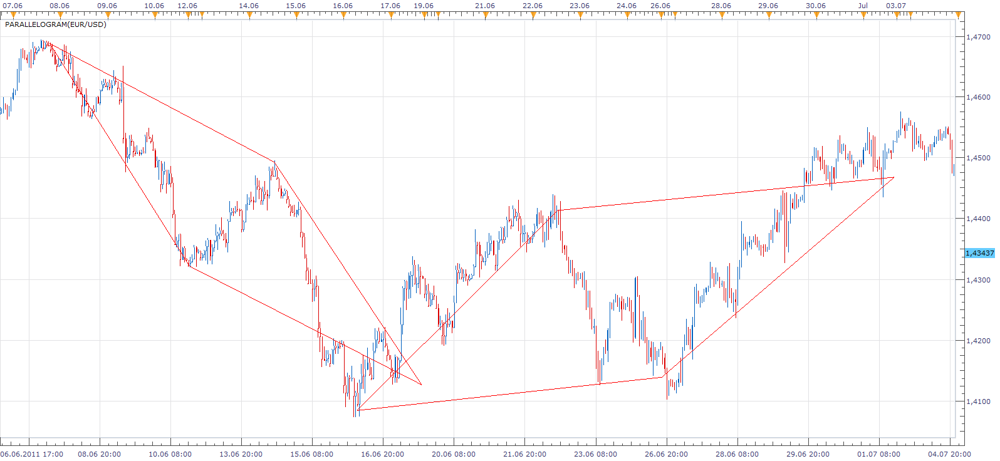
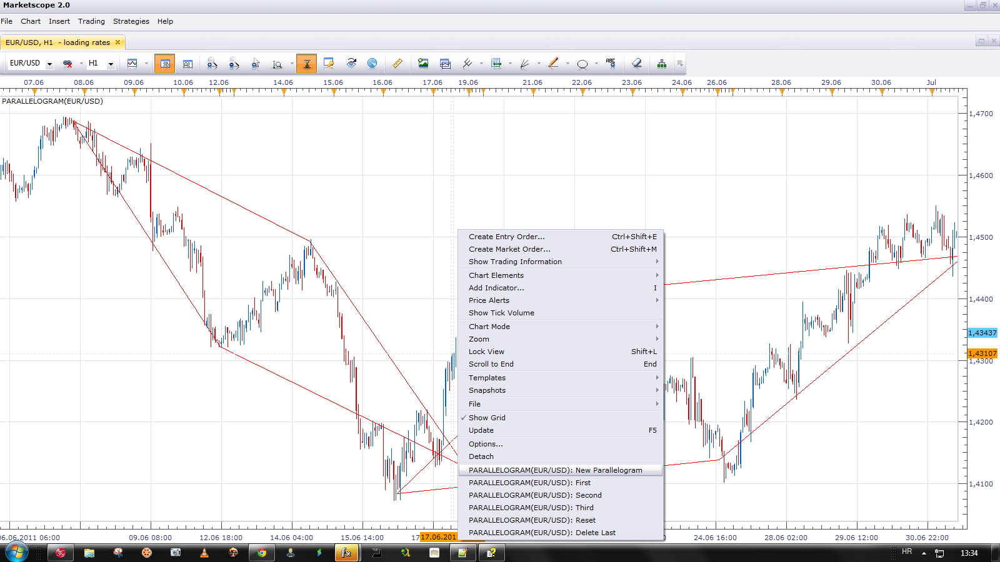
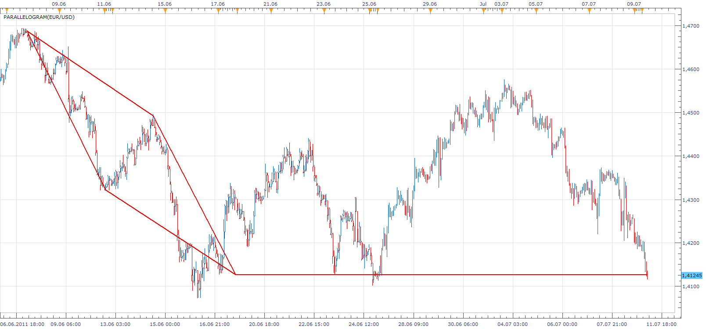
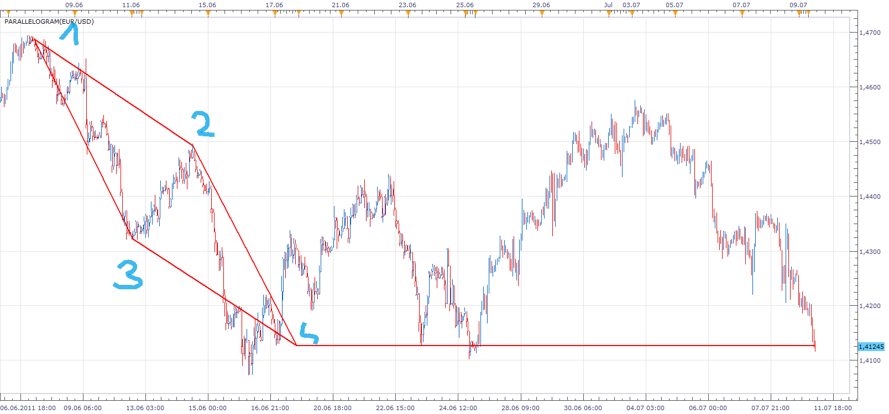

# Parallelogram Tool

> Source: https://fxcodebase.com/code/viewtopic.php?f=17&t=5142  
> Forum: 17 · Topic 5142 · 10 post(s)

---

## Parallelogram Tool

**Apprentice** · Sun Jul 10, 2011 6:26 am

This Tool allows you to define a Parallelogram Pattern,
with three points.

 [Parallelogram.lua](files/12564/Parallelogram.lua)

 

Each point can be defined using Left Mouse Menu Options.
1.New Parallelogram
2.First
3.Second
4. Third
5. Reset
6. Delete Last

 

Beta Version

The indicator was revised and updated

---

## Re: Parallelogram Tool

**Apprentice** · Mon Jul 11, 2011 4:53 am

As requested.
Target Line Added.

---

## Re: Parallelogram Tool

**t1982t** · Tue Jul 12, 2011 9:02 am

Hello, I can see the title of the signal in my window but not the numbers of the signal

Kind Regards

---

## Re: Parallelogram Tool

**t1982t** · Tue Jul 12, 2011 9:06 am

Pardon: I mean the lines of the signal, not the numbers.

---

## Re: Parallelogram Tool

**Apprentice** · Tue Jul 12, 2011 10:36 am

This Is True For Elliot Wave Labeling Tool, Parallelogram and other similar tools.
You have to define some things, before the indicator can draw something.

 

In this case.
These are points 1, 2 and 3
Point 4 is drawn automatically after you entered the previous point.

---

## Re: Parallelogram Tool

**t1982t** · Tue Jul 12, 2011 1:44 pm

I got it, thank you

---

## Re: Parallelogram Tool

**Apprentice** · Tue Oct 01, 2013 11:28 am

Bit of a face lift.
The algorithm improved / Fixed.
1) 2) 3) Labels added.
Price target added.

---

## Re: Parallelogram Tool

**Apprentice** · Thu Jun 22, 2017 6:35 am

The indicator was revised and updated.

---

## Re: Parallelogram Tool

**marcelo2k9** · Thu Sep 04, 2025 12:02 pm

Please Sir, can you give us the mt5 version of this indicator, you have really increased my confidence and you will be rewarded.

---

## Re: Parallelogram Tool

**Apprentice** · Thu Sep 04, 2025 2:51 pm

We have added your request to the development list.
Development reference 568
