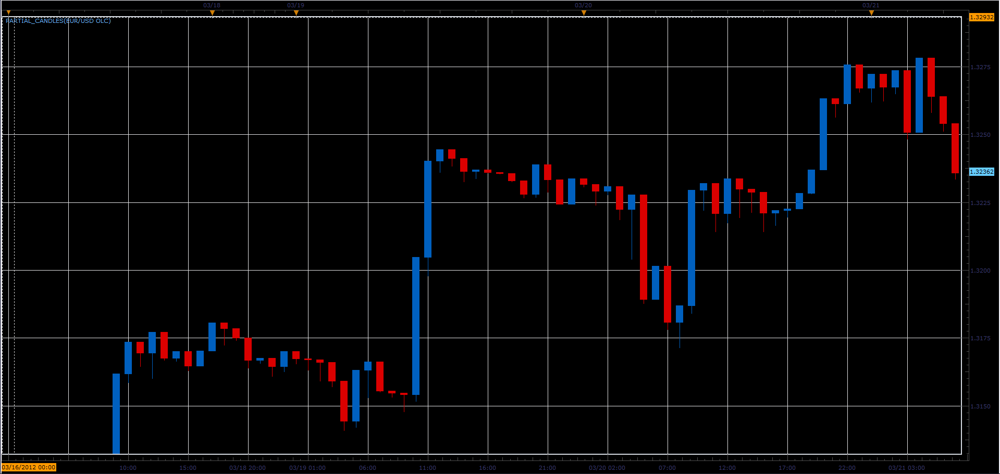

# Partial candles

> Source: https://fxcodebase.com/code/viewtopic.php?f=17&t=15078  
> Forum: 17 · Topic 15078 · 3 post(s)

---

## Partial candles

**Alexander.Gettinger** · Fri Mar 23, 2012 8:41 am

The indicator draws candles contain incomplete information about Open, High, Low and Close prices.

For example, Open, Low and Close prices only:

 

Download:

 [Partial_Candles.lua](files/28553/Partial_Candles.lua)

 [Heikin-Ashi_Partial_Candles.lua](files/28553/Heikin-Ashi_Partial_Candles.lua)

The indicator was revised and updated

---

## Re: Partial candles

**Apprentice** · Mon Mar 27, 2017 3:43 pm

Indicator was revised and updated.

---

## Re: Partial candles

**Apprentice** · Thu Jan 18, 2018 9:03 am

Heikin-Ashi_Partial_Candles.lua added.
