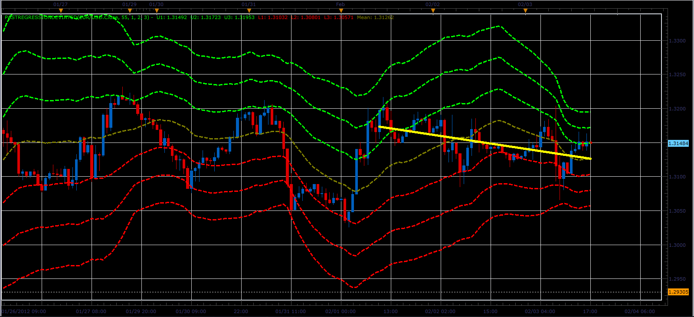

# Past Regression Deviated indicator

> Source: https://fxcodebase.com/code/viewtopic.php?f=17&t=12837  
> Forum: 17 · Topic 12837 · 2 post(s)

---

## Past Regression Deviated indicator

**Alexander.Gettinger** · Sat Feb 04, 2012 8:44 pm

This indicator is a ported MQL5 indicator from [http://www.mql5.com/en/code/717](http://www.mql5.com/en/code/717).

> Past Regression Deviated is an indicator consisting of 7 parallel lines that form a sort of price channels that can be used as support and resistance levels and also a trend line that is built to determine the current trend direction.
>
> Past Regression Deviated displays levels fairly well and can be used in the strategies considering price breakouts or retreats from the levels.

 

Download:

 [PastRegressionDeviated.lua](files/25178/PastRegressionDeviated.lua)

For this indicator must be installed StdDev indicator ([viewtopic.php?f=17&t=870&p=1577](https://fxcodebase.com/code/viewtopic.php?f=17&t=870&p=1577)).

---

## Re: Past Regression Deviated indicator

**Apprentice** · Mon Mar 05, 2018 1:58 pm

The Indicator was revised and updated.
