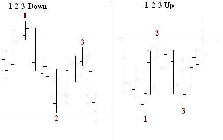
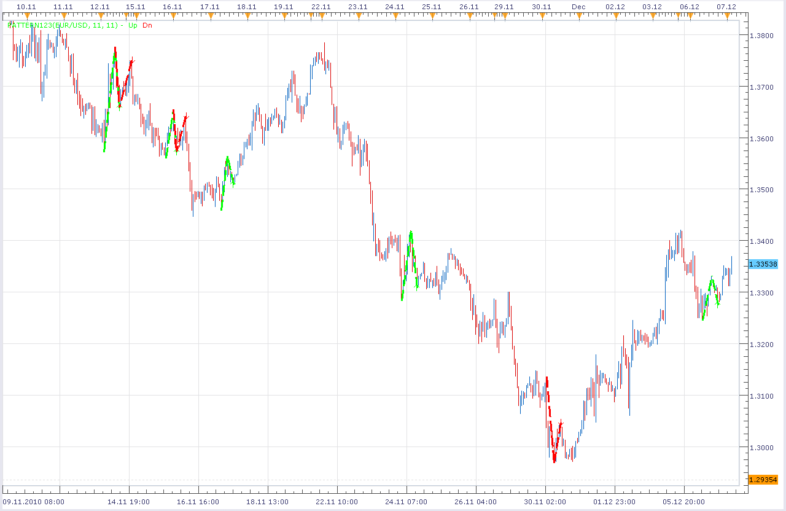

# Pattern 1-2-3

> Source: https://fxcodebase.com/code/viewtopic.php?f=17&t=2891  
> Forum: 17 · Topic 2891 · 11 post(s)

---

## Pattern 1-2-3

**Alexander.Gettinger** · Tue Dec 07, 2010 4:14 am

1-2-3 pattern - known reversal market pattern.

 

Down pattern:
After maximum 1 follows minimum 2 and maximum 3 (more low than 1).
Up pattern:
After minimum 1 follows maximum 2 and minimum 3 (more high than 1).

For identification minimums and maximums used advanced fractals ([viewtopic.php?f=17&t=724](https://fxcodebase.com/code/viewtopic.php?f=17&t=724)).

 

Download:

 [Pattern123.lua](files/6588/Pattern123.lua)

MT4 version
[https://fxcodebase.com/code/viewtopic.php?f=38&t=74716](https://fxcodebase.com/code/viewtopic.php?f=38&t=74716)

---

## Re: Pattern 1-2-3

**dlouisbriggs** · Sun Dec 12, 2010 11:34 am

In practical application I have found the use of high/low pricing to be erratic when price shocks occur. I believe the pattern would prove more predictive if the the Regression Line indicator (set at 2 periods) were to be utilized for the identification of the pattern. Would it be possible to get a version of this pattern using the Regression Line pricing instead?

---

## Re: Pattern 1-2-3

**Apprentice** · Thu Feb 02, 2017 4:23 pm

Indicator was revised and updated.

---

## Re: Pattern 1-2-3

**ahmedalhosenyy** · Tue Aug 29, 2023 1:10 pm

Very nice indicator

Many thanks

---

## Re: Pattern 1-2-3

**tkhanfx** · Wed Sep 27, 2023 6:04 pm

can we get MT4 version of this?

---

## Re: Pattern 1-2-3

**Apprentice** · Sat Sep 30, 2023 2:51 am

We have added your request to the development list.
Development reference 881.

---

## Re: Pattern 1-2-3

**tkhanfx** · Mon Oct 16, 2023 3:16 am

Hi. any update on this?

---

## Re: Pattern 1-2-3

**Apprentice** · Wed Mar 20, 2024 2:29 pm

MT4 version
[https://fxcodebase.com/code/viewtopic.php?f=38&t=74716](https://fxcodebase.com/code/viewtopic.php?f=38&t=74716)

---

## Re: Pattern 1-2-3

**ahmedalhosenyy** · Tue Feb 18, 2025 6:19 pm

may we have MTF lua version !

thanks

---

## Re: Pattern 1-2-3

**Apprentice** · Sat Feb 22, 2025 5:40 am

We have added your request to the development list.
Development reference 139

---

## Re: Pattern 1-2-3

**Apprentice** · Thu Jun 05, 2025 12:48 pm

 [Pattern123_Dashboard.lua](files/159491/Pattern123_Dashboard.lua)
