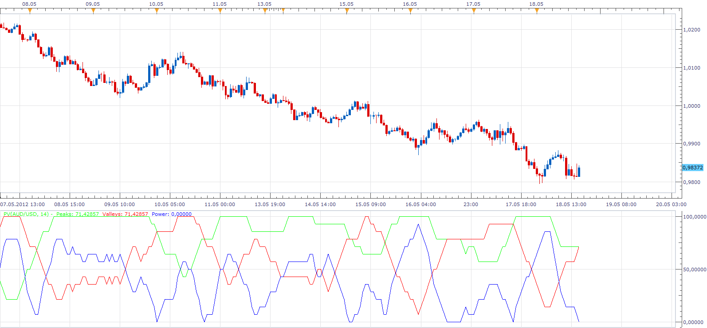

# Peaks and Valleys

> Source: https://fxcodebase.com/code/viewtopic.php?f=17&t=18740  
> Forum: 17 · Topic 18740 · 2 post(s)

---

## Peaks and Valleys

**Apprentice** · Sun May 20, 2012 8:30 am

This indicator is a translation of MT4 Indicator .
If you have experience with its use.
I ask you to share your experienc with the community.

 [PV.lua](files/33548/PV.lua)

The indicator was revised and updated

---

## Re: Peaks and Valleys

**Apprentice** · Sun Apr 02, 2017 7:28 am

Indicator was revised and updated.
