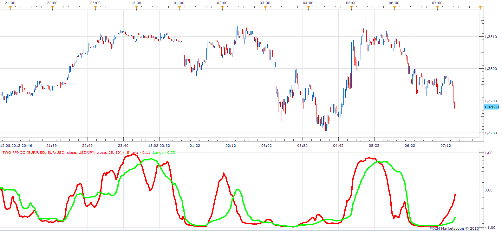

# Pearson product-moment correlation coefficient

> Source: https://fxcodebase.com/code/viewtopic.php?f=17&t=24131  
> Forum: 17 · Topic 24131 · 6 post(s)

---

## Pearson product-moment correlation coefficient

**Apprentice** · Sat Oct 06, 2012 4:18 am

Pearson product-moment correlation coefficient ( PPMCC or PCC, Pearson's r ), is a measure of the correlation (linear dependence) between two variables X and Y, giving a value between +1 and −1.
We distinguish, 0 do not correlate, 1 correlation, -1 Negativ correlation.

 [PPMCC.lua](files/41512/PPMCC.lua)

The indicator was revised and updated

---

## Re: Pearson product-moment correlation coefficient

**Apprentice** · Sat Oct 06, 2012 6:20 am

 [Geometric interpretation of PPMCC.lua](files/41521/Geometric%20interpretation%20of%20PPMCC.lua)

---

## Re: Pearson product-moment correlation coefficient

**Coondawg71** · Tue Aug 13, 2013 5:25 am

Is it possible to offer this indicator with a multi period function? As of now the indicator offers one period with two different currency pairs for comparison. Default settings do not offer any information. Can we request two different periods with the same currency pair for each period so as to compare different time frames. This would assist in finding divergence among price bars.

example:

5 minute price chart of Euro/USD with first period set to 12 (one hour) indicator plotting versus 48 period (four hour). When 12 period plotting is overly extended beyond 48 period, divergence is obvious and precise.

Thanks,

sjc

---

## Two Period Pearson product-moment correlation coefficient

**Apprentice** · Tue Aug 13, 2013 6:30 am

 [Two Period PPMCC.lua](files/88446/Two%20Period%20PPMCC.lua)

---

## Re: Pearson product-moment correlation coefficient

**Alexander.Gettinger** · Thu Sep 26, 2013 11:34 am

MQL4 version of Pearson product-moment correlation coefficient: [viewtopic.php?f=38&t=59584](https://fxcodebase.com/code/viewtopic.php?f=38&t=59584).

---

## Re: Pearson product-moment correlation coefficient

**Apprentice** · Thu Jul 27, 2017 9:33 am

The indicator was revised and updated.
