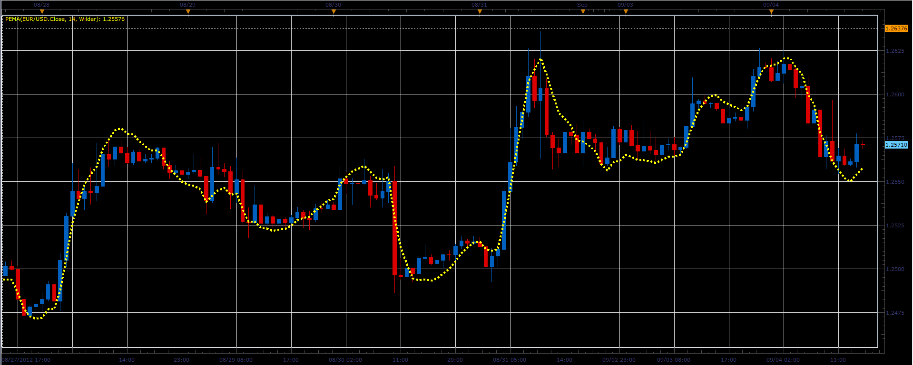

# Pentuple Exponential Moving Average

> Source: https://fxcodebase.com/code/viewtopic.php?f=17&t=23007  
> Forum: 17 · Topic 23007 · 2 post(s)

---

## Pentuple Exponential Moving Average

**Alexander.Gettinger** · Tue Sep 04, 2012 2:25 pm

Formulas:
PEMA=8*MA1-28*MA2+56*MA3-70*MA4+56*MA5-28*MA6+8*MA7-MA8, where
MA1=Moving Average(Price),
MA2=Moving Average(MA1),
MA3=Moving Average(MA2),
MA4=Moving Average(MA3),
MA5=Moving Average(MA4),
MA6=Moving Average(MA5),
MA7=Moving Average(MA6),
MA8=Moving Average(MA7).

 

Download:

 [PEMA.lua](files/39657/PEMA.lua)

For this indicator must be installed Averages indicator ([viewtopic.php?f=17&t=2430](https://fxcodebase.com/code/viewtopic.php?f=17&t=2430)).

The indicator was revised and updated

---

## Re: Pentuple Exponential Moving Average

**Apprentice** · Sat Jan 14, 2023 5:15 am

The indicator has been revised and updated.
