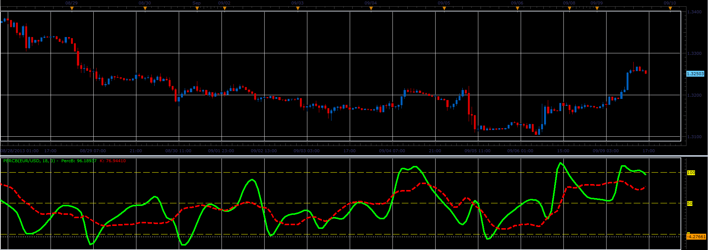

# Percent B oscillator

> Source: https://fxcodebase.com/code/viewtopic.php?f=17&t=59437  
> Forum: 17 · Topic 59437 · 9 post(s)

---

## Percent B oscillator

**Alexander.Gettinger** · Mon Sep 09, 2013 3:53 pm

Percent B oscillator is described in September 2013 issue of Stocks & Commodities (p38-43).

 

Download:

 [PercB.lua](files/89296/PercB.lua)

For this indicator must be installed StdDev indicator ([viewtopic.php?f=17&t=870](https://fxcodebase.com/code/viewtopic.php?f=17&t=870)) and TEMA1 indicator ([viewtopic.php?f=17&t=1052&p=2358](https://fxcodebase.com/code/viewtopic.php?f=17&t=1052&p=2358)).

The indicator was revised and updated

---

## Re: Percent B oscillator

**StefPasc** · Tue Sep 10, 2013 1:31 am

Good day Alexander ,
Can we please have the modified version of Percent B oscillator according to this :
[http://www.traders.com/Documentation/FEEDbk_docs/2013/09/Vervoort.html](http://www.traders.com/Documentation/FEEDbk_docs/2013/09/Vervoort.html)
thank you in advance

---

## Re: Percent B oscillator

**Apprentice** · Tue Sep 10, 2013 1:43 am

Your request is added to the development list.

---

## Re: Percent B oscillator

**Apprentice** · Tue Sep 10, 2013 5:38 am

Completed thill creation of ZLRB (zero-lag rainbow):
[viewtopic.php?f=17&t=59441](https://fxcodebase.com/code/viewtopic.php?f=17&t=59441)

---

## Re: Percent B oscillator

**StefPasc** · Tue Sep 10, 2013 7:03 am

> **Apprentice wrote:**
> Completed thill creation of ZLRB (zero-lag rainbow):
> [http://fxcodebase.com/code/viewtopic.php?f=17&t=59441](https://fxcodebase.com/code/viewtopic.php?f=17&t=59441)

so now in order to have Sylvain Vervoort Percent B oscillator as I requested above , we must apply the Percent B on the ZRLB or a new Percent B (according to Vervoort) must be written ?

---

## Re: Percent B oscillator

**Apprentice** · Tue Sep 10, 2013 7:35 am

u can use regular Percent B
This bit is missing

> // Plot Percent b indicator from smoothed band at 2 standard deviations
> PB_Plot.Set((TEMA(ZLRB, smooth)[0] + 2 * StdDev(TEMA(ZLRB,
> smooth), stdevperiod)[0] -
> WMA(TEMA(ZLRB, smooth),stdevperiod)[0]) /
> (4* StdDev(TEMA(ZLRB, smooth), stdevperiod)[0]) * 100);

Sylvain Vervoort version uses a modified version.
Uses TEMA smoothing prior to Percent B among other things.

---

## Re: Percent B oscillator

**StefPasc** · Tue Sep 10, 2013 8:01 am

Apprentice
thank you very much
One more question :
is it possible to have a version of Percent B that can be applied not only on price data but on another indicator (for example SATL indicator from FTLM-STLM components ....) ?
thank you again

---

## Re: Percent B oscillator

**Apprentice** · Tue Sep 10, 2013 9:17 am

U can apply Bollinger Bands Percentage to any data source.
[viewtopic.php?f=17&t=226&hilit=Bollinger](https://fxcodebase.com/code/viewtopic.php?f=17&t=226&hilit=Bollinger)

---

## Re: Percent B oscillator

**Apprentice** · Sun Jun 04, 2017 6:07 am

The indicator was revised and updated.
